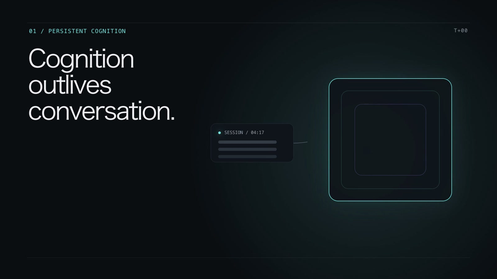

<p align="center">
  
</p>

# Morphz

English · [简体中文](README.zh-CN.md)

> **From Chat Completion to Structured Context Evaluation.**

<p align="center">
  <a href="https://morphz.ai/en/#demo">
    
  </a>
</p>

<p align="center"><a href="https://morphz.ai/en/#demo"><strong>See Morphz in 74 seconds →</strong></a></p>

Morphz is an **S-Expression Cognitive Machine** built for durable agents. It makes structured
Context—not a growing chat transcript—the object a language model evaluates directly. The model
handles nondeterministic semantics; a deterministic transaction kernel owns facts, authority,
state, execution, and recovery.

Morphz is created and maintained by Newvar.

## Developer Preview

Morphz 0.1 is a source-first Developer Preview. Its core mechanisms are reproducible, while public
interfaces, multi-process operation, and parts of cross-platform validation continue to evolve.
Breaking changes are possible, and this release does not claim production-grade multi-tenant cloud
operation.

Native sandbox implementations exist for macOS, Linux, and Windows. Morphz 0.1 supports macOS 11
or newer on Apple Silicon and Intel, ARM64 and x86_64 Linux with glibc 2.35 or newer, and x86_64 Windows.
Linux workspace-write mode requires Bubblewrap, and Windows security claims depend on the complete
Morphz Windows helper bundle.

See the [current implementation status](docs/morphz_runtime_core_implementation_status_v1.md) for
the verified boundary between implemented, validated, experimental, and planned capabilities.

## What Morphz changes

- **Context is durable state.** An Agent owns versioned cognitive Frames independently of any one
  Session or transcript.
- **Evaluation is a state transition.** The model proposes meaning and action; the deterministic
  kernel validates and commits authorized changes.
- **Concurrency has causal structure.** Objectives, Threads, Activations, dependencies, and
  versioned transactions make parallel work inspectable and recoverable.
- **Cognitive practice is programmable.** Harness packages and Yao programs can define evaluation
  loops without replacing Agent identity.
- **Experience is portable evidence.** Agent Trajectory and Mind Frame Exchange specifications
  define auditable records and selected cognitive exchange beyond one implementation.

## Install and run

### Prerequisites

- a supported operating system from the matrix above;
- access to at least one supported model service;
- read and write access to the working directory you give the Agent.

Local command execution on Linux requires Bubblewrap and working unprivileged user namespaces. The
installer reports this boundary before download when the host is not ready.

Install a prebuilt release on macOS or Linux:

```bash
curl -fsSL https://morphz.ai/install.sh | sh -s -- setup
```

On Windows PowerShell:

```powershell
irm https://morphz.ai/install.ps1 | iex
```

The installers select the native GitHub Release asset, show each installation stage, verify its
SHA-256 checksum, and add the user-level binary directory to future shell sessions. The `setup`
argument starts Setup directly from the installer. In a new terminal, continue with:

```bash
morphz doctor
morphz
```

Updates are explicit and use the same verified GitHub Release assets. `morphz update status`
checks for a release, `morphz update` installs it, and `morphz update rollback` restores the binary
retained by the last update.

`setup` opens the embedded Dashboard wizard by default and automatically selects the terminal
wizard in an interactive SSH or headless Linux session. Use `setup --tui` to select it explicitly,
or `setup --no-open` to print the Dashboard URL without opening it.

The directory from which Morphz runs may become the Agent's working directory. Use an explicit
`--cwd` when necessary; do not grant an experimental Agent write access to a source checkout
unintentionally. Developers can still build from source with the toolchain pinned by
[`rust-toolchain.toml`](rust-toolchain.toml).

For the complete first-run path, read [Getting started](https://morphz.ai/en/docs/getting-started).

## Documentation and research

- [Project website](https://morphz.ai)
- [Documentation](https://morphz.ai/en/docs)
- [Technical essay: From Chat Completion to Structured Context Evaluation](https://morphz.ai/en/blog/from-chat-completion-to-structured-context-evaluation)
- [English preprint](website/public/paper/morphz_nondeterministic_cognitive_symbol_evaluation_preprint_en.pdf)
  · [中文预印本](website/public/paper/morphz_nondeterministic_cognitive_symbol_evaluation_preprint_zh.pdf)
- [Morphz technical standards](docs/standards/README.md)
- [Core implementation status](docs/morphz_runtime_core_implementation_status_v1.md)

The standards workspace includes Structured Context, Agent Trajectory, Cognitive Applications and
Harnesses, Yao, and Mind Frame Exchange. Draft standards describe review targets; they do not by
themselves prove that every requirement is implemented.

## Repository map

- `morphz/` — core implementation, application API, CLI, and server adapters;
- `yao/` — the typed language used for deterministic evaluation programs;
- `morphz-evals/` — evaluation framework and fixtures;
- `extensions/` — optional capabilities outside the default core;
- `dashboard/` — embedded web control surface and inspector;
- `website/` — the Morphz technical website;
- `docs/standards/` — public specifications and conformance work;
- `docs/` — architecture, research, verification, and roadmap material.

## Development

Run the Rust quality gate:

```bash
cargo fmt --all -- --check
cargo clippy --workspace --all-targets -- -D warnings
cargo test --workspace --all-targets
cargo build --release --workspace
```

Validate the Dashboard separately:

```bash
cd dashboard
npm ci
npm run lint
npm run test
npm run build
```

See [CONTRIBUTING.md](CONTRIBUTING.md) before proposing a change and
[GOVERNANCE.md](GOVERNANCE.md) for project and standards governance.

## Security

Morphz applies a shared permission profile to file, shell, local execution, and remote execution
capabilities. Workspace-write mode is enforced by a native OS sandbox and fails closed when the
required backend is unavailable. `full_access` deliberately removes those boundaries and should
only be used in an environment you already trust.

The security model remains part of the Developer Preview. Review the
[sandbox and approval architecture](docs/morphz_sandbox_execution_and_approval_architecture.md)
before exposing Morphz to untrusted workspaces or remote users.

## License

Original source code, tests, development tools, technical documentation, specification text, and
public conformance fixtures are generally licensed under the
[Apache License 2.0](LICENSE). Papers, patent materials, website editorial content, brand assets,
and third-party materials may have separate terms. See the [license scope](LICENSE_SCOPE.md),
[patent policy](PATENTS.md), [trademark policy](TRADEMARKS.md), and
[third-party notices](THIRD_PARTY_NOTICES.md).
