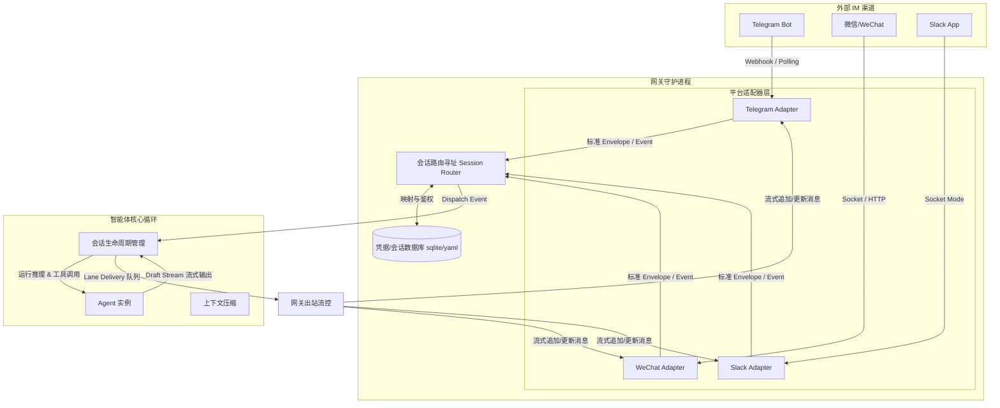

# openclaw 与 Hermes Agent 多渠道通信网关 Gateway 剖析

作为 AI Agent 的核心交互枢纽，多渠道通信网关（Messaging Gateway）负责打通外部聊天软件（如 Telegram, 微信, Slack, Discord 等）与智能体核心运行循环（Agent Loop）之间的通路。

本报告对 `openclaw` 和 `Hermes Agent` 的网关源码进行深度剖析，展示其拓扑架构、消息流转、异同对比以及安全机制，帮助您彻底吃透网关部分的底层设计。

---

## 1. 网关拓扑架构与单控制面角色

无论是 `openclaw` 还是 `Hermes Agent`，在拓扑上都采用了**“单网关守护进程（Single Gateway Daemon） + 平台适配器插件（Platform Adapters） + 会话路由分发（Session Router）”**的微内核架构。



### 单控制面（Control Plane）的核心职责
1.  **连接管理与保活（Keep-Alive）**：与 Telegram 的长轮询（Long Polling）、Slack 的 WebSocket Socket Mode 等保持长连接，处理断线重连与网络抖动。
2.  **凭据管理与热加载**：由于网关管理着多个 Bot API Token，控制面负责加密存储这些 secrets。当用户修改配置文件或 API Key 时，网关支持热重载（Hot Reload），无需停机重启。
3.  **多渠道会话隔离路由**：例如用户可以在 Telegram 和微信上同时与同一个 Agent 聊天，网关通过 `(platform, user_id, chat_id, thread_id)` 组合计算出一个唯一的 `SessionKey`，并将其分发到独立的沙箱会话中，确保不同平台、不同群聊的数据互不干扰。

---

## 2. 入站与出站消息流转生命周期（Ingress & Egress Flow）

下面我们以收到一条 Telegram 消息为例，详细走读其核心流转过程。

### 2.1 入站接收与规范化 (Ingress Normalize)
在收到外部消息后，各适配器会将非标的平台数据格式化为网关核心通用的 `SessionEnvelope` 或 `PlatformEvent`。

#### A. 媒体缓存与安全审查
当用户发送语音消息或图片时，平台提供的 URL 通常是短效的（例如 Telegram 的 `file_id` 链接会在 1 小时后过期）。
网关在规范化时，会执行媒体文件的本地落盘缓存：
*   在 Hermes 的 `gateway/platforms/base.py` 中，定义了 `IMAGE_CACHE_DIR` 和 `AUDIO_CACHE_DIR`：
    ```python
    # 将网络图片或语音下载到本地，以便 Vision 工具和 Whisper 语音转文字工具直接通过本地绝对路径读取
    filepath = cache_dir / f"img_{uuid.uuid4().hex[:12]}{ext}"
    filepath.write_bytes(downloaded_data)
    ```
*   **SSRF 注入防护**：为防止通过图片 URL 进行 SSRF（服务端请求伪造，例如诱导 Agent 下载内网 `169.254.169.254` 上的敏感凭证），在下载文件时，网关会通过 redirect 守卫拦截内网 IP 重定向：
    ```python
    async def _ssrf_redirect_guard(response):
        if response.is_redirect and response.next_request:
            redirect_url = str(response.next_request.url)
            if not is_safe_url(redirect_url):
                raise ValueError("Blocked redirect to private address!")
    ```

#### B. 消息元数据包装
网关接着将消息包装为带有 `sender_id`, `chat_id`, `thread_id` 的 Envelope。
以 openclaw 对应的 `bot-message-context.ts` 为例，消息会在这里被规整，并在 `sessions-resolve.ts` 中查找对应的活跃会话：
```typescript
// openclaw/src/gateway/sessions-resolve.ts
export async function resolveSessionForInbound(
  envelope: InboundEnvelope
): Promise<ResolvedSession> {
  const sessionKey = buildSessionKey(envelope.platform, envelope.senderId, envelope.chatId);
  // 从 SQLite 数据库中查找或生成会话行
  let session = await db.sessions.findByKey(sessionKey);
  if (!session) {
    session = await db.sessions.create({ key: sessionKey, state: 'active' });
  }
  return session;
}
```

### 2.2 流式出站与流控队列 (Egress & Lane Delivery)
Agent 生成回复往往需要十几秒甚至几分钟，如果等全部文本生成完毕才回复，IM 渠道的用户体验会非常糟糕。因此，网关必须实现**打字机流式效果（Typing Stream Effect）**。

然而，像 Telegram、微信等 IM 对消息发送频率有严格的限制（Rate Limit，如 Telegram 限制单个 Bot 每秒最多向同一个群发送 1 条编辑消息）。如果在 LLM 每次吐出几个 Token 时都去更新 IM，会触发 **429 Too Many Requests** 错误。

#### OpenClaw & Hermes 的解决方案：流式消息缓冲队列 (Lane Delivery)
在出站端，系统设计了 `Lane Delivery` 控制器（例如 openclaw 中的 `progress-draft-compositor.ts` 和 Hermes 中的 `stream_consumer.py`）。
其核心机制是：
1.  **消息积攒（Batching & Debounce）**：当 Agent 吐出文字流时，网关并不会实时调用 Telegram `editMessage`，而是在本地缓冲区积攒。
2.  **节流定时更新（Throttled Flush）**：启动一个定时器（通常为 1~1.5 秒），定时把当前缓冲区积累的新增文字一次性 flush 提交给 IM。
3.  **打字状态占位符**：在未完成回复前，向 IM 平台持续发送“正在输入 (typing...)”或“正在录音 (uploading audio...)”的动作包，并在输出文本的尾部追加闪烁的打字光标（如 `▊`）。

---

## 3. 双平台对比：TypeScript 动态插件 vs Python 异步并发

虽然它们实现了相近的功能，但底层的系统设计思想和技术栈选择导致了截然不同的开发与运行体验。

### 3.1 OpenClaw（TypeScript / Monorepo）
*   **设计模式**：**Monorepo 插件动态加载**。
    *   openclaw 核心极其精简。它的多渠道通道（Telegram, WeChat）都以独立的模块包存在于 `extensions/` 目录下。
    *   在启动时，`bootstrap-registry.ts` 通过读取 `openclaw.plugin.json` 中的声明，动态加载这些插件，并在运行时把它们注册到 `GatewayServer` 中。
*   **优势**：
    *   TypeScript 可以无缝使用前端庞大的生态。比如对接微信，可以直接使用 JavaScript 社区成熟的微信机器人库（Wechaty 等），或者通过 Node.js 原生的 `ws` 模块以极高的吞吐与控制面 UI 建立连接。
*   **劣势**：
    *   单线程 Event Loop 的限制使得在网关内部进行耗时的任务（如上下文分析、文件压缩、运行本地脚本）时，很容易因为阻塞而导致网关对其他 IM 通道的响应产生瞬时延迟。

### 3.2 Hermes Agent（Python / Asyncio）
*   **设计模式**：**Asyncio 多任务协程并发**。
    *   Hermes 完全使用 Python 异步协程机制重构了网关。在 `gateway/platforms/` 下，所有的适配器都继承自统一的基类 `BasePlatformAdapter`。
    *   主入口 `gateway/run.py` 使用 `asyncio.gather(*platforms)` 启动一个高性能的异步并发循环。
*   **优势**：
    *   **极致的系统级对接**：Python 原生支持丰富的多进程、多线程库，这使得网关在调用外部命令（如 Docker 沙箱、Daytona 接口、编译 C++ 依赖）时，可以通过 `asyncio.create_subprocess_exec` 优雅地在后台开辟子进程，完全不阻塞 IM 通道的消息接收。
    *   **内存监控机制**：在 `gateway/memory_monitor.py` 中实现了一个轻量级的内存监控，当发现 Python 宿主内存消耗异常时，会自动触发垃圾回收或上下文截断，这在资源受限的云端服务器（如 $5 VPS）上能保证进程不发生 OOM (Out Of Memory)。
*   **劣势**：
    *   对接某些非公开协议（如微信网页版或客户端 Hooks）时，Python 的第三方开源 SDK 质量和活跃度显著弱于 Node.js 社区。

---

## 4. 安全配对与过滤机制 (Security Gating)

网关直接暴露在开放的社交网络中，极易受到恶意用户的骚扰或提示词注入攻击（Prompt Injection）。因此，安全机制是网关的第一道防线。

### 4.1 DM 配对机制（DM Pairing）
当未被允许的用户私聊 Bot 时，网关会进行拦截，启动 **DM Pairing** 流程：
*   网关检测到发送方非 allowlist 用户，会产生一个随机的安全配对码（如 `18789-5`）。
*   Bot 在私聊里仅回复一条配对验证提示，并暂停后续的所有 Agent Loop 派生。
*   主操作员在 CLI 终端或 Web 控制台输入 `openclaw pairing approve <channel> <code>` 后，配对记录才会被写入本地 SQLite，开启后续的智能体会话。

### 4.2 输入消毒与清理（Input Sanitization）
在 `chat-input-sanitize.ts` (openclaw) 和 `message_sanitization.py` (Hermes) 中，网关会在将文本喂给 LLM 前做过滤：
*   **过滤系统命令前缀**：防止消息中的 `/reset`、`/status` 等指令作为普通文本传给 Agent，避免混淆。
*   **清除控制符**：移除不可见的 Unicode 干扰字符，防止通过复杂的字符欺骗（Adversarial Attacks）突破 LLM 的 System Prompt 限制。
