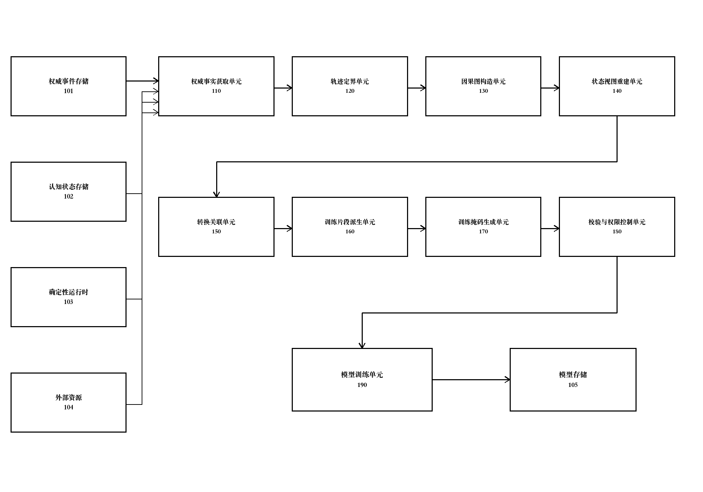
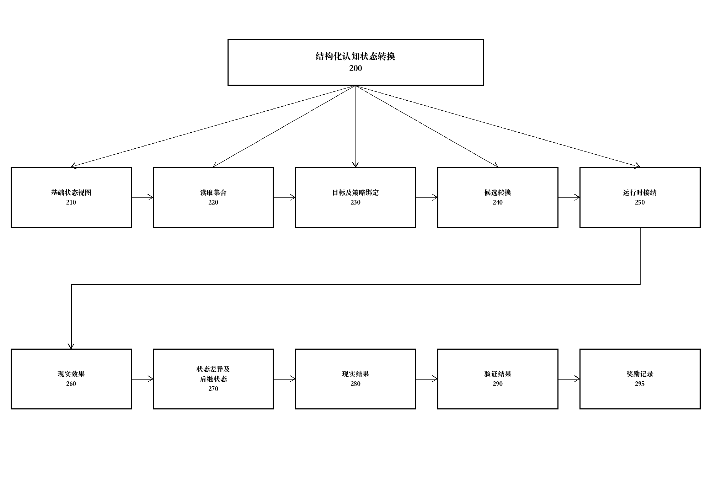
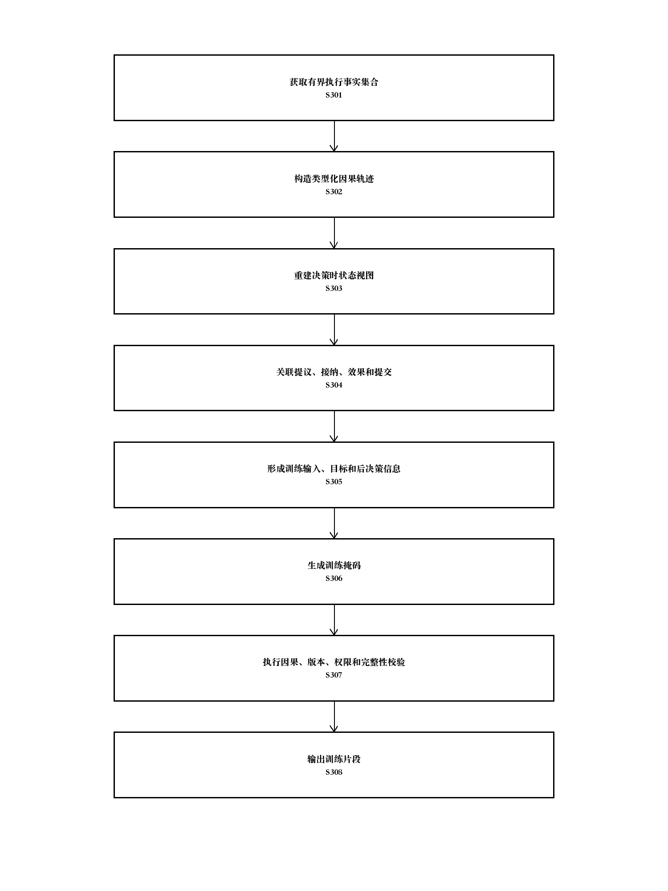
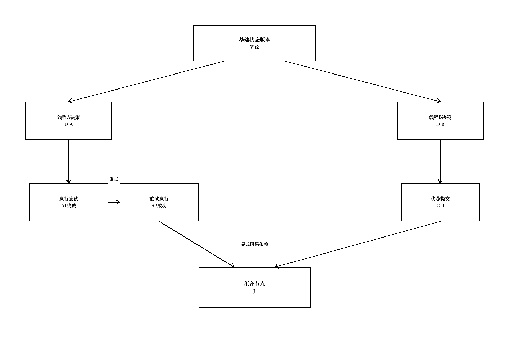
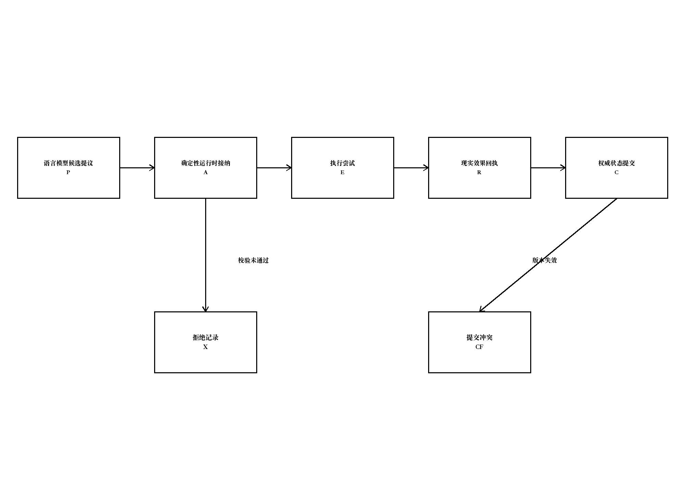
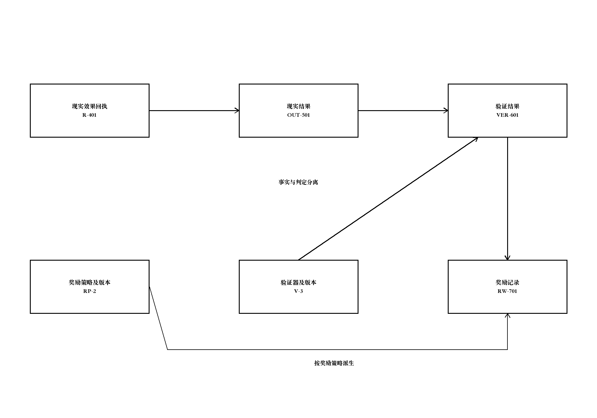
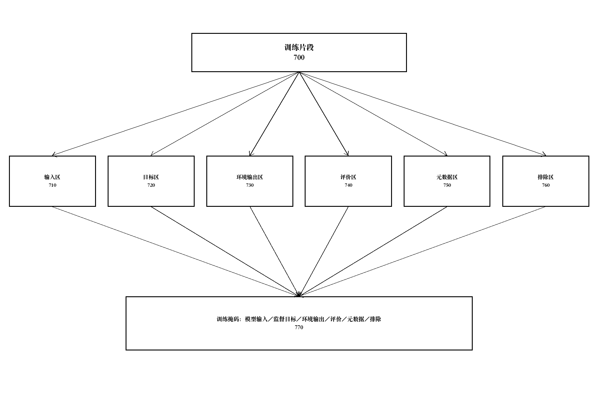
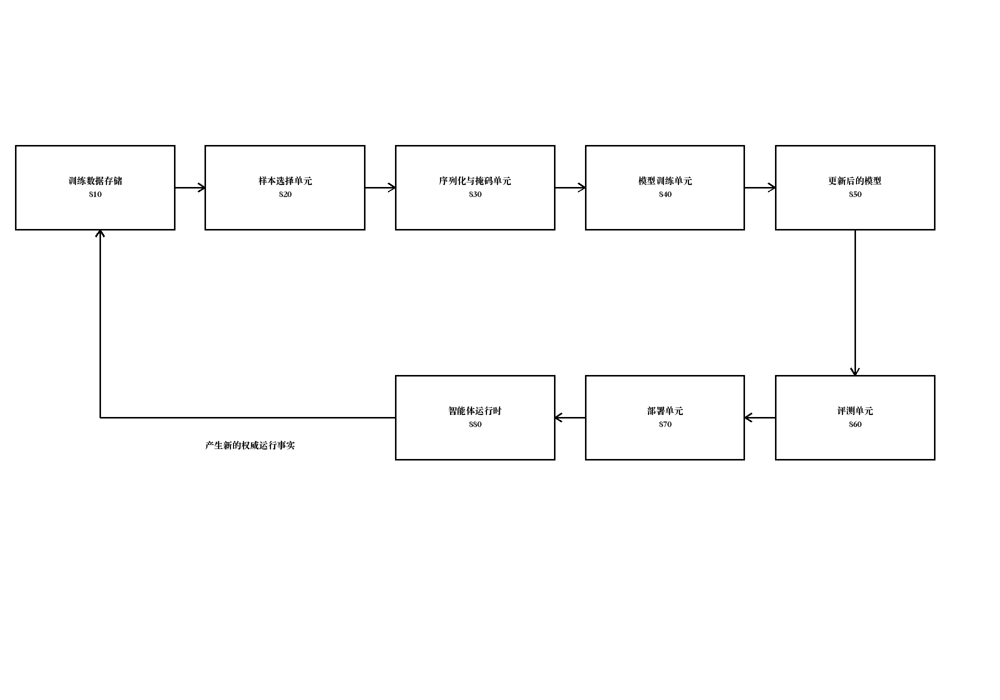

# 说明书

## 一种结构化认知状态转换数据构造及模型训练方法及系统

## 技术领域

[0001] 本发明涉及人工智能、计算机软件运行时、机器学习数据处理及模型训练技术领域，尤其涉及一种结构化认知状态转换数据构造及模型训练方法、系统、电子设备、计算机可读存储介质及计算机程序产品。

## 背景技术

[0002] 基于语言模型的智能体系统通常将对话消息、提示词、工具调用参数及工具返回结果顺序记录为消息历史或者执行轨迹，并利用所述消息历史或者执行轨迹构造监督微调、偏好学习或者强化学习所需的训练样本。

[0003] 上述方式主要以文本消息、调用跨度或者时间顺序作为数据组织单位，难以准确表示智能体在作出某一判断或者动作时实际可见的认知状态、读取的对象及版本、适用的目标和策略约束，以及该判断或者动作对权威状态产生的具体变化。

[0004] 在语言模型生成候选内容、确定性运行时进行校验并执行现实副作用的系统中，模型提出的候选动作、运行时接纳的执行任务、外部资源实际发生的效果以及最终提交的权威状态可能彼此不同。若将这些对象合并为单一工具调用记录，训练过程可能把未被接纳的提议错误地视为已执行事实，或者把失败、冲突及重试路径错误地标注为成功动作。

[0005] 现有轨迹还容易把动作发生后才获得的观察、状态差异、验证结论或者奖励值混入模型决策时的输入，从而造成目标泄漏或者后见信息泄漏。由此得到的模型可能在离线训练指标上表现良好，但在实际运行时无法仅依据决策时可见信息作出相同判断。

[0006] 对于跨会话、多线程、并发提交、失败恢复及重试执行场景，事件的时间戳顺序不等同于因果顺序。仅按照时间排列数据难以区分同一动作的不同尝试、不同线程读取的状态版本、汇合点依赖以及延迟到达的现实结果，进而导致训练目标与其真实原因错误关联。

[0007] 此外，现实执行结果、验证器输出和奖励信号分别对应环境事实、规则判定和训练策略。若三者未被分离保存并进行版本化，后续改变验证规则或者奖励策略时，原始现实证据可能被覆盖；若缺少数据来源、使用权限、脱敏记录和完整性校验，执行轨迹也难以安全、可重复地用于模型训练。

## 发明内容

[0008] 本发明旨在解决至少以下技术问题之一：现有智能体训练数据不能准确重建模型决策时可见的结构化认知状态；候选提议、运行时接纳、现实效果和权威提交相互混淆；后决策信息进入训练输入造成信息泄漏；并发、重试及恢复过程中的因果关系和状态版本难以保持；以及现实证据、验证结论、奖励和数据使用权限缺乏可追溯边界。

[0009] 为解决上述技术问题，本发明提供一种由计算机系统执行的结构化认知状态转换数据构造方法。所述计算机系统从权威事件存储或者与权威事件存储对应的执行记录中，获取与目标认知决策相关的有界执行事实集合；基于稳定标识、状态版本和因果关系构造类型化因果轨迹；从所述类型化因果轨迹重建决策时状态视图和候选认知状态转换；按照训练字段角色形成训练掩码；并在通过因果、版本、权限及完整性校验后输出训练片段。

[0010] 所述有界执行事实集合至少包括决策时状态事实和候选认知状态转换事实，并且还能够包括运行时接纳事实、现实效果事实、后续观察事实、状态提交事实、现实结果事实、验证事实和奖励事实中的至少一种。所述有界执行事实集合能够根据目标决策标识、目标状态转换标识、目标线程标识、目标任务标识或者目标现实结果标识确定。

[0011] 所述决策时状态事实用于重建语言模型在产生候选认知状态转换时允许读取的结构化认知状态，包括状态对象的稳定标识、对象类型、对象版本、对象内容或者内容摘要、对象之间的关系、读取集合、权限投影、目标绑定、线程绑定、策略绑定以及观察绑定中的至少一种。

[0012] 所述候选认知状态转换包括上下文事务、认知帧形成操作、认知帧修订操作、认知帧激活操作、结构化程序、工具调用计划、现实动作、对象关系变更、变量绑定变更或者其组合。所述候选认知状态转换包含其来源决策、基础状态版本、读取集合、写入集合、前置条件或者预期结果中的至少一种。

[0013] 所述计算机系统为不同执行事实分配或者保留稳定事实标识，并使用显式因果边连接具有依赖关系的执行事实，以构造类型化因果图。所述显式因果边包括派生自、读取自、提议、接纳、执行、产生、验证、奖励、提交、拒绝、重试、恢复、分支或者汇合关系中的至少一种，从而使因果关系不依赖于单纯的时间戳顺序。

[0014] 所述计算机系统在所述类型化因果轨迹中区分候选提议、由确定性运行时形成的接纳记录、现实效果和权威状态提交。语言模型生成候选认知状态转换不表示该候选认知状态转换已经生效；仅当所述确定性运行时完成相应校验和提交条件时，所述候选认知状态转换才被标记为已接纳或者已提交；外部资源返回的效果回执作为现实效果事实独立保存。

[0015] 所述计算机系统根据目标决策发生时的状态版本和读取集合形成决策时状态视图。对于在目标决策之后生成或者对目标决策不可见的字段，所述计算机系统将其从模型输入中排除；对于因权限、脱敏或者采集缺失而不可用的字段，分别标记为无权限、已脱敏或者未知，而不将所述字段统一表示为空值。

[0016] 所述计算机系统从所述类型化因果轨迹派生训练片段。所述训练片段包括训练输入和训练目标，其中训练输入至少包括所述决策时状态视图，训练目标至少包括所述候选认知状态转换或者经所述确定性运行时接纳的认知状态转换；动作发生后的观察、现实效果、状态差异、现实结果、验证结果及奖励记录作为环境输出、评价信息或者元数据保存，并被排除在对应目标决策的模型输入之外。

[0017] 所述计算机系统为训练片段中的字段设置训练掩码。训练掩码至少将字段区分为模型输入字段、监督目标字段和不计入对应预测损失的字段；所述不计入对应预测损失的字段还能够被区分为环境输出字段、评价字段、元数据字段和排除字段。

[0018] 现实结果用于记录环境或者确定性运行时所确认的事实；验证结果用于记录指定版本验证器对所述现实结果、状态差异或者候选转换的判定；奖励记录用于根据现实结果和验证结果中的至少一种按照指定版本的奖励策略生成训练信号。所述现实结果、验证结果和奖励记录分别保存并通过引用建立关联。

[0019] 在候选认知状态转换被拒绝、发生版本冲突、权限校验失败、现实执行失败或者提交失败时，所述计算机系统保留候选提议和拒绝原因，并能够将其构造为负训练样本、偏好对比样本或者重新求值样本，而不把所述候选提议标记为已经发生的权威事实。

[0020] 所述计算机系统对有界执行事实集合和训练片段执行校验。校验内容包括稳定标识唯一性、引用闭合性、因果无环性或者受控循环展开、状态版本一致性、读取集合与状态视图一致性、提议和效果边界、训练输入可见性、训练掩码完整性、数据使用权限、脱敏规则以及内容摘要或者数字签名中的至少一种。

[0021] 训练片段能够绑定产生该片段的语言模型标识、模型版本、提示或者求值协议版本、确定性运行时版本、策略版本、工具或者执行环境版本、智能体标识、会话标识、线程标识和任务标识中的至少一种，以支持数据复现、模型比较和问题追溯。

[0022] 本发明还提供一种模型训练方法，包括：获取采用上述方法构造的训练片段；根据训练掩码序列化模型输入和训练目标；将模型输入提供给待训练语言模型；基于待训练语言模型的预测结果与训练目标计算监督损失、偏好损失、价值损失、策略损失或者其组合；以及根据所述损失更新待训练语言模型的模型参数或者参数高效适配参数。

[0023] 在模型训练过程中，能够根据现实结果、验证结果和奖励记录选择正样本、负样本、困难样本或者偏好样本；能够针对结构化认知状态遵循、认知帧形成、认知帧修订、认知帧激活、上下文事务生成、程序生成、现实动作选择及运行时反馈后的重新求值中的至少一种任务更新模型。

[0024] 本发明还提供一种结构化认知状态转换数据构造及模型训练系统，包括权威事实获取单元、轨迹定界单元、因果图构造单元、状态视图重建单元、转换关联单元、训练片段派生单元、训练掩码生成单元、校验与权限控制单元以及模型训练单元。各单元能够部署在同一电子设备，也能够分布在执行环境、数据处理环境和训练环境中。

[0025] 本发明还提供一种电子设备，包括存储器、一个或多个处理器以及存储在所述存储器中并能够在所述一个或多个处理器上运行的计算机程序，所述处理器执行所述计算机程序时实现上述数据构造方法或者模型训练方法。本发明还提供存储有所述计算机程序或者计算机指令的计算机可读存储介质以及包括所述计算机程序或者计算机指令的计算机程序产品。

[0026] 与仅将消息或者调用跨度顺序拼接为训练数据的方式相比，本发明根据状态版本和读取集合重建决策时状态视图，使模型输入对应于作出目标决策时真实可见的信息，能够降低后决策观察、最终答案或者高权限信息进入训练输入所造成的信息泄漏。

[0027] 本发明分离候选提议、运行时接纳、现实效果和权威提交，能够避免把未执行、被拒绝或者提交冲突的候选内容错误标记为已生效事实，并能够从拒绝和冲突路径形成具有明确原因的负样本或者重新求值样本。

[0028] 本发明使用稳定标识、显式因果边和状态版本组织多线程、重试及恢复数据，使训练目标能够与其真实读取状态、执行尝试和现实结果关联，而不依赖可能交错或者延迟的时间戳顺序。

[0029] 本发明将现实结果、验证结果和奖励记录分别保存并进行版本化，在更新验证规则或者奖励策略时能够复用原始现实证据，减少因奖励覆盖事实而造成的数据不可追溯和训练信号漂移。

[0030] 本发明通过训练掩码、权限声明、脱敏记录和完整性校验，使结构化认知轨迹能够以可验证、可复现且符合使用范围的形式进入监督微调、偏好学习或者强化学习流程，并使模型学习认知状态的形成、维护、修订和求值，而不限于预测后续自然语言文本。

## 附图说明

[0031] 图1为本发明一实施方式中结构化认知状态转换数据构造及模型训练系统的总体结构示意图。

[0032] 图2为本发明一实施方式中结构化认知状态转换及其关联执行事实的组成示意图。

[0033] 图3为本发明一实施方式中训练数据构造方法的流程示意图。

[0034] 图4为本发明一实施方式中包含并发、重试和汇合关系的类型化因果轨迹示意图。

[0035] 图5为本发明一实施方式中候选提议、运行时接纳、现实效果和权威提交的边界示意图。

[0036] 图6为本发明一实施方式中现实结果、验证结果和奖励记录的分离及关联示意图。

[0037] 图7为本发明一实施方式中训练片段及训练掩码的结构示意图。

[0038] 图8为本发明一实施方式中模型训练及部署反馈流程示意图。

## 具体实施方式

[0039] 以下结合附图和具体实施方式对本发明作进一步说明。应当理解，所描述的实施方式仅用于解释本发明，而不用于限定本发明的保护范围。在不冲突的情况下，不同实施方式中的技术特征能够相互组合。

[0040] 本发明所称结构化认知状态，是指由可寻址认知对象及对象之间的关系构成、能够被计算机系统读取、投影、版本化和修改的状态。认知对象可以包括认知帧、观察对象、目标对象、策略对象、任务对象、工具对象、关系对象、变量绑定、程序表达、上下文事务和状态版本信息中的至少一种。

[0041] 本发明所称认知状态转换，是指以一个或者多个结构化认知状态为基础，对认知对象、对象关系、变量绑定、程序表达或者现实动作作出新增、修改、替换、激活、退役、提交或者执行的候选变化。认知状态转换既可以由语言模型生成，也可以由规则、人工操作或者其他计算组件生成。

[0042] 本发明所称权威事实，是指由被授权组件以可追溯方式记录并用于确认系统状态或者现实执行情况的事实。权威组件可以包括事件存储、状态存储、事务管理器、确定性运行时、工具执行器、外部资源适配器和验证器中的至少一种。语言模型输出在被权威组件接纳前属于候选提议，而非权威事实。

[0043] 本发明所称状态视图，是指特定决策主体在特定决策时刻依照状态版本、读取集合和权限投影能够获得的结构化认知状态表示。状态视图可以是全量状态的子图、对象集合、递归项数据结构、对象树、图结构、抽象语法树、键值结构或者其序列化结果。

[0044] 本发明所称训练片段，是指由有界执行事实集合派生、具有明确输入字段、目标字段、排除字段及来源引用的数据单元。一个执行轨迹能够派生多个训练片段；不同训练片段能够针对不同目标决策、不同认知任务或者不同训练方式设置不同训练掩码。

[0045] 本发明所称训练掩码，是指为训练片段中的字段指定训练角色及损失参与方式的信息。训练掩码不以二值掩码为限，也能够采用字段角色表、路径规则、张量掩码、类型标记或者序列位置范围进行表示。

[0046] 本发明所称现实结果是对环境状态、现实副作用或者任务完成情况的事实性记录；验证结果是验证器根据指定规则版本对所述现实结果或者状态变化作出的判定；奖励记录是训练策略根据所述现实结果和验证结果中的至少一种计算出的训练信号。三者在逻辑上相互关联但不相互替代。

[0047] 本发明所称决策时可见，是指字段在目标决策产生之前已经存在，并且依据该目标决策适用的权限、状态版本和读取范围能够被决策主体获得。字段仅仅具有更早的物理写入时间并不必然表示其对目标决策可见，系统还能够校验事务提交状态、因果前驱和授权范围。

[0048] 稳定标识用于跨导出、重放和训练过程定位同一事实、状态对象、决策、执行尝试或者训练片段。局部序号能够用于单个文件内展示，但在因果校验和跨文件关联时被解析为稳定标识及相应版本。

[0049] 在本发明中，语言模型包括能够基于输入生成文本、结构化数据、程序表达、对象关系、状态转换或者动作提议的神经网络模型。模型训练包括全参数训练、持续预训练、监督微调、偏好优化、强化学习、蒸馏、参数高效适配或者其组合。

[0050] 如图1所示，系统100包括权威事实获取单元110、轨迹定界单元120、因果图构造单元130、状态视图重建单元140、转换关联单元150、训练片段派生单元160、训练掩码生成单元170、校验与权限控制单元180以及模型训练单元190。系统100能够连接权威事件存储101、结构化认知状态存储102、确定性运行时103、外部资源104和模型存储105。

[0051] 权威事实获取单元110从权威事件存储101读取追加式事件，或者从状态存储、运行时日志、工具回执和验证记录中获取能够映射为权威事实的记录。每一事实至少具有事实类型和稳定事实标识，并能够包括来源组件、产生主体、接收主体、时间信息、因果前驱、内容摘要和签名信息。

[0052] 轨迹定界单元120以目标决策D-001为种子，沿显式因果边向前查找其状态读取、目标、策略和观察前驱，并沿显式因果边向后查找其接纳、执行、效果、提交、现实结果、验证结果和奖励记录后继，从而获得有界执行事实集合。定界条件能够包括任务结束、状态提交、最大因果深度、指定时间窗或者指定事实类型。

[0053] 为防止把无关并发事件混入训练片段，轨迹定界单元120优先依据稳定标识和因果边选取事实；时间范围仅用于限制检索规模或者处理缺失关联的降级场景。当显式因果边缺失时，系统能够将相应事实标记为关联不确定，并按照策略拒绝生成训练片段或者降低其训练权重。

[0054] 因果图构造单元130将获取的事实转换为类型化节点，并根据事实中的前驱引用、状态版本、事务标识、执行尝试标识和结果引用建立有向边。对于重试执行，不同执行尝试具有不同稳定标识，并共同引用原始候选提议；对于线程汇合，汇合节点显式引用各分支的完成或者状态提交节点。

[0055] 如图2所示，结构化认知状态转换200包括基础状态视图210、读取集合220、目标及策略绑定230、候选转换240、运行时接纳250、现实效果260、状态差异及后继状态270、现实结果280、验证结果290和奖励记录295。上述对象能够分布在多个事实中，并通过稳定引用和版本信息形成闭合关联。

[0056] 基础状态视图210能够包含对象O-101的版本7、对象O-102的版本3和观察对象OBS-201。读取集合220明确候选转换240实际读取或者被允许读取的对象及版本。若候选转换240声明基于对象O-101的版本7，但执行时权威状态已经变为版本8，运行时接纳250能够记录版本冲突并拒绝提交。

[0057] 转换关联单元150将同一认知状态转换在不同阶段产生的事实关联起来。候选提议使用proposal-id，接纳记录使用admission-id，执行尝试使用attempt-id，效果回执使用receipt-id，状态提交使用commit-id；各标识能够不同，但通过类型化因果边闭合到同一转换链。

[0058] 校验与权限控制单元180能够在导出前、训练片段派生前和训练开始前分别执行校验。多阶段校验允许权威事实保持原始形态，同时使不同训练任务按照各自的输入范围、使用权限和脱敏规则派生不同训练片段。

[0059] 如图3所示，在步骤S301中，获取与目标认知决策相关的有界执行事实集合；在步骤S302中，基于稳定标识和显式因果边构造类型化因果轨迹；在步骤S303中，根据状态版本、读取集合和权限投影重建决策时状态视图；在步骤S304中，关联候选转换、接纳、现实效果和权威提交；在步骤S305中，形成训练输入、训练目标和后决策信息；在步骤S306中，生成训练掩码；在步骤S307中，执行因果、版本、权限和完整性校验；在步骤S308中，输出训练片段。

[0060] 在一实施方式中，有界执行事实集合采用递归对象结构或者图结构序列化。以下为一个训练片段的示意性字段结构，其中字段名称不构成对具体序列化格式的限定：

```text
(training-episode
  (decision D-001)
  (state-view (object O-101 7) (object O-102 3))
  (read-set (O-101 7) (O-102 3))
  (target (context-tx TX-301))
  (post-decision (receipt R-401) (outcome OUT-501)
                 (verification VER-601) (reward RW-701))
  (mask (state-view model-input)
        (target supervised-target)
        (post-decision environment-output excluded)))
```

[0061] 状态视图重建单元140不直接采用轨迹结束时的最新状态，而是根据目标决策D-001的基础状态版本、读取集合和权限投影读取对象。当对象在目标决策之后被修改时，状态视图重建单元140读取历史版本或者根据事件重放恢复对应版本。

[0062] 若某一对象虽然在目标决策之前存在，但未被目标决策的权限投影允许读取，所述对象不进入模型输入。若训练任务要求模型判断是否请求访问该对象，系统能够保留对象存在但无权访问的元数据，同时隐藏其具体内容。

[0063] 如图4所示，线程A和线程B能够从同一状态版本分别产生决策D-A和D-B。线程A的第一次执行尝试A1失败后产生重试A2，线程B产生提交C-B；汇合节点J显式依赖A2的结果和C-B。针对D-A生成训练片段时，D-B后产生的内容不因时间相近而自动进入D-A的输入。

[0064] 如图5所示，语言模型产生候选提议P，确定性运行时对P执行结构、权限、前置条件和版本校验并形成接纳记录A。仅在接纳后，执行器生成执行尝试E并从外部资源获得效果回执R；状态管理器再根据R和当前版本形成提交C或者拒绝记录X。训练目标能够选择P、A所接纳的规范化转换或者C对应的已提交转换，但必须记录所选目标的来源类型。

[0065] 当模型输出经规范化、补全默认值或者降低权限后才被运行时接纳时，系统同时保留原始提议和接纳后的规范化转换。监督训练能够将规范化转换作为目标，偏好训练能够将规范化转换与原始提议组成偏好对，并使用接纳原因作为评价元数据。

[0066] 如图6所示，效果回执R-401用于证明外部资源返回的现实信息；现实结果OUT-501根据一个或者多个回执及状态事实形成；验证结果VER-601引用现实结果OUT-501和验证器版本；奖励记录RW-701引用验证结果VER-601和奖励策略版本。改变奖励策略时能够生成新的奖励记录而不修改效果回执、现实结果或者原验证结果。

[0067] 如图7所示，训练片段700包括输入区710、目标区720、环境输出区730、评价区740、元数据区750和排除区760。训练掩码770为各区或者各字段指定角色。序列化器按照训练协议把输入区710和目标区720转换为模型可接受的文本、令牌、张量、图序列或者递归表达，并确保环境输出区730、评价区740和排除区760不出现在对应目标预测之前。

[0068] 在一实施方式中，部署智能体需要依据项目状态、部署约束和测试证据生成是否允许部署的结构化判断。目标决策D-DEPLOY的基础上下文版本为42，读取集合包括项目状态对象project-state的版本12、部署约束对象deployment-constraint的版本5以及测试观察对象test-report的版本8。

[0069] 状态视图重建单元140根据读取集合和权限投影形成状态视图SV-42。状态视图SV-42只包含决策时已提交的对象内容及来源引用，不包含随后生成的部署执行结果、验证结果和奖励记录。

[0070] 语言模型根据状态视图SV-42生成候选上下文事务TX-43-P，候选事务拟新增结构化部署判断对象deployment-judgment，并将其值设为preflight-failed，同时引用test-report作为证据。该候选事务声明基础上下文版本42、读取集合以及拟写入对象。

[0071] 确定性运行时验证TX-43-P的结构、对象引用、权限和基础版本。在一种路径中，验证通过并生成接纳记录AD-43，随后将事务提交为上下文版本43；在另一种路径中，若project-state已经被并发事务更新为版本13，则生成版本冲突记录CF-43，不提交候选事务。

[0072] 对于提交成功路径，训练片段派生单元160能够将SV-42作为模型输入，将接纳并提交的上下文事务作为监督目标，将上下文版本43、后续部署结果、验证结果和奖励记录标记为后决策信息。即使后续结果证明部署判断正确，所述正确性信息也不进入D-DEPLOY对应的模型输入。

[0073] 对于版本冲突路径，系统保留原始候选事务TX-43-P和冲突原因CF-43。能够形成重新求值训练片段：模型输入包括更新后的状态视图SV-43以及冲突观察，训练目标为基于新版本生成的修订事务；也能够形成偏好样本，使正确处理新版本的事务优于继续引用旧版本的事务。

[0074] 在训练片段写出前，校验与权限控制单元180验证SV-42中的对象版本与读取集合一致、TX-43-P的来源决策为D-DEPLOY、接纳记录与提交记录具有完整因果链、后决策字段均被训练掩码排除，并验证训练使用权限为允许状态。

[0075] 系统对通过校验的训练片段执行规范化序列化，并计算内容摘要episode-digest。相同权威事实、相同导出规则版本和相同训练掩码应当得到相同摘要；若对象内容、因果关系、权限声明或者掩码发生变化，则生成不同摘要或者校验失败。

[0076] 上述实施例中的对象名称、版本号和判断值仅用于说明。训练数据能够来源于软件开发、机器人控制、运维、科研、客户服务或者其他由智能体维护结构化认知状态并执行现实任务的场景。

[0077] 如图8所示，训练数据存储810保存通过校验的训练片段，样本选择单元820按照任务类型、现实结果、验证结果、难度、来源分布和权限选择训练批次，序列化与掩码单元830构造模型输入和训练目标，模型训练单元840计算损失并更新模型850，评测单元860对更新后的模型执行离线或者受控运行时评测，部署单元870将满足部署条件的模型版本提供给智能体运行时880，运行时产生的新权威事实能够再次进入数据构造流程。

[0078] 在监督微调实施方式中，序列化与掩码单元830把决策时状态视图、目标及策略绑定和当前观察作为输入，把接纳的上下文事务、认知帧、结构化程序或者现实动作作为目标。损失仅计算于目标字段对应的令牌或者结构节点，不计算环境输出、验证结果、奖励记录和来源元数据。

[0079] 在偏好学习实施方式中，系统从同一或者等价状态视图下的多个候选转换中构造偏好对。被运行时接纳并经指定验证器确认的候选转换能够作为优选样本；因结构错误、权限错误、陈旧版本、无效引用或者现实执行失败被拒绝的候选转换能够作为非优选样本。偏好关系及其依据分别保存。

[0080] 在强化学习实施方式中，奖励记录能够作为回报信号，状态视图作为状态表示，候选认知状态转换作为动作表示。对于延迟现实结果，系统通过显式因果路径将所述现实结果和验证结果关联到一个或者多个先前决策，并按照奖励策略分配回报；未被因果路径覆盖的并发决策不接收所述回报。

[0081] 在认知帧形成任务中，模型依据观察、目标和已有对象生成新的认知帧；在认知帧修订任务中，模型依据新观察和旧认知帧生成替换、退役或者保留操作；在认知帧激活任务中，模型从允许访问的认知帧中选择与当前目标相关的帧。不同任务能够使用同一轨迹派生不同训练片段和训练掩码。

[0082] 待训练语言模型能够采用参数高效适配方式更新。系统冻结基础模型参数并仅更新低秩适配参数、前缀参数或者其他附加参数；也能够更新全部模型参数。训练配置记录所使用的基础模型摘要、分词器版本、序列化协议版本、数据集摘要和随机性配置，以支持复现。

[0083] 在一种具体的监督微调实施方式中，待训练语言模型采用仅解码器式Transformer结构，包括令牌嵌入模块、依次连接的多层自注意力模块和前馈网络模块以及输出映射模块。训练片段按照序列化协议依次形成模型输入区和监督目标区，输入区与目标区之间设置角色边界标记；训练掩码将输入区、环境输出区、评价区、元数据区和排除区对应位置的损失权重设为零，将监督目标区对应位置的损失权重设为一，使参数更新仅依据监督目标区的预测误差进行。

[0084] 在所述监督微调实施方式的一组示例性训练配置中，采用与基础模型匹配的分词器，将最大序列长度设置为4096个令牌，将训练批次大小设置为32，将训练轮次设置为3，采用AdamW优化器并将学习率设置为0.00002；在自注意力模块的查询、键、值及输出投影矩阵上设置秩为16、缩放系数为32且丢弃率为0.05的低秩适配参数，并冻结基础模型的其余参数。训练数据按照任务稳定标识进行互斥划分，使同一任务派生的训练片段仅进入训练集、验证集或者测试集之一。上述数值用于说明可执行的训练配置，能够根据基础模型规模、计算资源和应用场景进行调整。

[0085] 训练过程能够设置防泄漏校验，例如在输入序列中搜索目标对象摘要、结果字段路径或者决策后才出现的稳定标识；能够构造时间切分、任务切分、主体切分或者状态对象切分的数据集，以降低同一轨迹或者同一对象同时进入训练集和评测集所造成的数据重叠。

[0086] 模型评测能够包括状态更新合法率、陈旧版本引用率、权限越界率、因果引用闭合率、认知帧修订正确性、运行时接纳率、现实任务完成情况以及在未见任务上的迁移情况中的至少一种。所述指标用于比较模型版本或者训练数据构造方式，不要求在专利实施时预先达到固定数值。

[0087] 本实施方式描述的是可由计算机执行的训练流程及数据约束。具体模型规模、训练批次、优化器、学习率、训练轮次和评价任务能够根据计算资源与应用场景确定，而不影响结构化认知状态转换、决策时状态视图、训练掩码及权威结果关联的技术组合。

[0088] 在多线程场景中，每一决策和状态转换绑定线程标识及基础状态版本。因果图允许不同线程并行读取互不冲突的对象，也允许在汇合节点合并结果。若不同线程写入同一对象或者读取基础版本失效，运行时生成冲突事实，数据构造系统据此区分成功提交、重试和放弃路径。

[0089] 在进程中断或者跨会话恢复场景中，系统根据稳定标识、未完成执行尝试、状态版本和继续信息恢复轨迹关联。恢复后产生的新执行尝试引用原尝试或者原候选提议，避免被误认为与先前决策无关的新样本。

[0090] 对于没有最终结果的截断轨迹，系统能够仅输出用于状态理解或者下一步提议的训练片段，也能够标记为未完成并排除于需要结果监督的训练任务。系统不把缺少结果自动解释为失败或者成功。

[0091] 权限声明能够指定数据是否允许用于训练、允许的模型或者组织范围、允许的训练任务、有效期、地域和再分发限制。仅当训练片段涉及的必要事实均满足适用权限时，校验与权限控制单元180才允许所述训练片段进入相应训练数据集。

[0092] 脱敏处理能够在保留因果结构和类型信息的同时替换或者删除个人信息、客户数据、凭据、源代码片段或者其他受限制内容。脱敏后的字段携带脱敏原因、处理规则版本和原内容摘要的受控引用，以便验证同一原始事实是否被重复导出，而无需暴露原内容。

[0093] 完整性信息能够包括单个事实摘要、训练片段摘要、事实集合的树形摘要、数字签名或者可信时间戳。训练开始前，系统验证训练片段引用的事实、掩码和权限声明未被未授权修改。

[0094] 若后续发现某一来源事实权限撤销、验证器存在缺陷或者奖励策略错误，系统能够根据稳定引用定位受影响的训练片段和模型训练批次，将其排除、重新派生或者标记模型版本受影响，而无需删除未受影响的权威事实。

[0095] 数据构造和模型训练能够在不同安全域中执行。数据构造环境能够只向训练环境输出经过权限投影和脱敏的训练片段；训练环境无须直接访问完整权威事件存储。内容摘要和导出清单用于验证两侧数据的一致性。

[0096] 上述结构化认知状态不以特定语法形式为限。其能够采用S表达式、对象树、图结构、抽象语法树、关系表、键值对象、协议缓冲结构或者其他能够表达类型、引用、关系和版本的结构表示或序列化。

[0097] 各单元能够由软件、硬件、固件或者其组合实现。多个单元能够合并为一个组件，一个单元也能够拆分为多个服务；只要其执行的功能及数据边界与本发明一致，均属于本发明的实施方式。

[0098] 本领域技术人员能够理解，流程步骤的编号用于说明而非限定绝对执行顺序。在保证决策时可见性、因果关系、权威边界和训练掩码语义的前提下，部分步骤能够并行、合并或者调整顺序。

[0099] 以上实施方式中的具体标识、字段名称、版本号、模型训练方式和应用场景仅为示例。本发明的保护范围以权利要求为准。

---PAGEBREAK---

# 权利要求书

1. 一种结构化认知状态转换数据构造方法，其特征在于，由计算机系统执行，所述方法包括：从权威事件存储或者与所述权威事件存储对应的执行记录中，获取与目标认知决策相关的有界执行事实集合，所述有界执行事实集合至少包括决策时状态事实和候选认知状态转换事实，所述候选认知状态转换事实记录候选提议以及所述候选提议包含的候选认知状态转换；基于所述有界执行事实集合中的稳定标识、状态版本和显式因果关系构造类型化因果轨迹，所述类型化因果轨迹对所述候选提议、由确定性运行时形成的接纳记录、现实效果和权威状态提交进行区分；根据所述目标认知决策对应的状态版本、读取集合和权限投影，从所述类型化因果轨迹重建所述候选提议产生时可见的决策时状态视图；从所述类型化因果轨迹派生训练片段，将至少所述决策时状态视图设置为训练输入，将所述候选提议包含的候选认知状态转换或者经所述确定性运行时接纳的认知状态转换设置为训练目标，并将所述目标认知决策之后产生的观察、现实效果、状态差异、现实结果、验证结果或者奖励记录设置为不进入所述训练输入的后决策信息；为所述训练片段生成训练掩码，所述训练掩码至少区分模型输入字段、监督目标字段和不计入对应预测损失的字段；以及在所述训练片段通过因果关系、状态版本、数据使用权限和完整性中的至少一种校验后输出所述训练片段。

2. 根据权利要求1所述的方法，其特征在于，获取所述有界执行事实集合包括：以目标决策标识、目标状态转换标识、目标线程标识、目标任务标识或者目标现实结果标识为种子，沿显式因果边查找与状态读取、目标、策略、观察、接纳、执行、效果、提交、现实结果、验证结果或者奖励记录相关的事实，并根据任务结束、状态提交、最大因果深度、指定时间窗或者指定事实类型确定轨迹边界。

3. 根据权利要求1所述的方法，其特征在于，所述决策时状态视图包括结构化认知对象的稳定标识、对象类型、对象版本、对象内容或者内容摘要、对象关系、读取集合、权限投影、目标绑定、线程绑定、策略绑定或者观察绑定中的至少一种；所述计算机系统读取所述目标认知决策发生时对应的历史对象版本，而不是直接使用轨迹结束时的最新对象版本。

4. 根据权利要求1所述的方法，其特征在于，所述候选认知状态转换包括上下文事务、认知帧形成操作、认知帧修订操作、认知帧激活操作、结构化程序、工具调用计划、现实动作、对象关系变更或者变量绑定变更中的至少一种，并包括基础状态版本、读取集合、写入集合、前置条件或者预期结果中的至少一种。

5. 根据权利要求1所述的方法，其特征在于，所述类型化因果轨迹分别记录候选提议标识、运行时接纳标识、执行尝试标识、现实效果回执标识和状态提交标识；语言模型生成所述候选提议不表示所述候选提议已经生效，只有经确定性运行时校验并提交后，相应状态变化才被标记为权威状态提交。

6. 根据权利要求1所述的方法，其特征在于，所述显式因果关系包括派生自、读取自、提议、接纳、执行、产生、验证、奖励、提交、拒绝、重试、恢复、分支或者汇合关系中的至少一种；对于并发线程、重试执行或者恢复执行，基于线程标识、执行尝试标识和状态版本确定因果关系，而不以时间戳顺序替代所述因果关系。

7. 根据权利要求1所述的方法，其特征在于，所述有界执行事实集合还包括现实结果、验证结果和奖励记录中的至少一种；所述现实结果用于记录环境或者确定性运行时确认的事实，所述验证结果用于记录指定版本验证器对所述现实结果、状态差异或者候选认知状态转换的判定，所述奖励记录由指定版本奖励策略根据所述现实结果和所述验证结果中的至少一种生成，且三者分别保存并通过引用关联。

8. 根据权利要求1所述的方法，其特征在于，所述训练掩码还将所述不计入对应预测损失的字段区分为环境输出字段、评价字段、元数据字段和排除字段；序列化所述训练片段时，确保动作发生后的环境输出字段、评价字段和排除字段不出现在所述训练目标对应的模型预测位置之前。

9. 根据权利要求1所述的方法，其特征在于，对于因权限、脱敏或者采集缺失而不可用的字段，分别标记为无权限、已脱敏或者未知；仅当所述训练片段涉及的必要事实满足训练使用权限时输出所述训练片段，并记录权限声明和脱敏规则版本。

10. 根据权利要求1所述的方法，其特征在于，对所述有界执行事实集合和所述训练片段进行规范化序列化并生成内容摘要、树形摘要、数字签名或者可信时间戳中的至少一种；相同权威事实、导出规则版本和训练掩码生成相同的训练片段摘要。

11. 根据权利要求1所述的方法，其特征在于，当所述候选认知状态转换被拒绝、发生状态版本冲突、权限校验失败、现实执行失败或者权威状态提交失败时，保留所述候选认知状态转换及拒绝或者失败原因，并将其构造为负训练样本、偏好对比样本或者包括更新后状态视图的重新求值样本，而不将所述候选认知状态转换标记为已经发生的权威事实。

12. 根据权利要求1所述的方法，其特征在于，一个类型化因果轨迹根据不同目标认知决策或者不同训练任务派生多个训练片段；对于缺少最终结果的截断轨迹，将其标记为未完成，并仅用于不需要结果监督的训练任务或者从相应训练数据集中排除。

13. 根据权利要求1所述的方法，其特征在于，所述训练片段绑定语言模型标识、语言模型版本、求值协议版本、确定性运行时版本、策略版本、工具版本、执行环境版本、智能体标识、会话标识、线程标识或者任务标识中的至少一种。

14. 一种模型训练方法，其特征在于，包括：获取根据权利要求1至13中任一项所述的方法构造的训练片段；根据所述训练片段的训练掩码序列化模型输入和训练目标；将所述模型输入提供给待训练语言模型，并获得所述待训练语言模型的预测结果；基于所述预测结果与所述训练目标计算监督损失、偏好损失、价值损失、策略损失或者其组合；以及根据所述损失更新所述待训练语言模型的全部模型参数或者参数高效适配参数。

15. 根据权利要求14所述的方法，其特征在于，所述训练目标包括上下文事务、认知帧、结构化程序或者现实动作中的至少一种；所述方法用于训练结构化认知状态遵循、认知帧形成、认知帧修订、认知帧激活、上下文事务生成、程序生成、现实动作选择或者接收运行时反馈后的重新求值中的至少一种能力。

16. 一种结构化认知状态转换数据构造及模型训练系统，其特征在于，包括：权威事实获取单元，用于获取与目标认知决策相关的有界执行事实集合，所述有界执行事实集合至少包括决策时状态事实和候选认知状态转换事实，所述候选认知状态转换事实记录候选提议以及所述候选提议包含的候选认知状态转换；因果图构造单元，用于基于稳定标识、状态版本和显式因果关系构造类型化因果轨迹，并区分所述候选提议、由确定性运行时形成的接纳记录、现实效果和权威状态提交；状态视图重建单元，用于根据所述目标认知决策对应的状态版本、读取集合和权限投影重建所述候选提议产生时可见的决策时状态视图；训练片段派生单元，用于将至少所述决策时状态视图设置为训练输入，将所述候选提议包含的候选认知状态转换或者经所述确定性运行时接纳的认知状态转换设置为训练目标，并将所述目标认知决策之后产生的后决策信息排除在所述训练输入之外；训练掩码生成单元，用于至少区分模型输入字段、监督目标字段和不计入对应预测损失的字段；校验与权限控制单元，用于执行因果关系、状态版本、数据使用权限和完整性中的至少一种校验；以及模型训练单元，用于使用通过所述校验的训练片段更新语言模型参数。

17. 一种电子设备，包括存储器、一个或多个处理器以及存储在所述存储器中并能够在所述一个或多个处理器上运行的计算机程序，其特征在于，所述一个或多个处理器执行所述计算机程序时实现权利要求1至15中任一项所述的方法。

18. 一种计算机可读存储介质，其上存储有计算机程序或者计算机指令，其特征在于，所述计算机程序或者计算机指令被处理器执行时实现权利要求1至15中任一项所述的方法。

19. 一种计算机程序产品，包括计算机程序或者计算机指令，其特征在于，所述计算机程序或者计算机指令被处理器执行时实现权利要求1至15中任一项所述的方法。

---PAGEBREAK---

# 说明书摘要

本发明公开一种结构化认知状态转换数据构造及模型训练方法及系统。该方法从权威执行记录获取与目标认知决策相关的有界事实，依据稳定标识、状态版本和显式因果关系构造类型化因果轨迹，并区分模型提议、运行时接纳、现实效果和权威提交；根据决策时版本、读取集合及权限投影重建状态视图，将其作为训练输入，将候选或已接纳的认知状态转换作为训练目标，将后续观察、现实效果、现实结果、验证结果和奖励记录排除在对应输入之外；生成训练掩码并完成因果、版本、权限和完整性校验。所形成的训练片段可用于监督、偏好或强化训练，使模型学习结构化认知状态的形成、维护、修订和求值。

---PAGEBREAK---

# 说明书附图
















