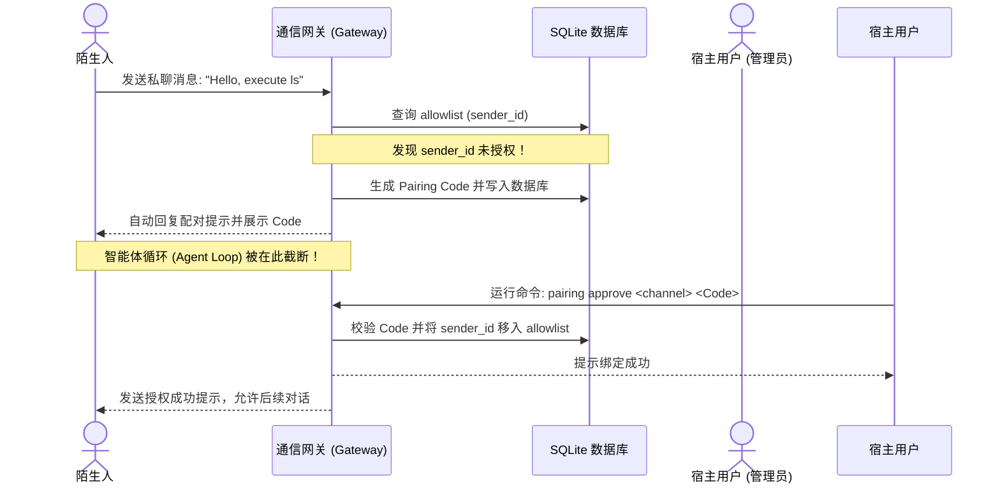

# 长连接维护与授权配对安全机制对比剖析

在多渠道智能体架构中，**“长连接的高可用性”**是保障响应实时性的物理基础，而**“授权配对安全机制”**则是防止算力被盗刷、宿主机被黑的第一道防御围栏。

本报告对 `openclaw` 与 `Hermes Agent` 在这两个核心领域的具体技术实现进行全方位对比。

---

## 1. 长连接维护（WebSocket & Polling）机制对比

为了保障会话链路不掉线，两个项目都设计了精密的网络监听、保活（Heartbeat）与自动重连机制。

### 1.1 OpenClaw：看门狗与重连风暴防范 (TS/Node)
*   **重连门禁（Reconnect Gating）**：
    在 `src/gateway/reconnect-gating.ts` 中，网关针对客户端（如桌面 Canvas、iOS/Android 节点）在短时间内的频繁重连设计了阻断门禁。一旦检测到某个 `client_id` 重连频率超过阈值，网关会通过 `ReconnectGating` 拒绝握手，防止出现**重连风暴（Reconnect Storms）**耗尽系统句柄和 CPU。
*   **客户端看门狗（Client Watchdog）**：
    在 `gateway/client.watchdog.ts` 中维护了看门狗计时器。网关会定期下发 Ping，并在收到 Pong 后重置计时器。如果在 45 秒内未收到心跳，Watchdog 会强制断开已死连接并触发 `drain`，立刻释放 session 在 Node.js 内存中的缓存，防止死连接残留导致 OOM。

### 1.2 Hermes Agent：降级状态机与异步自愈 (Python/Asyncio)
*   **路径降级机制（Send Path Degradation）**：
    Hermes 针对长连接抖动引入了一个非常有创意的**“路径降级状态机”**：
    ```python
    self._send_path_degraded: bool = False
    ```
    当与 Telegram 或 Slack 连接中断时，适配器不仅会自动尝试后台重连，还会立刻将 `_send_path_degraded` 设为 `True`。
    此时，任何出站消息的发送请求（如来自定时任务 Cron 或后台 Agent 的输出）都会被挂起（Queue Suspended），而不是报错丢弃。
*   **健康自愈检查（Self-Healing / getMe()）**：
    在重连成功后，网关并不立即恢复发送，而是首先异步发起 `getMe()` 的健康检测。只有确认 API 完全连通、无 401/403 权限失效后，才将 `_send_path_degraded` 重置为 `False`，并按顺序刷出挂起的出站队列。这在服务器网络极度恶劣时能极大保证消息的不丢失。

---

## 2. 授权配对（Pairing）安全机制对比

为防范外部不明用户的恶意注入和垃圾消息攻击，两套系统都强制推行了 DM 配对策略。

| 对比维度 | OpenClaw | Hermes Agent |
| :--- | :--- | :--- |
| **设备配对 (Node Pairing)** | **强支持**。支持 iOS/Android 节点通过 WS 连接到 Gateway 进行 pairing，获取本地工具执行授权。 | **弱支持**。更侧重于云端 serverless API 的直连和 TUI 交互。 |
| **私聊配对 (DM Pairing)** | 支持。配置 `dmPolicy="pairing"`。 | 支持。全面兼容 openclaw 的 pairing 拦截机制。 |
| **交互控制** | 依赖终端 CLI 命令或 Web 控制台。 | 支持本地 TUI 的 slash-command 自动补全确认。 |
| **凭证持久化** | 本地 SQLite 关系表 `pairing_requests`。 | `~/.hermes/` 目录下的 yaml/json 凭证池。 |

### 2.1 微信/Telegram IM 配对的防注入闭环
以 Telegram 为例，配对机制的工作过程如下：



*   **拦截强度**：配对的拦截发生在 **Connector 规整消息之后、Agent Loop 触发之前**（参见上一个报告中的 `enforceTelegramDmAccess` 走读）。这能够彻底防止攻击者通过复杂的精心构造文本（提示词注入）让 Agent 误以为已经配对，保证了 Agent 的安全性。

### 2.2 多终端设备配对（Device Pairing）
这是 openclaw 独有的闪光点：
*   **场景**：您可以在局域网或内网中，把安卓手机和 iPad 挂载成 openclaw 的“执行节点”（Node）。这些节点可以贡献自己独特的工具（例如调用手机的摄像头、震动、通知推送等）。
*   **实现**：设备配对利用 `node-pairing-auto-approve.ts` 和 `device-auth.ts`。设备在首次连接网关的 WebSocket 时，会交换非对称加密密钥（RSA/ECDSA），生成一个 device token 并锁定，防止局域网内其他恶意设备伪造节点劫持 Agent。
