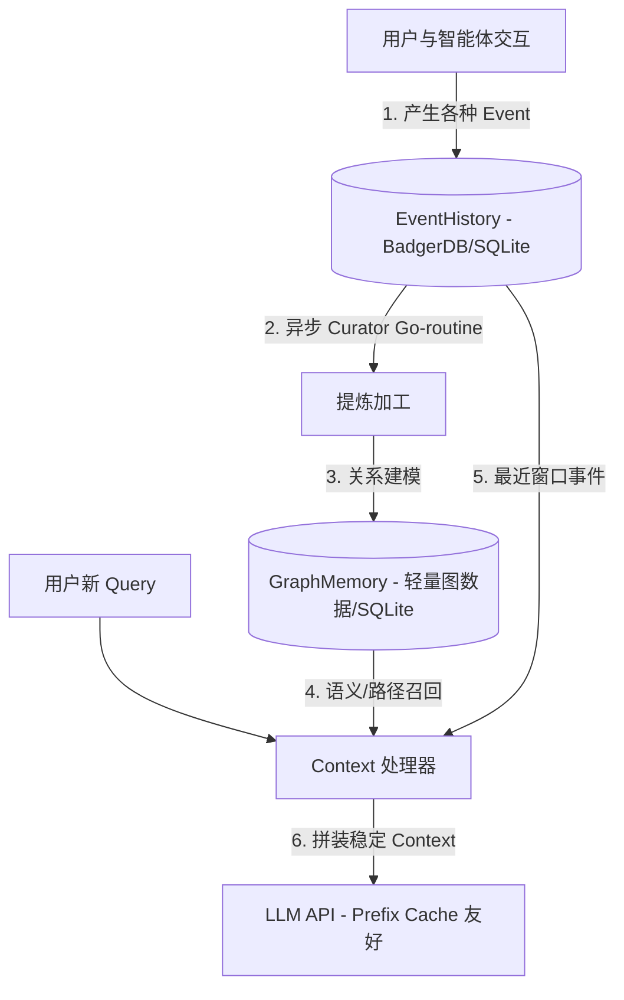

# openclaw & Hermes 记忆系统 (Memory System) 源码深度剖析

> [!WARNING]
> 本文的三层自动召回与 Context 装配部分是早期研究结论，不再代表 Morphz 主链路。当前方向见 [Agent-Owned Context](./morphz_agent_owned_context_design.md)：检索只能提供显式 Recall 或候选 Inbox，不能替 Agent 决定 Mind 内容。

本报告深度剖析智能体（Agent）如何维护长期记忆、执行语义召回，并解答关于“记忆泄露防护”与“Prefix Cache 缓存稳定”的核心设计疑问。最后，我们将结合您的 **EventHistory ➔ GraphMemory ➔ Context 三层记忆系统构想**，为 `Morphz` 梳理具体的落地实现方案。

---

## 1. 记忆安全隐患：如何从源头避免泄露给前端？

在分析 Hermes 时，源码中实现了一个精妙的流式状态机 `StreamingContextScrubber`，用来在打字机流（Streaming）中实时剔除 `<memory-context>` 等私有标签及被召回的记忆内容。

### 1.1 为什么召回的记忆会存在暴露给前端的风险？
您的质疑非常准确：**“召回的上下文是提交给 LLM 的，为什么会有泄露给前端的风险？源头上不就已经避免了吗？”** 

从高内聚、低耦合的架构设计来看，被召回的记忆应当在**后端的 Prompt 构造层**就被吞掉，绝不应该流入**前端流式输出（Chat Streaming）信道**。然而，实际开发中之所以需要兜底状态机，主要由于以下两个原因：

1.  **物理通道混杂的遗留设计（如 OpenClaw）**：
    *   在 OpenClaw 等一些早期框架的设计中，为了方便调试或统一排队，将“LLM 的思考流 (Thought)”、“调用工具的过程 (Tool execution traces)”以及“最终给用户的回复 (Chat Output)”全部合流在同一个 Socket Stream 中发送。
    *   如果流式推送没有在后端做物理链路级的强解耦，那么流里夹带的记忆隐私元数据，确实需要通过前端或流代理处的正则/状态机（如 `stripBlockTags`）来做清洗。
2.  **大模型的“复读与幻觉泄露”（LLM Echoing）**：
    *   被召回的记忆通常会被拼接在 Prompt 的某处提供给 LLM。如果大模型在生成回答时受到了该 Context 的强烈注意力干扰，有概率在输出中无意“带出”或“复述”这些私有格式（例如大模型吐出：“*根据您记忆里提到的 `<memory-context> 用户不喜欢喝茶 </memory-context>`，我为您推荐咖啡……*”）。
    *   此时，即便后端将 LLM Output 直接投递给前端，也会导致这些私有标签“穿透”并破坏前端 Markdown 渲染。

> [!TIP]
> ### 🏆 Morphz 的源头防御设计建议
> *   **物理信道强隔离**：在 Morphz 引擎中，应当将 `ChatResponseStream` 与 `InternalTraceStream`（包含 tool calls, recalled context）在底层彻底划分为两条不同的信道。**流向前端的打字机流，从物理上绝不经手任何记忆召回数据**。
> *   **Scrubber 仅作安全兜底**：仅在 LLM 输出可能意外复述私有控制标签（如 `<memory-context>`）时，作为最后一道防线进行实时清洗截断，避免破坏前端 UI 排版。

---

## 2. 缓存守护：记忆究竟该不该放到 System Prompt 中？

在很多早期的 Agent 实践（包括 openclaw 的静态加载 `MEMORY.md` 逻辑）中，开发者习惯性地把长期记忆和用户画像作为 Prompt 拼接在 `System Prompt` 之中。

### 2.1 为什么早期的框架喜欢塞入 System Prompt？
早期开发者将 System Prompt 视作智能体的“全局规则区”。他们认为，类似于“用户喜欢什么”、“过往任务的总结说明”这类“长期规则”，其逻辑效力与 System Prompt 类似，都应该放在最顶层来约束大模型的“人格与偏好”。

### 2.2 这样做有什么严重弊端？
这会彻底击穿云端 API（如 Anthropic Claude 3.5 / DeepSeek）的 **Prefix Cache（前缀缓存）** 机制。
*   **缓存击穿**：云端大模型的 Prefix Cache 要求 Prompt 的**前缀字符级完全一致**。如果记忆被塞进 System Prompt，只要 LLM 在会话中途触发了 memory 写入（哪怕只修改了一个字符），就会导致下一轮的 System Prompt 彻底改变。
*   **后果**：这会导致整段 Prompt 的缓存全部脱靶（Miss），不仅造成响应时延（TTFT）飙升，还会产生高昂的重复 token 计算费用。

### 2.3 现代架构的“冷热双轨”最佳实践
为了保护 Prefix Cache，现代优秀的智能体（如 Hermes 升级后的 MemoryStore）采用了**冷热双轨隔离**：

*   **冷轨（Frozen System Prompt）**：
    *   System Prompt 只包含绝对恒定的“系统指令、工具格式定义和角色定义”，保证字元级不变，使 Prefix Cache 命中率接近 100%。
*   **热轨（Context Injection）**：
    *   动态召回的记忆或用户画像被移出 System Prompt。
    *   它们被转化为独立的 **Context 提示块**，以单独的 `user` / `developer` 角色消息的形式，插入到对话历史的最前端或特定滑动窗口中，或者以热轨形式仅在 LLM 主动调用 `memory_read` 工具时才呈现给模型。

---

## 3. 落地设计：您的 3 层记忆系统在 Morphz 中的落地路径

您提出的 **EventHistory ➔ GraphMemory ➔ Context** 的三层记忆构想，是一套极具前瞻性的“世界事件模拟”与“语义联想”的高阶架构。以下是结合 openclaw/Hermes 经验，在 Go 语言下的具体设计与落地路径：



### 3.1 第一层：EventHistory (事件历史，Append-Only)
它是最底层的只读数据流，模拟客观世界的事件流。
*   **物理存储**：在 Go 中推荐使用 `BadgerDB`（高性能 KV）或 `SQLite`。每一条事件被封装为 `Event` 结构并序列化为 JSON/Protobuf。
*   **数据模型**：
    ```go
    type Event struct {
        ID        string    `json:"id"`
        Timestamp time.Time `json:"timestamp"`
        Type      string    `json:"type"`      // "chat", "tool_call", "sys_status", "compaction"
        SessionID string    `json:"session_id"`
        Payload   []byte    `json:"payload"`   // 具体的事件载荷（如对话文本、工具执行参数、系统报错）
    }
    ```

### 3.2 第二层：GraphMemory (图谱记忆，联想与抽象)
**核心挑战：如何从 EventHistory 中自动提炼并计算出 GraphMemory？**
我们设计一套**异步提炼管道 (Asynchronous Distillation Pipeline)**：

1.  **触发机制（Idle Nudge）**：
    *   避免在交互主线程同步计算。在 Go 中启动一个后台 `Curator` 协程，当检测到智能体处于 Idle（空闲）状态，或 `EventHistory` 新增数据达到阈值时触发。
2.  **事件抽象与关系提炼（Entity-Relation Extraction）**：
    *   Curator 协程拉取上一批未处理的 `EventHistory` 序列。
    *   通过较小、廉价的 LLM 执行**信息抽取**提示词，识别出事件中的：
        *   **Nodes (节点)**：实体（Entity，如“项目A”）、概念（Concept，如“Rust编程”）、任务（Task，如“重构网关”）。
        *   **Edges (边)**：关系（Relation，如“依赖”、“学习”、“出错”）。
3.  **边权重计算与遗忘模型（Weighting & Decay）**：
    *   **增强**：当两个节点在事件流中频繁共现（Co-occurrence），它们之间的边权重 $W$ 增加：$W_{new} = W_{old} + \alpha$。
    *   **衰减（人类遗忘曲线）**：引入时间或步长衰减因子 $\lambda$。每次更新时对未被激活的边进行衰减：$W_{new} = W_{old} \times e^{-\lambda \Delta t}$。
    *   **清理**：当某条边的权重 $W$ 低于阈值 $\theta$ 时，自动将其删除，保证图谱的紧凑性。
4.  **物理存储**：
    *   对于 Go 而言，无需引入庞大的 Neo4j。直接在 `SQLite` 中建立两张表：
        *   `nodes` 表：`id`, `label`, `type`, `created_at`
        *   `edges` 表：`source_id`, `target_id`, `relation`, `weight`, `updated_at`

### 3.3 第三层：Context (上下文求值层，Prefix Cache 友好)
这是在大模型请求发起前的“过滤器与装配中心”。
*   **双路召回（Dual-Path Retrieval）**：
    *   **语义/图召回**：根据当前用户 Query，从 `GraphMemory` 中执行 RAG（向量召回匹配的 Nodes，再向外扩散 $k$ 步召回关联的 Edges 和 Nodes）。
    *   **时序召回**：从 `EventHistory` 中提取最近发生的 $N$ 个滑动窗口事件，保持最热交互上下文的完整性。
*   **按需披露与贪婪截断（Context Assembly）**：
    *   设定一个最大的 Context Token 预算（例如 8k tokens）。
    *   将召回的内容进行排序，优先放入高权重 Graph 记忆及最近 History 事件，超出预算的进行贪婪截断（Greedy Pruning）。
*   **拼装传递**：
    *   将这些 Context 装配在最近的交互历史之前，作为独立的外部背景数据（而非混进 System Prompt），确保 System Prompt 的 100% 缓存命中率。
