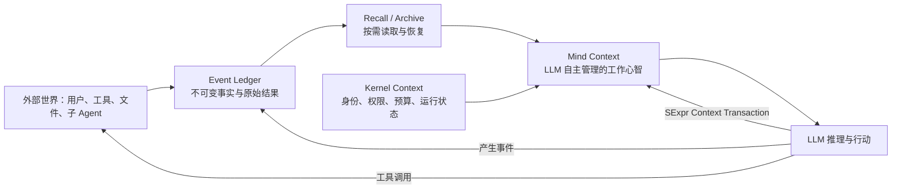
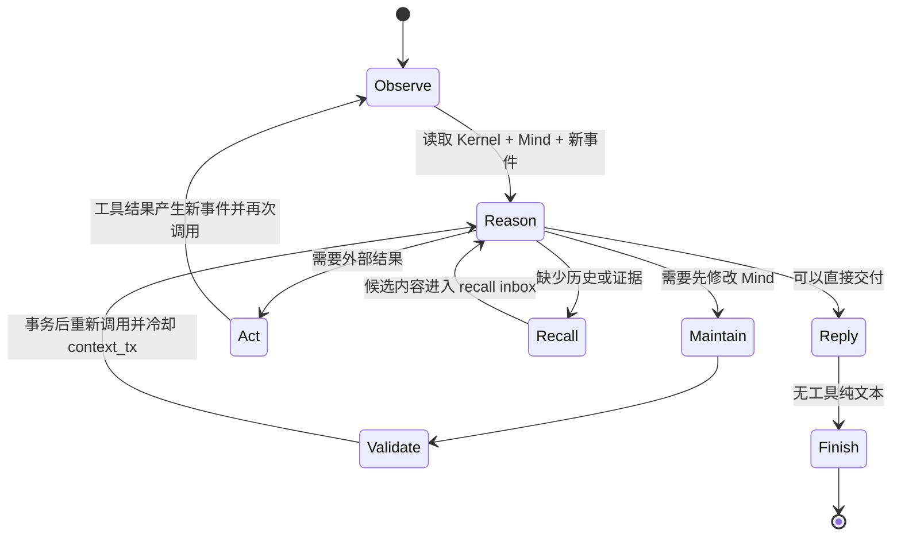

# Morphz Agent-Owned Context：由 LLM 自主管理的心智上下文

> 状态：核心设计基线；Agent-Owned Context protocol v15 已实现并进入评测
> 适用范围：Morphz Agent Runtime、SExpr DSL、Context 生命周期、记忆召回与产品调试界面
> 设计优先级：本文件用于澄清 Morphz 的核心方向；当既有文档中的“自动评分、自动裁剪、自动摘要、自动注入”与本文冲突时，应以本文的职责划分为准。

> 长期 Context 拓扑说明：本文件第 10.5、11 节描述的是当前 v1 的保守单写者/独立子 Mind 策略。关于 Session 共享、Shared Mind、多 Sub Agent、COW 分支、Context Generation 和状态/算力分离的北极星设计，以 [`morphz_shared_context_multisession_architecture.md`](morphz_shared_context_multisession_architecture.md) 为准。

> 现实约束与认识论说明：Agent 拥有 Context 语义，不等于 Runtime 只提供存储。Runtime 还应提供不可伪造的顺序、直接因果、身份、来源、版本、事务和控制反馈，但不能替 Agent 认证业务真理。完整契约见 [`morphz_reality_constrained_epistemic_context.md`](morphz_reality_constrained_epistemic_context.md)。

> Protocol v11 更新（2026-07-13）：本文后部关于“无工具纯文本是最终 reply”的 v6 历史说明已被显式 Reply 协议取代。当前三个 System Prompt Profile 都使用标准 `reply(disposition=deliver|suppress)` Function Calling；普通文本和空响应不是终态，Runtime 最多纠错两次后熔断。完整定义见 [三版本 System Prompt 与显式 Reply 协议](./morphz_system_prompt_profiles_and_reply_v1.md)。

## 1. 设计命题

Morphz 的 Context 不是由 Runtime 按固定规则拼装出来的一份“结构化 Prompt”，也不是一段只能随对话线性增长、最终由框架统一压缩的聊天历史。

Morphz 的核心命题是：

> **LLM 应当拥有并维护自己的工作 Context。它通过 SExpr DSL 观察、修改和重组当前心智状态，自主决定保留什么、遗忘什么、摘要什么、召回什么，以及当前目标和执行计划是什么。Runtime 不替它做语义判断，只提供可靠的机制、资源边界和恢复能力。**

这里的关键不是“把 Context 设计得更结构化”，而是把 **Context 的语义控制权交给 Agent 自己**。

SExpr 只是 Agent 操作自身 Context 的控制语言。它提供可组合、可校验、可事务执行的修改能力，但不要求 Runtime 预先定义一个固定且完备的心智本体。Context 可以具有结构，但这个结构应主要由 LLM 根据任务动态形成和演化，而不是由框架硬编码。

因此，Morphz 研究的不是更好的 RAG 或更好的 Compaction 算法，而是一种新的 Agent 能力：

> **可编程的元认知（Programmable Metacognition）。**

## 2. 为什么必须由 LLM 自己维护 Context

传统 Agent Runtime 通常掌握以下决策：

- 保留最近多少轮对话；
- 哪些旧消息需要摘要；
- 哪些记忆应当被召回；
- 哪些工具输出可以截断；
- 当前目标和计划以何种固定 Schema 保存；
- Token 压力达到多少时触发统一 Compaction。

这类机制在工程上容易实现，但存在根本局限：Runtime 只看得到长度、时间、相似度、类型和固定权重，看不到信息在当前推理过程中的真实语义价值。

例如：

- 一条很久以前的用户约束，可能比最近十轮调试日志更重要；
- 一次失败尝试的错误原因，可能必须保留到任务结束；
- 一个看似重复的工具输出，可能包含尚未验证的关键差异；
- 当前计划在出现新证据后，应被重写而不是继续执行；
- 某段历史应当被抽象成规则，而不是被压缩成流水账摘要。

只有正在推理的 LLM 能够结合目标、证据、风险和后续计划判断这些信息的作用。因此，Runtime 可以报告资源压力，却不应冒充 Agent 做语义决策。

## 3. 三种状态：Ledger、Kernel 与 Mind

Morphz 应明确区分三种性质完全不同的状态。



在单次模型请求中，可以把 Runtime 提供的可见状态划分为三个权限域。`inbox` 是从 Ledger 向 Agent 交付尚未消化事件的暂存区，不是 Runtime 已经替 Agent 形成的认知：

```lisp
(context
  (kernel ...)  ; Runtime 拥有，Agent 只读
  (mind ...)    ; Agent 拥有，通过 SExpr transaction 修改
  (inbox ...))  ; Runtime 投递，Agent 读取并确认消费
```

### 3.1 Event Ledger：不可变事实账本

Event Ledger 保存系统真正发生过的事情，包括：

- 用户原始消息；
- LLM 回复与工具调用；
- 完整工具输出及其内容引用；
- 文件修改、执行结果和异常；
- Context 修改提案、提交结果和前后 Diff；
- 子 Agent 的创建、回传和终止；
- Checkpoint、恢复和分支行为。

Ledger 是审计与恢复依据，不等于 LLM 每轮都要看到的 Context。Agent 从 Mind 中清除一段信息，不代表物理删除 Ledger 中的事实。

Ledger 的职责是“发生过什么”，不负责回答“现在应该想什么”。

### 3.2 Kernel Context：Runtime 掌握的最小运行状态

Kernel Context 是 Runtime 必须维护、LLM 可以感知但不能任意篡改的状态，例如：

- session / attempt / parent session 标识；
- 模型与能力信息；
- 工具权限和安全边界；
- Token、时间、成本与 Context 容量预算；
- 当前未完成工具进程；
- Ledger 游标和 Checkpoint 标识；
- Context 压力信号；
- 当前用户回合的 Attempt 预算与剩余额度；
- 必须遵守的系统级约束。

Kernel 只维护运行正确性和安全性，不保存 Runtime 自己推断出的“当前目标”“重要事实”或“下一步计划”。这些属于 Mind。

### 3.3 Mind Context：LLM 拥有的工作心智

Mind Context 是实际参与下一轮推理的可变工作集，由 LLM 负责维护。它可以包含但不限于：

- 当前目标、成功条件和禁止事项；
- 当前计划、待办、阻塞项和验证状态；
- 已确认事实与尚未验证的假设；
- 用户偏好和任务约束；
- 正在使用的文件、符号、实体和外部资源引用；
- 对历史的摘要及其来源范围；
- 失败尝试留下的教训；
- 等待中的子 Agent 或后台任务；
- LLM 为当前任务临时创造的任意心智结构。

Mind 应当是 **schema-light** 的。v1 不把 Mind 实现成一棵带固定路径的全局树，而是实现成一组具有稳定 ID 的 Context Frame。Runtime 只理解 Frame 的 ID、版本、来源、顺序、保护和生命周期；Frame 的 SExpr body 完全由 LLM 创造。

一个可能的 Mind 示例是：

```lisp
(mind
  (frame
    (id objective)
    (revision 1)
    (protected true)
    (sources event:user-request)
    (body
      (goal "修复同一 session 的并发写入问题"
        (success-when
          "同一 session 串行执行"
          "不同 session 保持并行"
          "并发测试稳定通过"))))
  (frame
    (id investigation)
    (revision 3)
    (protected false)
    (sources event:120 event:168)
    (body
      (working-theory
        (confirmed "EventBus 当前会并发 spawn handler")
        (hypothesis "需要 per-session mailbox")
        (open-question "后台工具输出是否进入同一 mailbox？")))))
```

这只是 Agent 某一时刻选择的布局，不是 Runtime 强制的永久 Schema。

## 4. Context 所有权宪章

为了避免实现逐渐退回“Runtime 替 Agent 管理 Context”，系统必须明确决策权。

| 决策 | LLM / Agent | Runtime / Kernel |
| --- | --- | --- |
| 当前目标与成功标准 | 决定并维护 | 持久化修改事件 |
| 信息的语义重要性 | 决定 | 不评分、不改写 |
| 哪些内容应摘要 | 决定摘要范围与结果 | 提供原文引用、事务提交 |
| 哪些内容应从 Mind 清除 | 决定 | 执行并记录 Diff |
| 哪些历史应召回 | 主动请求或确认候选 | 查询 Ledger / Archive |
| Mind 的内部结构 | 动态设计 | 做最小语法与资源校验 |
| Token、成本、时间压力 | 响应并采取维护动作 | 精确测量并发出信号 |
| 安全、权限和不可变元数据 | 不可绕过 | 强制执行 |
| 原始事实保存与恢复 | 可引用、可申请恢复 | 可靠保存、索引、重放 |
| Context 修改原子性 | 提交修改意图 | 事务执行、失败回滚 |

一句话原则：

> **Kernel 管机制和边界，Agent 管语义和注意力。**

## 5. SExpr DSL 的角色

### 5.1 SExpr 不是 Prompt 模板

SExpr 不应被理解为一种固定的 Prompt 数据格式。它是 LLM 对自身工作心智执行变换的 DSL，类似一个很小的“认知指令集”。

选择 SExpr 的价值在于：

- 语法小，模型容易稳定生成；
- 代码与数据同形，适合表达树形 Context 变换；
- 修改意图清晰，可生成精确 Diff；
- 可以事务执行、校验和回放；
- 容易扩展组合操作与心智宏；
- 相比自然语言“请记住/忘掉”，结果可验证。

### 5.2 最小原语与目标原语

v1 放弃以 `set/push/pop/clear` 作为正式认知接口。它们暴露的是树存储细节，会诱导 Runtime 固化 Agent 的心智结构。v1 原语围绕“认知单元的生命周期”设计：

| 原语 | 语义 |
| --- | --- |
| `create` | 创建一个具有稳定 ID、自由格式 body 的 Frame |
| `derive` | 基于 Observation / Frame 创建新 Frame，并记录来源血缘 |
| `revise` | 修订既有 Frame，保留稳定 ID 并递增 revision |
| `retire` | 将 Frame 或 Observation 移出活跃 Context，但不删除 Ledger |
| `restore` | 恢复被 retire 的 Frame 或 Observation |
| `protect` / `unprotect` | 建立或解除由 Kernel 强制执行的遗忘保护 |
| `place` | 调整 Frame 的注意力顺序 |
| `relate` / `unrelate` | 建立或撤销两个稳定 ID 之间的开放语义关系；Runtime 只特别解释 `supersedes` |

> 长期语义修正：当前 v1 的 `retire/restore` 同时承担“退出活跃 Context”的作用。随着 Frame 数量增长，容量换出不能继续与语义退役混为一谈。未来 Frame Virtual Memory 将区分 `active/retired` 的语义生命周期、`resident/swapped_out` 的长期驻留以及本次 Evaluation 的临时激活；仍然有效但暂时不占模型窗口的 Frame 应 swap out，而不是 retire。完整方向见 [`morphz_single_identity_distributed_cognition_architecture.md`](morphz_single_identity_distributed_cognition_architecture.md) 的 Frame Virtual Memory 章节。

摘要不是 Runtime 原语。LLM 通过 `derive` 自己写出摘要 body，并在同一事务中显式 retire 被替代的原始 Observation：

```lisp
(context-tx
  (base-version 42)
  (reason "调查阶段完成，以带来源的结论替代原始过程")
  (derive concurrency-conclusion
    (from event:120 event:168)
    (conclusion
      "竞态源于同一 session 的多个 handler 并发 Fold 和提交"
      (proposal "引入单写者 mailbox")
      (confidence high)))
  (protect concurrency-conclusion)
  (retire event:120 event:168))
```

### 5.3 Context 修改必须是事务

每次 SExpr 修改应遵循以下提交协议：

1. LLM 基于当前 Context 版本生成修改指令；
2. Runtime 在 shadow copy 上解析和执行；
3. 校验语法、权限、容量、引用及 Pin 约束；
4. 生成 `before_version`、`after_version` 与结构化 Diff；
5. 全部成功后原子提交，否则完整回滚；
6. 将提案、结果和错误写入 Event Ledger；
7. 下一轮向 LLM 明确反馈提交结果。

`reason` 是事务级审计元数据。普通创建或修订可以省略，但 `retire` 与 `unprotect` 必须给出 reason，确保系统不仅知道 Agent 忘记了什么，也知道它为什么做出这一决定。

v1 使用乐观并发版本，防止过期 Attempt 覆盖新的 Mind：

```lisp
(context-tx
  (base-version 42)
  (reason "记录下一步及新验证证据")
  (create next-action (plan "运行并发测试"))
  (derive evidence
    (from @e27)
    (verified "并发测试已通过")))
```

若当前版本已不是 42，Runtime 应拒绝提交并要求 LLM 基于最新 Mind 重新决策，而不是静默合并。

### 5.4 元认知元数据（Metacognitive Metadata）

Agent 负责语义判断，不等于 Runtime 应让它在信息不完备的情况下猜测。Runtime 应把自己能够客观测量的事实紧凑地附在 Observation 上，但不输出“重要性分数”。protocol v5 提供以下属性：

| 英文属性 | 中文解释 | 所有者与用途 |
| --- | --- | --- |
| `ref` | 稳定短引用 | Runtime 从 Ledger sequence 确定性派生，例如 `@e27`；Agent 在 recall/context_tx 中原样使用，提交前解析为完整 Event ID |
| `seq` / sequence | 账本写入顺序 | Runtime 生成的单调顺序，帮助 Agent 判断物理先后 |
| `turn` | 用户回合 | 该 Observation 属于第几个用户回合 |
| `attempt` | 回合内尝试次数 | 该 Observation 来自本回合第几次模型执行 |
| `caused-by` | 可观察的因果来源 | 例如产生工具结果的 tool call 或 attempt |
| `residency` | 当前驻留形态 | `full` 是全文、`preview` 是截断预览、`recalled-chunk` 是主动召回片段；同时公开可见字符数、总字符数和是否可召回 |
| `resource` | 外部物理资源身份 | Provider 可声明资源种类、稳定 key 和版本；Runtime 只比较同一 key 的物理版本 |
| `freshness` | 新旧/取代状态 | `latest` 表示同一物理资源中的最新版本；`supersedes` 表示 Agent 声明的语义取代 |
| `usage` | 有效使用记录 | 只统计主动 `recall` 与 `derive/revise` 的 `(from ...)` 证据引用 |

关键边界如下：

1. `latest` 只表示“物理上较新”，不表示“语义上必然正确”；Agent 仍需结合证据判断。
2. Observation 只是被呈现在 Context 中，不计为“使用”。只有 Agent 主动召回或把它作为推导/修订来源，才增加 usage。
3. usage 次数高不等于更重要、更可信；它只让 Agent 感知自己过去是否反复依赖过该证据。
4. `relate SUBJECT supersedes OBJECT` 只声明新内容取代旧内容。旧内容仍留在 Ledger 和当前 Context，除非 Agent 另行 `retire`。
5. 除 `supersedes` 外，`relate` 的 relation 名称保持开放，Runtime 不解释业务含义，避免形成固定心智本体。

这套分工的目的不是用更多字段替 Agent 思考，而是让它能看到时间、驻留、血缘、物理版本与真实使用历史，从而做出更有根据的自主维护决策。

### 5.5 自描述协议与工具调用边界

每轮 Context 必须携带由 Runtime 生成的 `protocol`，使 Agent 不依赖隐藏约定猜测自己的操作方式。协议至少自描述：

- `reply`：通过标准 `reply(deliver/suppress)` Function Calling 明确结束 single 求值；`deliver` 投递正文，`suppress` 明确不向 Session 投递；
- `act`：调用物理工具以取得必要的新结果，可并行附带一个不依赖本批新结果的 `context_tx`；正文只是可见进度，工具执行后 Runtime 必定再次调用模型；
- `maintain`：可单独调用 `context_tx`；它不是用户回合终点，Runtime 执行后必须再次调用模型，且非 critical 时下一响应冷却 `context_tx`；
- `context-tx-contract`：事务骨架、reason 作用域及全部可用原语的准确语法；
- `kernel.wake`：本轮由用户消息、外部工具结果还是 Context transaction 回执唤醒。

protocol v6 不再向模型暴露 `context_tx.final_reply` 布尔参数，也不再提供“事务与最终正文同响应终止”的快速路径；当时曾采用“有工具则继续、无工具纯文本结束”的响应形态。Protocol v11 已进一步把 single 求值终态统一为标准 `reply(deliver/suppress)` Function Calling；普通文本或空响应会触发有限纠错，不能再静默结束用户回合。

Context 修改继续只暴露一个标准 Function Calling 工具：`context_tx(transaction: string)`。外层遵循模型训练过的标准工具调用接口，内部参数保留 canonical SExpr；暂不把 operations 改成结构化 JSON。真实测试发现，多种模型会自然地把 goal、status、source 等多个字段写成并列 BODY；这些表达语义明确，没有必要要求模型添加无业务含义的 `record/frame` 外壳。protocol v5 因此正式接受 `BODY...`，由 Runtime 规范化为单一 `(context-body ...)` 后写入 Ledger。来源语义仍保持严格：`create` 不接受 `from`，有来源时使用 `derive`，避免容错吞掉证据血缘。

Operations Continuity 长程基线暴露了 `revise` 契约歧义：Runtime 一直执行完整 body 替换，而模型将“修订”理解为局部 merge，导致稳定字段在后续 revision 中消失。protocol v7 因此把“完整替换，仍需的旧字段必须重述”写入 System Prompt、Context 自描述和工具描述。v7 还增加 `checkpoint/rollback/drop-checkpoint`：快照由 Agent 显式建立，回滚必须提供 reason，Runtime 只负责确定性恢复和审计。

为避免 System Prompt、工具描述与 Context 协议发生漂移，正式原语的名称、语法和含义由 Runtime 中同一份协议定义生成。错误反馈也应给出可执行的正确形式，例如明确提示 `retire` 只接受 ID，reason 必须提升为事务级字段。

自描述 Context 不能弥补物理工具缺失的证据定位能力。`read` 因此支持标准 Function Calling 参数 `query/context_lines/max_matches` 和 `start_line/end_line`：查证指定文件中的具体结论时，Agent 应直接取得带行号的窄证据，避免整文件 Observation 被 preview 截断后反复调用 `exec/grep`。这仍然只提供原始证据，不替 Agent 形成结论。

## 6. Context Pressure Protocol

LLM 自主管理不等于 Runtime 什么都不做。Runtime 必须把不可见的物理限制变成清晰、准确、可行动的信号。

建议 Kernel 在每轮提供如下压力状态：

```lisp
(context-pressure
  (level warning)
  (used-tokens 92160)
  (soft-limit 98304)
  (hard-limit 114688)
  (largest-regions
    ((path (mind working_set tool_outputs)) (tokens 28140))
    ((path (mind history recent_turns)) (tokens 19720)))
  (unresolved-references 2)
  (maintenance-required-before-next-tool false))
```

压力协议分为四级：

- `normal`：不得仅为降低体积压缩，只维护确实改变的长期目标、约束或结论；
- `notice`：只提示增长趋势，不因容量触发维护；
- `warning`：优先在最终 `reply` 前或随当前 `act` 提交压缩事务；
- `critical`：暂停新的高成本动作，要求先提交一次 Context maintenance transaction。

Runtime 只能要求“必须释放多少预算”，不能决定“删除哪一段”。如果 Agent 多次无法在硬限制内生成有效维护指令，Kernel 才可进入紧急模式：冻结当前 Mind、创建 Checkpoint，并启动显式恢复流程。紧急模式不是普通 Compaction，也不能静默丢弃语义内容。

系统必须预留一段不参与普通工作分配的 maintenance reserve，确保进入 `critical` 后仍有足够 Token 让模型读取压力报告、检查 Mind 并提交维护事务。`critical` 阈值必须早于模型真实硬上限；不能等到下一次请求已经无法容纳完整 Mind 时，才要求 Agent 自救。

首次 Context Pressure Eval 已验证一次真实闭环：在 9,000 模拟硬上限和 2,500 reserve 下，38 条合成长历史产生 9,177 estimated tokens；模型自主创建并保护 `core_facts`、保留五条关键原始证据、退休 33 条陈旧 observation，最终降至 2,140 tokens 和 `normal`。该历史夹具使用确定性的局部压力模拟。生产主链路现已在 completion 前计量完整候选工作请求，并显式标记来源与可信度。核心路径禁止为 Token 计数增加远程请求；当前 OpenAI-compatible Client 使用完整请求估算与 completion `usage.prompt_tokens` 校准，并按 Context/Session 求值链路隔离校准。本地 tokenizer/chat-template、模型窗口 metadata 自动发现、渐进压力成功率和 emergency checkpoint 仍未完成。详见 [Prompt Token Accounting v1](morphz_prompt_token_accounting_v1.md)。

后续 Context Long-Run Eval 从 normal 开始连续运行六轮。模型在峰值 4,491/8,000 时仍未进入 warning/critical，三次在 notice 主动维护，退休全部 56 条原始历史，并在隐藏核验中保持六项事实和接口作废关系；容量与语义保真通过。但它提交 18 次事务、三个回合耗尽 Attempt，并把每个批次过程都创建为受保护 Frame，导致 Mind 结构线性增长。由此确认“避免物理溢出”和“形成可持续长期心智”是两个不同验收目标。当时 Runtime 实现的 protocol v2 将 sidecar 作为可选快速路径；后续多模型测试证明该路径会诱发进度文本被误标为最终回复，已被 protocol v6 取代。事务回执冷却、normal/notice 禁止容量压缩和低价值批次升格仍保留。frame consolidation 仍需继续验证。

Context 自主必须有物理控制，但正常的长期工作不能被一个很小的工具轮次上限截断。Kernel 按用户回合公开 `turn-control`：`attempt` 统计模型求值次数，一次响应并行发起多个工具仍只计一次；默认每 90 次进入一次 `soft-checkpoint`。软检查点只要求模型复盘目标、证据、Mind 与下一步是否一致，完整工具集保持可用，下一次求值自动恢复 `work`，不会强制收口或回复。Context transaction 仍有独立的回合预算，防止连续 housekeeping 挤占执行；成功事务在脱离 critical 后触发一次 `context_tx` 冷却，失败事务保留修复机会。模型请求、单次工具和网络操作可以各自拥有物理超时；交互任务本身持续等待，直到明确 `reply`、错误熔断或用户主动中断。

## 7. Agent 的 Context 维护循环

Context 维护是 Agent 的语义决策。事务调用无论是否携带可见正文，都必须由 Runtime 继续驱动到无工具 reply，不能成为用户回合终点。

评估 Context 生命周期时可以启用 `MORPHZ_CONTEXT_EVAL_MODE=true`，此时 Runtime 只注册
`context_tx`，以排除 recall、文件和命令工具对轨迹的干扰。该开关仅用于隔离评估，不改变生产工具集。真实六轮复测中，六个有新事实的回合均为“一次 standalone transaction + 一次冷却 reply”，无变化对照直接 reply；因此 standalone 偏好由 Runtime 收敛，而非依赖模型同时输出正文和工具调用。



典型维护触发点包括：

- 目标被用户修改；
- 一个阶段完成，需要将过程压缩为结论；
- 工具产生大量输出；
- 连续失败暴露出新的约束或教训；
- 子 Agent 回传改变了计划；
- Pressure 进入 warning / critical；
- 准备挂起、迁移模型或跨设备恢复；
- 任务结束，需要形成可复用记忆。

维护动作应由主 Agent 在语义上完成，例如：

```lisp
(begin
  (archive (mind working_set raw_test_failures)
           (as "archive:test-failures-before-fix"))
  (set (mind evidence test_result)
       (verified "55 unit + 5 integration tests passed"))
  (move (mind plan doing) (mind plan done))
  (set (mind plan doing) "审查部署链路")
  (clear (mind scratch)))
```

## 8. Recall 不应等于自动注入

长期记忆、图检索和向量检索仍然有价值，但它们的定位必须改变。

错误方式是：Runtime 根据当前消息自动选出若干“相关事实”，直接写入主 Context，令 LLM 无法区分这些内容为何出现、是否完整、是否可信。

Morphz 更合适的方式有两种：

1. **Agent 主动召回**：LLM 通过工具按事件范围、实体、文本、时间、任务或向量相似度查询；
2. **候选召回 Inbox**：Runtime 可以低成本地产生候选，但只能放入有来源和置信度的 `recall-inbox`，由 LLM 决定采纳、忽略、进一步查询或写入 Mind。

示例：

```lisp
(recall-inbox
  (candidate
    (ref "memory:9f21")
    (reason "与 SessionActor 相似度 0.84")
    (source "event:400..438")
    (preview "此前曾讨论 per-session single writer...")
    (status pending)))
```

Agent 可以明确处理候选：

```lisp
(begin
  (copy (inbox recall "memory:9f21")
        (mind working_set prior_design))
  (annotate (mind working_set prior_design)
            (relevance high)
            (needs_revalidation true)))
```

这样，检索系统提供联想能力，但不篡夺 Context 所有权。

## 9. 大型工具输出的处理

Runtime 不应在 LLM 看见之前擅自把工具输出改写成语义摘要。正确模型是：

- 原始输出完整写入 Ledger 或内容寻址存储；
- 当前轮返回容量受控的 preview、元数据和原文引用；
- LLM 可以按 range、pattern 或分页继续读取原文；
- LLM 观察后决定把什么结论写入 Mind；
- 若需要摘要，由 LLM 提交带来源范围的 `summarize` 或 `set` 指令；
- Mind 中的摘要永远可以追溯到未被改写的原始输出。

示例：

```lisp
(tool-result
  (ref "blob:sha256:...")
  (bytes 1842200)
  (preview "...最后 200 行...")
  (truncated true)
  (read-capability "read_output(ref, offset, limit)"))
```

这既满足物理 Context 限制，也避免 Runtime 在 Agent 尚未理解输出时替它决定什么重要。

## 10. 可靠性边界：自主不等于无保护

LLM 管理自身 Context 会带来传统 Compaction 不具备的新风险，必须正面设计。

### 10.1 自我失忆

Agent 可能错误删除关键约束、目标或尚未完成的工作。

应对机制：

- 所有修改保留 Ledger 与 Diff；
- 支持 Pin、Checkpoint、undo 和 restore；
- 用户原始指令默认保留可追溯引用；
- 删除被 Pin 内容必须使用更高显式级别的操作并说明理由；
- Runtime 可做结构一致性检查，但不替 Agent 判断语义重要性。

### 10.2 摘要漂移

多轮“摘要的摘要”会逐渐丢失约束或把假设写成事实。

应对机制：

- 摘要必须记录来源范围和代次；
- 区分 `confirmed`、`inferred`、`hypothesis`、`unknown`；
- 优先从原始来源重新摘要，避免无限链式压缩；
- 在关键决策前允许 Agent 请求 source revalidation；
- Dashboard 显示摘要血缘和未覆盖的信息范围。

### 10.3 Agent 不主动维护

模型可能一直执行任务，直到 Context 接近溢出仍不整理。

应对机制：

- Context Pressure Protocol；
- 在阶段边界加入 maintenance opportunity；
- critical 时暂停新高成本动作；
- 记录 maintenance debt，但不静默替它压缩。

### 10.4 弱模型无法稳定使用 DSL

不同模型的元认知和结构化输出能力不同。

应对机制：

- 极小、正交、可自描述的原语集；
- Schema / capability discovery；
- 解析错误返回局部、可操作的反馈；
- shadow transaction 与完整回滚；
- 提供有限的维护宏，但宏的选择仍由 Agent 作出；
- 将 Context 自治能力作为模型选择与评测维度，而不是假设所有模型同样可靠。

### 10.5 并发修改冲突

主 Agent、子 Agent、后台事件可能同时影响同一 session。

应对机制：

- 每个 session 使用 single-writer / mailbox；
- Context transaction 携带 base version；
- 子 Agent 默认拥有独立 Mind，只通过回传消息提出信息，不直接写父 Mind；
- 外部事件进入 Kernel inbox，父 Agent 消费后决定如何更新 Mind。

## 11. 子 Agent 的 Context 所有权

每个子 Agent 都应拥有自己的 Kernel 与 Mind，而不是共享父 Agent 的可变 Context。

父 Agent 创建子 Agent 时，只传递一个经过父 Agent 主动选择的初始视口：

- delegated goal；
- success criteria；
- 必要约束；
- 精选证据或可读取的 Ledger 引用；
- 权限、预算和回传协议。

子 Agent 完成后回传的是结果、证据引用、未解决问题和可选的 Context patch proposal。父 Agent 自己决定是否把这些内容写进自己的 Mind。

这保证了两层自主性：子 Agent 管自己的注意力，父 Agent 管自己的注意力。

## 12. 快照、恢复与分支

Snapshot 的作用是加速恢复和支持时间旅行，不是把 Runtime 计算出的摘要固化为“正确 Context”。

应支持：

- 按提交版本保存 Mind Snapshot；
- 从 Snapshot + 后续 Context transaction 重放；
- 在错误清理后回滚到指定 Checkpoint；
- 从历史版本创建 Context branch，比较不同决策路径；
- 恢复后保留“为何回滚”的新事件，不能改写历史；
- Snapshot 只是一份物化视图，Ledger 才是最终审计依据。

## 13. Prompt 装配原则

即便 Agent 拥有 Mind，Runtime 仍需要把状态传给模型。装配顺序应反映权限与可变性，而不是混为一段文本：

1. **Frozen System Contract**：恒定角色、DSL 与安全约束；
2. **Kernel Context**：当前 session、权限、预算、pressure、inbox；
3. **Mind Context**：Agent 上一次提交的工作心智；
4. **New Observations**：自上次游标后新增的用户、工具和子 Agent 事件；
5. **Available Actions**：工具和 SExpr transaction 能力。

其中只有第 3 部分的语义组织权属于 Agent。第 4 部分是尚未被 Agent 消化的新观察，不能由 Runtime 悄悄写进 Mind；Agent 处理后可自行归纳、引用或清除 inbox。

## 14. 产品形态：Mind Inspector

这种架构的产品价值不应只体现在内部 Token 优化上。Morphz 的关键界面应让用户看见并控制 Agent 的“工作心智”。

Mind Inspector 至少应支持：

- 实时查看 Kernel、Mind 和 Inbox，明确三者边界；
- 查看每次 Context transaction 的结构化 Diff；
- 回答“Agent 当前目标是什么、为什么做这一步”；
- 查看它保留、摘要、归档和遗忘了什么；
- 从摘要跳回原始事件和工具输出；
- Pin / Unpin 用户认为不可遗忘的约束；
- 创建 Checkpoint、回滚和分支；
- 显示 Context token 分布、压力与维护成本；
- 显示摘要血缘、置信度和待验证假设；
- 对比不同模型管理同一任务 Context 的效果。

这会使 Morphz 从一个黑盒 Agent Runtime 变成一个可观察、可审计、可恢复的认知系统。

## 15. 与传统 Compaction / RAG 的本质差异

| 维度 | 传统 Agent Runtime | Morphz Agent-Owned Context |
| --- | --- | --- |
| Context 决策者 | Runtime 固定策略 | LLM / Agent |
| 触发方式 | Token 阈值自动压缩 | 压力信号 + Agent 主动维护 |
| 遗忘依据 | 时间、长度、固定权重 | 当前目标下的语义判断 |
| 摘要责任 | 框架后台摘要器 | 主 Agent 明确提交 |
| RAG 结果 | 自动注入 Prompt | 主动召回或候选 Inbox |
| 工具输出 | 框架先截断/压缩 | 原文归档 + preview + 按需读取 |
| Context Schema | 框架预定义 | 最小 Kernel + 动态 Mind |
| 错误恢复 | 依赖压缩前备份或无恢复 | Ledger、Diff、Checkpoint、restore |
| 可解释性 | 只能看到最终 Prompt | 能看到每次心智变化及原因 |
| 核心能力 | Runtime 管理历史 | Agent 管理自己的注意力 |

## 16. protocol v8 实现状态与剩余边界

第一版已经完成以下纵向闭环：

1. Context 顶层由只读 `kernel`、Agent-Owned `mind` 与原始 `inbox` 组成；
2. Mind 使用稳定 ID 的自由格式 Frame，不再强制 `facts/state/plan/todo_stack/history`；
3. `context_tx` 支持版本校验、shadow transaction、完整回滚和结构化 Diff；
4. `create/derive/revise/retire/restore/protect/unprotect/place` 已成为正式 v1 原语；
5. 对话、工具、回复和子 Agent 结果作为 Observation 进入 Inbox，不再自动 Fold 成固定历史；
6. 主链路已移除自动消息摘要、硬历史裁剪和 Graph facts 自动注入；
7. `recall` 可以按 `@eN` 稳定短引用分页读取 Event 原文、搜索 Ledger 或读取已退役 Frame，并向后兼容完整 Event ID；
8. 同一 session 的 Attempt 与 Context transaction 均具有 single-writer 保护；
9. Context transaction 作为 Event Ledger 事件保存完整 state-after、version 和 Diff；
10. Dashboard 已能直接观察 Mind Frames、来源、revision、保护状态、Inbox 和 Pressure；
11. Kernel 已分离物理 Attempt 与 Context transaction 预算，并强制执行一次性 Context closure 和最终回复，防止模型无界探索或元认知循环；
12. 每轮 Context 已自描述 response contract、工具结果回传契约、`context_tx` DSL，并暴露动态 wake cause；`context_tx` 继续使用单一 SExpr transaction 参数；protocol v15 同时说明稳定短引用、多 BODY 规范化、完整 revise 替换、恢复点、标准工具回传、显式 `reply`、Session Working Set、attention 与并发因果边界。
13. `read` 已支持带行号的文本查询与行范围读取，减少长文件证据在 Inbox 中的重复膨胀。
14. Coding Tools v1 已提供 `list_files/search/read/edit/write/exec` 最小闭环；文件修改带 SHA-256 版本前提、原子提交、Diff 和 `file_change` Observation。
15. Event Ledger 通过 SQLite `rowid` 暴露稳定写入 `sequence`，并为 Observation 提供 turn、attempt、caused-by、residency、resource、freshness 与 usage。
16. DSL 已增加开放的 `relate/unrelate`；Runtime 只对 `supersedes` 建立新旧解释，旧证据不会被自动删除。
17. 已建立 `context_metacognition_eval` 黑盒评测，分别评分 Runtime 契约与 Agent 元认知策略，并支持基线/候选对比。
18. Observation、wake、frame sources、freshness 与 relation 在模型视口中统一使用 `@eN`；Runtime 只解析操作参数中的引用位，Ledger transaction 与 Mind state 始终保存完整 canonical ID，保证确定性重放与旧数据兼容。
19. `create/derive/revise` 正式接受 `BODY...`；多项由 Runtime 确定性规范化为 `(context-body BODY...)`，单项保持原样。`create` 不接受 `from`，`derive/revise` 的来源必须紧跟 ID，避免容错掩盖证据血缘错误。
20. `context_tx.final_reply` 已从 Function Calling schema 和 Runtime 终止逻辑中移除；物理工具和 `context_tx` 响应展示为进度并续跑，single 求值只有标准 `reply(deliver/suppress)` 能形成模型选择的正常终态。
21. `revise` 的完整替换语义已在三层契约中显式公开；`checkpoint/rollback/drop-checkpoint` 提供 Agent 可控、可重放的 Mind 恢复。
22. 当前用户回合内建立临时标准 Function Calling transcript：工具输出先写 Ledger，再以匹配原始 `tool_call_id` 的 `role=tool` message 返回；同一请求从 Inbox 排除这批结果正文，下一独立 Context 快照再按 active/retired 状态恢复为 Observation。空输出使用显式 `status=success, output_state=empty`，避免模型把沉默误判为未执行。

v1 有意尚未覆盖的边界：

- exec 已将完整原始输出持续归档到独立文件，Context 只展示受控 preview 与路径；后续仍需把本地文件归档升级为内容寻址、可迁移的 Artifact Store；
- branch、一般化跨版本 undo 和摘要血缘可视化尚未实现；checkpoint/rollback 已实现为 Agent 显式原语；
- Prompt Token 计量已拆为无网络的本地可插拔能力；当前 OpenAI-compatible 主链使用完整请求估算与 completion usage 校准。本地 tokenizer/chat-template 尚未接入 profile，远程 Token 计数不会进入 Agent loop；
- v1 为简化重启恢复，在每条 Context transaction 事件中保存完整 `state_after`；长期运行后应改为增量 transaction + 周期物化快照，避免账本体积呈二次增长；
- GraphMemory 尚未重构为纯候选 Recall Provider；v1 主链路暂时完全不自动使用它；
- Context 自治效果尚需通过长程任务基准验证。

## 17. 分阶段落地建议

### Phase 1：确立所有权边界（v1 已完成）

- Context 顶层改为 `kernel` + `mind` + `inbox`；
- Kernel 路径严格只读，Mind 路径由 Agent 可写；
- 移除根 Context 的修改旁路；
- 为 Context transaction 增加 version、Diff 和 Ledger 事件；
- 同一 session 建立 single-writer 保证。

### Phase 2：停止 Runtime 替 Agent 做语义维护（v1 主链路已完成）

- 对话、工具和子 Agent 结果进入 observation inbox；
- 工具原始输出归档，返回 preview 与引用；
- 自动 graph injection 改为 recall 工具或 recall candidate；
- 自动 history trimming 改为 Pressure Protocol；
- 正常路径停用 Runtime 自主摘要。

### Phase 3：演进认知 DSL（进行中）

- 先用真实任务验证 v1 原语是否最小完备，再决定是否增加新原语；
- 摘要记录 source range、generation 和 epistemic status；
- 增加 DSL capability discovery、静态校验和错误修复反馈；
- 为常见维护策略提供可选 mental macros。

### Phase 4：Mind Inspector 产品化

- Context tree、token heatmap 和 transaction timeline；
- Diff、血缘、Pin、Checkpoint、restore 与 branch；
- 显示 Agent 的维护行为和 maintenance debt；
- 支持用户直接审查但不静默篡改 Agent Mind。

### Phase 5：建立可证伪的评测体系

- 与固定滑动窗口、Runtime compaction、自动 RAG 基线进行对照；
- 覆盖长任务、目标变更、中断恢复、多 Agent 协作和大输出场景；
- 用数据验证自治 Context 是否真的更可靠、更省 Token，而不是只凭设计直觉。

## 18. 核心评测指标

Morphz 是否优于 OpenClaw、Hermes 或传统 Agent，不应以“支持 SExpr”判断，而应以长期任务表现判断：

- **Constraint Retention**：长任务后仍能遵守早期关键约束的比例；
- **Goal Consistency**：目标变更后计划和行为与新目标保持一致的程度；
- **Relevant Recall**：需要旧信息时能主动找回正确证据的比例；
- **Irrelevant Context Ratio**：实际发送 Token 中与当前决策无关的比例；
- **Summary Faithfulness**：摘要对原始证据、限定条件和不确定性的保持度；
- **Recovery Success**：错误遗忘或中断后恢复正确状态的比例；
- **Self-Amnesia Rate**：因自主清理丢失关键约束导致失败的比例；
- **Maintenance Overhead**：用于 Context 维护的模型轮次、Token、延迟和成本；
- **Long-Horizon Completion**：数百至数千事件任务的最终完成率；
- **Context Autonomy Gain**：相对固定 Runtime 策略带来的净质量收益。

评测必须保留失败案例。若某类模型无法稳定维护 Mind，Morphz 应诚实地将其视为模型能力边界，而不是用 Runtime 静默接管语义决策后仍声称 Context 是 Agent 自主维护的。

## 19. 设计红线

以下行为违背本设计，应在 Review 中被明确指出：

- Runtime 按时间或相似度直接决定信息的语义重要性；
- 达到阈值后静默删除或摘要 Mind 内容；
- 把检索结果无来源地直接混入 Agent 的已知事实；
- 在 Agent 查看前用不可逆摘要替代原始工具输出；
- 用越来越复杂的固定 Schema 预定义 Agent 应如何思考；
- 允许多个执行流并发覆盖同一 Mind；
- Context 修改不可追踪、不可回滚或无法说明来源；
- 把 Event Ledger、长期记忆、Prompt 和 Mind Context 混为同一概念。

## 20. 与当前研究的关系

Morphz 的方向与近年的 Agent Memory 研究一致，但组合方式不同：

- [MemGPT](https://arxiv.org/abs/2310.08560) 把长上下文建模为由模型管理的分层虚拟内存，支持显式换入换出；Morphz 进一步把可审计的 Mind 修改收口为事务 DSL。
- [Reflexion](https://papers.neurips.cc/paper_files/paper/2023/hash/1b44b878bb782e6954cd888628510e90-Abstract-Conference.html) 证明语言反思写入 episodic memory 能改善后续决策；Morphz 将“写入什么、何时修订/退休”扩展成通用元认知控制面。
- [A-MEM](https://arxiv.org/abs/2502.12110) 使用动态 note 属性、链接与记忆演化；Morphz 的开放 Frame 与 `relate` 与其方向相近，但刻意不让 Runtime 固化语义 schema。
- [MemInsight](https://aclanthology.org/2025.emnlp-main.1683/) 强调自主语义增强；Morphz 让 Agent 自己形成 body、来源与关系，同时保留 Ledger 原始证据。
- [AgeMem](https://aclanthology.org/2026.acl-long.981/) 把记忆操作作为工具行为，并通过分阶段强化学习训练策略；这表明“有操作接口”并不足够，后续仍需训练或优化 Morphz 的维护策略。
- [MMPO](https://arxiv.org/abs/2605.30159) 指出递归摘要会丢失任务状态，并用 belief entropy 评估记忆质量；这支持 Morphz 保留原始 Ledger、来源血缘和避免摘要套摘要的原则。
- [MemBench](https://arxiv.org/abs/2506.21605) 把记忆评测拆为效果、效率和容量；Morphz 的评测同样分开报告 Runtime 可观测性、Agent 保真/选择策略与执行开销。

因此，Morphz 当前可以称为“研究方向先进、机制组合有独特性”，但不能仅凭架构自称领先。真正需要证明的是：在相同模型、任务和预算下，它是否比滑动窗口、Runtime 自动摘要和自动 RAG 获得更高的长期成功率、更低的自我失忆率以及可接受的维护开销。

## 21. 最终定义

Morphz 的 Context 系统可以用下面四句话定义：

1. **Ledger 保存世界发生过什么。**
2. **Kernel 保证 Agent 在现实边界内运行。**
3. **Mind 表达 Agent 此刻选择关注什么。**
4. **SExpr 让 Agent 能够可靠地改造自己的 Mind。**

Morphz 要超越现有 Agent 框架，关键不在于 Runtime 比它们更聪明地管理 Context，而在于 Runtime 第一次把可靠、可审计、可恢复的 Context 主权交给了 Agent 自己。
