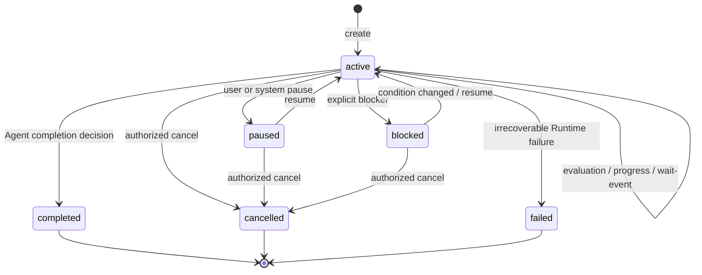

# Morphz First-Class Objective 与内置监督器设计 v1

> 状态：v1 已实现并通过确定性验收
> 日期：2026-07-14
> 目标：让长期目标跨多次 Context Evaluation、进程重启和异步等待持续存在，同时保持 Runtime 控制论与 LLM 认识论的边界

## 1. 设计结论

Morphz 将 Objective（长期目标）定义为 **First-Class Runtime Object**，但把自动续跑、完成审计和阻塞处理实现为内置 `ObjectiveSupervisor` 模块。

这不是“核心或者扩展”的二选一，而是两个不同维度：

- **第一等概念**决定 Objective 是否拥有稳定身份、持久化状态、公共事件、生命周期和恢复语义；
- **内置扩展**决定 Objective 的监督策略是否与普通 Context Evaluation 解耦，能够独立演进、开关和测试。

核心原则是：

> Runtime 负责让一个尚未结束的目标继续拥有执行生命；LLM 负责理解目标、形成计划、解释证据并判断是否真正完成。

Objective 不是固定的 Todo Schema，也不是 Runtime 替模型维护的计划。Objective 的控制状态由 Runtime 拥有；目标的语义认知仍由 Agent 在自由格式 Mind Frame 中维护。

## 2. 为什么不能只把 Goal 放在 Mind 中

Agent 已经可以在 Mind 中自主创建类似以下 Frame：

```lisp
(create delivery-objective
  (goal "完成 v1 发布")
  (constraints ...)
  (status active))
```

这种 Frame 足以表达模型的目标认识，却不能单独承担 Runtime 控制职责：

1. 模型调用 `reply` 后，本次求值已经结束，Mind Frame 自己不能重新唤醒模型；
2. 进程重启后，Runtime 需要确定哪些工作应恢复，不能依赖先调用一次模型再猜测；
3. 多 Session 共用一个 Mind，同一 Context 可以同时存在多个目标，Runtime 必须知道该唤醒和回复哪条连接；
4. 等待工具、审批、定时器或外部事件时，Runtime 必须停止忙轮询并登记精确唤醒条件；
5. pause、resume、cancel、权限和资源限制属于物理控制，不应由可自由改写的 Frame 决定；
6. 分布式 Worker、重试和并发执行需要稳定 Objective ID、版本和幂等键。

反过来，Runtime 也不能解析固定的 Mind BODY 来判断业务目标是否完成。Frame 结构仍然属于模型，Objective 控制面只接收明确的状态转换。

## 3. 与 Agent、Context、Session、Evaluation 的关系

Morphz 的基本层级扩展为：

```text
Agent
├── Cognitive Context
│   ├── Shared Mind
│   ├── Event Ledger
│   ├── Session A
│   ├── Session B
│   ├── Objective O1 → coordinator Session A
│   └── Objective O2 → coordinator Session B
└── ObjectiveSupervisor
    └── 监听 Objective、Evaluation 与外部唤醒事件
```

边界如下：

- **Context** 是 Objective 的认知环境和共享 Mind 所属位置；
- **Session** 是输入、进度和回复路由，不是 Objective 的认知所有者；
- **Objective** 是跨多次 Evaluation 持续存在的工作控制对象；
- **Evaluation** 是一次模型求值及其内部工具循环；
- **Sub Agent / Delegation** 是执行 Objective 或其子目标的计算方式，不等于 Objective 本身；
- **reply** 只结束一次 single Evaluation 的 IO 决策，不再隐含长期 Objective 已完成。

Codex 将 Goal 绑定到单个 Thread。Morphz 不能直接复制该层级，因为一个 Cognitive Context 可以承载多个 Session，也可以让多个执行单元复用同一个 Mind。Morphz v1 允许一个 Context 中存在多个 Objective；每个 Objective 先绑定一个 coordinator Session，未来再扩展为多个参与 Session 和多个并行 Worker。

## 4. 第一等 Objective 数据模型

建议的持久化控制记录为：

```text
ObjectiveRecord
├── objective_id
├── agent_id
├── context_id
├── coordinator_session_id
├── delivery_session_id
├── parent_objective_id          optional
├── source_event_id
├── stated_objective             用户或调用方声明的原始目标
├── revision
├── status
├── status_reason                当前状态的最近一次明确原因
├── wait_condition               optional
├── active_evaluation_id         optional / lease
├── continuation_sequence
├── token_budget                 optional
├── tokens_used
├── time_used_seconds
├── created_at
└── updated_at
```

字段语义：

- `stated_objective` 保存调用方明确声明的目标，是控制与产品展示所需的稳定输入，不是 Runtime 生成的任务摘要；
- `source_event_id` 指向目标声明进入 Ledger 的原始事实；
- 模型对目标的理解、拆解、当前结论和完成证据仍保存在自由格式 Mind 中，Runtime 不要求固定 Frame ID 或 BODY；
- `revision` 用于目标修改、状态更新和并发控制；
- `active_evaluation_id` 是执行租约，不表示目标语义状态；
- `continuation_sequence` 与最近一次 Evaluation ID 组成幂等键，避免重复唤醒；
- `parent_objective_id` 为 Delegation 或子目标预留，但 v1 不自动把所有委派都建模为子 Objective。

`coordinator_session_id` 负责接收续跑输入和保持局部执行顺序；`delivery_session_id` 负责把进度与结果路由给外部连接。v1 中二者默认相同，但不能在数据模型里合并，以便后续支持后台目标、跨 Session 协作和结果转发。

## 5. 生命周期状态与等待状态必须分离

Objective 的生命周期状态：

```text
active | paused | blocked | completed | cancelled | failed
```

其中：

- `active`：目标尚未完成，Runtime 应保证其最终继续推进；
- `paused`：使用者或系统主动暂停，保留恢复能力；
- `blocked`：当前不存在 Runtime 可自动等待的确定事件，需要外部条件或用户决策；
- `completed`：模型明确声明目标已满足，正常终态；
- `cancelled`：使用者或有权限的控制方终止目标；
- `failed`：Runtime 遇到不可恢复的物理失败；普通一次模型或工具错误不应轻易升级为 Objective failed。

等待不是生命周期终态。`active` Objective 可以附带一个 `wait_condition`：

```text
none
tool_task(task_id)
delegation(delegation_id)
timer(deadline)
permission(request_id)
user_input(session_id)
external_event(topic, correlation_id)
resource_available(kind)
```

这样可以区分：

- **还有立即可做的工作**：`status=active, wait_condition=none`，Supervisor 自动续跑；
- **正在等待可确定事件**：`status=active, wait_condition=...`，Runtime 登记唤醒条件，不重复调用模型；
- **无法自动恢复的阻塞**：`status=blocked`，通知使用者并等待显式 resume。

如果把等待也建模成 `blocked`，后台任务、审批和限额恢复都需要人工恢复；如果只保留 `active`，Supervisor 又会形成无进展的自动轮询。因此两个维度必须独立。

## 6. 状态机



约束：

1. `completed` 必须由 Agent 的明确控制调用产生，不能由普通 `reply`、文本内容或无工具响应推断；
2. `paused/cancelled` 由用户或 Runtime 控制面拥有，模型不能绕过；
3. `blocked` 必须携带原因和已确认的阻塞条件；Supervisor 可以通过策略要求多次一致阻塞后才接受；
4. token、时间或 Context 压力耗尽不等于 `completed`；它们应转为等待、暂停或物理失败；
5. 终态 Objective 不原地恢复。需要继续时创建新 generation 或显式 reopen 事件，保留原终态审计。

## 7. ObjectiveSupervisor 的职责

`ObjectiveSupervisor` 是内置模块，不是第三方插件。它通过通用生命周期接口工作，不把 Goal 分支散落在 Orchestrator 主循环中。

它监听：

- Objective create/update/pause/resume/cancel；
- Evaluation start/terminal/error；
- Session 与 Context resume；
- 工具任务、Delegation、审批、定时器和外部事件；
- token、时间、权限和资源状态变化；
- Runtime 启动与崩溃恢复。

一次 Evaluation 结束后的确定性处理：

```text
evaluation terminal
        ↓
reload Objective at latest revision
        ↓
status == completed/cancelled/failed ? ── yes → stop
        ↓ no
status == paused/blocked ? ───────────── yes → wait explicit control event
        ↓ no
wait_condition exists ? ──────────────── yes → register wake, do not poll
        ↓ no
schedule objective/continue event with idempotency key
        ↓
start next Evaluation when coordinator Session is idle
```

内部 continuation 必须是 Runtime Event，不得伪造一条用户说出的“继续”。它应在 Context Encoding 中表现为可审计的 `kernel.wake`，并包含 Objective ID、revision、上次 Evaluation 和续跑原因。

Supervisor 不直接执行任务，不生成计划，不修改 Mind，也不决定编译或测试结果是否足以证明完成。

## 8. Reply、进度与 Objective 完成

现有标准 Reply 协议保持不变：

```json
{"disposition":"deliver","content":"..."}
{"disposition":"suppress"}
```

但其物理含义收窄为：

> `reply` 是当前 single Evaluation 的终态 IO 决策。

无 Objective 时：

```text
reply → 当前 Session 用户回合结束
```

存在 active Objective 时：

```text
reply → 本次 Evaluation 结束
      → 消息可以作为进度交付
      → Supervisor 根据 Objective 状态决定续跑或停止
```

Objective 完成必须使用独立的 Runtime 控制原语，例如：

```json
{
  "objective_id": "objective-123",
  "base_revision": 7,
  "status": "completed",
  "reason": "所有要求已满足，构建与测试通过",
  "evidence_refs": ["@e82", "@e91"]
}
```

建议首版提供标准 `objective_update` Function Calling，而不是：

- 在 `reply` 中增加 Goal 状态，混淆 IO 与生命周期；
- 让 Runtime 从回复正文中的“已完成”三个字推断；
- 解析自由格式 Mind Frame 的 `(status complete)`；
- 把 Objective 状态变化塞进 `context_tx`，混淆模型认知写入与 Runtime 控制事务。

`objective_update(completed)` 成功后会像其他工具结果一样再次调用模型；模型随后用标准 `reply` 交付最终报告。这样 Objective 状态和最终用户消息都有确定回执，也不需要让两个终态工具出现在同一次响应中。

## 9. Context Encoding 中的自描述

Objective 是 First-Class 后，Context Encoding 的稳定 protocol 应说明：

- Objective 与 Evaluation、Session、Context 的层级；
- `reply` 只结束本次 Evaluation；
- `objective_update` 的状态权限和完成纪律；
- active Objective 在无等待条件时会自动续跑；
- 等待外部事件时必须提交明确 wait condition，禁止轮询；
- Context 维护、预算压力和软检查点不能伪装成目标完成。

动态 kernel 只提供紧凑的客观状态：

```lisp
(objectives
  (active objective-123
    (revision 7)
    (context context-main)
    (coordinator-session session-A)
    (evaluation attempt-42)
    (wait none)))
```

目标的详细计划和认识仍位于 Mind，不把完整 Objective 历史重复注入 kernel。为利用 Prefix Cache，固定 Objective 协议位于稳定前缀；动态状态位于 Mind 之后的 kernel/active evaluation 区域。

## 10. 完成判定与证据边界

Morphz 不提供通用业务“完成契约引擎”。完成判断分为三层：

1. **外部世界证据**：测试、编译、查询、文件、服务状态和用户反馈；
2. **Agent 认识判断**：LLM 对照 stated objective、约束和证据逐项审查；
3. **Runtime 控制提交**：Agent 显式调用 `objective_update(completed)`，Runtime 校验身份、revision、权限、引用存在性和状态转换。

Runtime 可以验证 `evidence_refs` 是否真实存在且时序合法，但不能声明这些证据在业务语义上足够。任务使用方仍可提供自己的测试、Hook 或评测器作为外部工具；这些验证结果进入 Ledger，供 Agent 判断，不进入 Runtime 的通用 Objective 规则。

Supervisor 的 continuation 指令应强调：

- 先按当前 stated objective 做逐项审计；
- 意图、部分进展和看似合理的最终答案都不是完成证据；
- 仍存在未验证要求时保持 active 并继续工作；
- 不因预算接近耗尽、Context 压力或想结束当前响应而标记 completed；
- blocked 只用于无法自动等待且没有可靠进展路径的真实阻塞。

这些是通用认识纪律，不是针对编码、新闻或坦克任务的特化契约。

## 11. Context 压力、错误与长程连续性

当前 `critical + context_tx budget exhausted → final-reply` 的安全熔断只能结束一次 Evaluation，不能隐式结束 active Objective。

引入 Supervisor 后：

1. 当前 Evaluation 可以交付已完成状态和剩余工作；
2. Objective 仍保持 active；
3. 新 continuation 开启新的 Objective continuation cycle；Context 维护预算必须从“最后一条用户消息之后”改为按 cycle 计量并确定性重置，不能通过伪造用户消息获得预算；
4. 如果 Context 已物理不可求值，则 Objective 转为 `paused` 或 `failed`，并记录准确原因；
5. 单次 LLM 请求超时、暂时网络错误或工具失败默认只结束/重试当前 Evaluation，不直接完成或永久取消 Objective。

软检查点仍只用于复盘，不限制模型请求或工具数量。Objective 的预算状态与每次 Evaluation 的 Attempt 计数必须分离。

## 12. 并发、共享 Context 与恢复

### 12.1 v1 并发规则

- 同一 Objective 同时最多一个 coordinator Evaluation 持有执行租约；
- 同一 Context 可以有多个 Objective 并发求值；
- 对共享 Mind 的 `context_tx` 继续按 Context 锁和 version 串行提交；
- 不同 Objective 的工具结果和 reply 必须通过 Session/Objective ID 双重路由；
- 重复 terminal、重复 wake 和进程恢复必须通过 Objective revision、Evaluation ID 和 continuation sequence 去重。

### 12.2 重启恢复

Runtime 启动后扫描非终态 Objective：

- active + 无 wait + 无有效 Evaluation lease：重新调度 continuation；
- active + wait：恢复对应事件订阅或检查已持久化终态事件；
- paused/blocked：恢复展示，但不自动执行；
- 残留 running lease 超过有效期：记录 recovery event，转回 idle 后续跑；
- completed/cancelled/failed：只恢复查询和审计，不调度。

恢复行为必须产生 Ledger Event，不能静默篡改状态。

### 12.3 与 Delegation 的关系

Delegation 仍然是一次受托执行。父 Objective 可以等待 `delegation(delegation_id)`；子 Agent 是否创建独立 Objective 由调度策略决定。

v1 不让子 Agent 直接修改父 Objective。子任务结果回到父 coordinator Session，由父 Agent 验证并决定更新 Mind 或完成父 Objective。未来共享 Objective 多 Worker 协作需要独立的 proposal/lease/merge 协议，不能复用 v1 单协调者写权限后假装已经解决并发。

## 13. Core、内置模块与产品表面的边界

### 13.1 Runtime Core

Core 提供：

- Objective 数据模型、Repository 和状态转换校验；
- Objective Event 与公共查询/控制 API；
- Evaluation/Session/Context 的稳定身份；
- 调度、租约、幂等、等待注册和恢复原语；
- 通用生命周期回调或事件订阅接口。

### 13.2 Built-in ObjectiveSupervisor

内置模块提供：

- active Objective 的自动 continuation；
- continuation SExpr 指令和完成审计政策；
- blocked 重复确认策略；
- token/time accounting 与进度事件；
- `objective_update` 工具和模型可见的 Objective Context 片段。

### 13.3 CLI、TUI 与 SDK

产品表面提供可读操作：

```text
create objective
show objective
edit objective
pause objective
resume objective
cancel objective
```

具体 CLI 拼写在命令行设计阶段单独评审，不在本文冻结。所有表面必须调用同一 Objective API，不能各自实现续跑逻辑。

### 13.4 暂不建设通用第三方扩展框架

首版不因为 Objective 一个功能就提前建设复杂插件 ABI。工程上先把 `ObjectiveSupervisor` 做成边界清晰的内置模块，并让 Orchestrator 暴露最小生命周期接口。未来 Skills、Recall、Guardian、Scheduler 等需要同类接口时，再把它提升为稳定 Extension Registry。

## 14. v1 实现范围

v1 必须实现：

1. Objective 持久化实体、状态转换和审计事件；
2. 一个 Context 多 Objective，每个 Objective 一个 coordinator/delivery Session；
3. create/get/list/edit/pause/resume/cancel 控制 API；
4. Agent `objective_create` 自主升级长期工作，以及 `objective_update(completed/blocked/active-wait)` 控制工具；
5. `reply` 结束 Evaluation、Supervisor 决定是否续跑；
6. timer、后台 task、Delegation、permission 与 user input 等待条件；
7. Runtime 重启后的自动恢复；
8. Context Encoding 自描述与 SExpr continuation 指令；
9. 软检查点、Context critical 和单次错误不误完成 Objective；
10. CLI/TUI 可观察进度、状态和暂停/恢复。

v1 明确不实现：

- 多 Worker 并发修改同一 Objective；
- Raft/Paxos 或跨机器一致性；
- Runtime 业务正确性契约；
- 自动把每条用户消息升级成持久 Objective；
- 固定 Goal/Todo/Plan Mind Frame Schema；
- 根据回复文本猜测 complete；
- 自动合并父子 Objective 的语义结论；
- 第三方 Objective 策略插件 ABI。

## 15. 验收测试

### 15.1 兼容性

1. 没有 Objective 的普通聊天、代码任务和工具循环行为不变；
2. `reply(deliver/suppress)` 仍是 single Evaluation 的唯一正常终态；
3. 现有多 Session 独立求值和 Delegation 回传不退化。

### 15.2 长程连续性

1. active Objective 在一次进度 reply 后自动开始下一 Evaluation；
2. `objective_update(completed)` 后的最终 reply 不再触发续跑；
3. 90 次软检查点不停止任务，超过 100 次模型求值仍可继续；
4. critical Context 收口只结束当前 Evaluation，不误完成 Objective；
5. 单次模型超时和可重试工具错误不会永久丢失 Objective。

### 15.2.1 自主创建

1. 普通 Evaluation 中的 Agent 可以显式调用 `objective_create`，且不能指定 Agent、Context、Session 或 Objective ID；
2. 创建成功后当前 Evaluation 被收编为该 Objective 的第一次 Evaluation，不额外制造竞争性的 continuation；
3. 相同 Session、parent 和目标陈述的非终态 Objective 重复创建返回 existing，不生成第二条控制对象；
4. 普通问答不会被 Runtime 自动升级为 Objective，是否调用由 Agent 依据稳定协议自行判断；
5. 子 Objective 的 parent 只能指向当前正在求值且属于同一 Context/coordinator Session 的 Objective。

### 15.3 事件驱动等待

1. 后台 task 运行时只登记一次 wait，不重复调用 `wait_task`；
2. task 完成或 wait deadline 到达后精确唤醒对应 Objective；
3. 等待审批、用户输入和 Delegation 时不产生忙轮询；
4. 无输出工具也产生明确终态 Observation，并能推进 Objective。

### 15.4 多 Session 与恢复

1. 同一 Context 中 Session A/O1 与 Session B/O2 并发运行，工具、进度和回复不串线；
2. O1 修改 Shared Mind 后，O2 后续求值能看到新版本；
3. Context transaction 冲突按现有版本机制重试，不丢 Objective 状态；
4. Runtime 在 active、waiting、paused 三种状态下重启，恢复行为分别正确；
5. 重复 wake、重复 terminal 和过期 lease 不产生重复模型调用。

## 16. 与 Codex 的关系

Codex 当前把 Goal 数据模型、持久化、公共协议和产品 API 做成第一等能力，同时通过内置 Goal Extension 监听 thread/turn 生命周期并执行自动 continuation。其 `goals` feature 已是 stable 且默认启用，因此“扩展”不代表实验或次要，而代表监督策略不侵入普通 turn loop。

Morphz 采用相同的依赖方向，但不复制 `ThreadGoal` 层级：

| Codex | Morphz |
| --- | --- |
| Goal 绑定 Thread | Objective 绑定 Cognitive Context，并关联 Session 路由 |
| Thread idle 后续跑 | Evaluation terminal/Context ready 后由 Supervisor 续跑 |
| conversation context | Agent-Owned Shared Mind + Event Ledger |
| `update_goal` | 独立 Runtime 控制原语 `objective_update` |
| 普通 final assistant message 结束 turn | 标准 `reply` 结束 Evaluation |

真正要借鉴的是“第一等状态 + 外层监督循环 + 普通执行循环保持通用”，而不是 Codex 当前的对象层级或 Prompt 文本。

## 17. 实现前仍需评审的问题

1. `Objective` 与产品层 `Goal` 是否统一命名，还是底层 Objective、上层 Goal；
2. `blocked` 的重复确认门槛由固定策略、Profile 还是模型建议决定；
3. stated objective 的 edit 是否创建新 revision 继续执行，还是创建新 Objective generation；
4. progress reply 的默认展示频率与 TUI 交互方式；
5. token/time budget 达到边界时使用 paused 还是独立 reason/status；
6. v1 是否允许 coordinator 与 delivery Session 不同，还是只在 schema 中预留。

这些问题不会改变本文冻结的核心边界：Objective 是第一等控制对象，Mind 保有语义自治，ObjectiveSupervisor 是内置监督模块，`reply` 只结束一次 Evaluation。

## 18. v1 实施记录

本设计已于 2026-07-14 落地。实现保持了“Objective 是 Runtime 控制对象，Mind 仍由模型自治”的依赖方向，没有为编码、新闻或其他具体任务引入业务完成契约。

### 18.1 已落地能力

- SQLite 持久化 `ObjectiveRecord`，支持 revision CAS、生命周期校验、等待条件、Evaluation 租约、continuation sequence、Prompt Token 本地计量与运行时间记账；
- 内置 `ObjectiveSupervisor` 在 `reply(deliver/suppress)` 后依据最新状态自动续跑，内部 continuation 使用可审计的 `chat/tool_output` Runtime Event，不伪造 user message；
- Evaluation 租约在认领时登记到期唤醒；过期后释放本地路由并可重新认领，旧定时器不能清除新租约；进程重启会恢复 active/waiting Objective，并清理非 active Objective 的残留 Evaluation；
- 标准 `objective_update` Function Calling 只允许当前 coordinator Session 更新自身 Objective，验证 revision、状态转换和 Ledger evidence reference；模型可以提交 `completed`、真实 `blocked` 或带精确等待条件的 `active`；
- 标准 `objective_create` Function Calling 允许模型把真正需要跨 Evaluation、异步等待或重启恢复的当前工作升级为 Objective；Runtime 独占 Agent/Context/Session/ID 路由，审计创建原因和来源，并对同一非终态目标做串行幂等去重；
- Context Encoding protocol version 14 固定说明 Objective/Context/Session/Evaluation 边界及自主创建纪律，动态 `kernel.objectives` 只注入紧凑控制状态；`objective/evaluation_started` 会确定性重置本 continuation cycle 的 Attempt 与 Context 事务预算；
- 后台 task、Delegation、permission、user input、timer、external event 和 resource available 均有精确等待类型；task/timer 完成采用事件驱动唤醒，不通过模型轮询；
- Runtime 公共 API 提供 create/get/list/edit/update/pause/resume/cancel；CLI 提供 `objective list/show/create/edit/pause/resume/cancel`，运行命令持续展示进度、工具、审批和最终回复；
- 同一 Context 的多个 Objective 可以绑定不同 coordinator/delivery Session 并发运行，共享 Mind 仍使用既有 Context version 锁串行提交。

### 18.2 验收结果

确定性回归覆盖了以下关键路径：

- active Objective 在进度 reply 后自动续跑，显式 completed 后的最终 reply 停止续跑；
- Agent 在普通 Evaluation 中自主创建 Objective 后，当前 Evaluation 被收编；重复创建返回 existing，第一次 reply 后只产生一次 Supervisor continuation；
- completed/blocked 状态先提交，最终 reply 保持 Objective 路由并按 Evaluation ID 释放租约；
- 连续 101 个 Objective Evaluation、总计 102 次模型请求后仍能正常完成，没有硬性 Attempt/工具次数终止；
- 后台 task 等待不轮询，只由匹配的物理终态事件唤醒一次；
- timer 等待跨 Runtime 重启恢复；过期 Evaluation 租约跨重启只恢复一次；
- 同一共享 Context 中两个 Session/Objective 的模型求值与回复不串线；
- Objective Prompt Token 计量在请求前按 Evaluation 租约持久化，终态提交或进程异常不会抹掉已有成本；
- 无 Objective 的普通会话、工具、Context、权限与原生沙箱行为继续通过原有回归。

最终验证命令及结果：

```text
cargo clippy -p morphz --all-targets -- -D warnings
# passed

cargo test -p morphz --lib
# 171 passed; 0 failed
```

### 18.3 有意保留的边界

- `tokens_used` 当前记录跨 Provider 可稳定获得的完整 Prompt 本地/usage 校准估算，不发起远程 token count，也不把估算伪装成任意模型的精确总量；统一 Completion Usage 记账留给后续 Client 协议；
- 当前 TUI 表面是事件驱动的 CLI 实时监控，不是 Ratatui 全屏界面；状态控制和观察 API 已稳定，后续 UI 只需复用同一接口；
- `blocked` 首版要求明确 reason 且不能携带可自动等待条件，但“连续多次一致阻塞才接受”的阈值策略仍按第 17 节保留评审，不在 Runtime 中武断固化；
- token/time budget 到达边界后的 pause/failed 策略仍未冻结，因此 v1 只负责可靠记账，不把预算耗尽误判为 completed。

## 19. 参考依据

- [Codex Long-running work](https://learn.chatgpt.com/docs/long-running-work)
- [Codex Goal feature registry](https://github.com/openai/codex/blob/main/codex-rs/features/src/lib.rs)
- [Codex Goal protocol](https://github.com/openai/codex/blob/main/codex-rs/protocol/src/protocol.rs)
- [Codex built-in Goal extension](https://github.com/openai/codex/blob/main/codex-rs/ext/goal/src/extension.rs)
- [Codex Goal continuation runtime](https://github.com/openai/codex/blob/main/codex-rs/ext/goal/src/runtime.rs)
- [Morphz Agent / Context / Session Lifecycle v1](./morphz_agent_context_session_lifecycle_v1.md)
- [Morphz 共享 Context、多会话与并行认知架构](./morphz_shared_context_multisession_architecture.md)
- [Morphz 三版本 System Prompt 与显式 Reply 协议 v1](./morphz_system_prompt_profiles_and_reply_v1.md)
