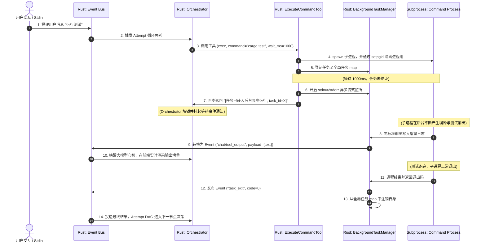

# Morphz 整体软件架构设计文档 (High-Level Architecture)

> [!WARNING]
> 本文包含早期固定 Context Fold、自动 GraphMemory 注入和后台语义整理方案。当前 Agent 主链路以 [Agent-Owned Context](./morphz_agent_owned_context_design.md) 为准；本文仅保留为系统工程背景材料。

本设计文档规范了下一代智能体框架 `Morphz` 迁移为**纯 Rust 架构**后的高层软件架构、子系统职责、进程模型以及通信协议。

---

## 1. 系统设计哲学 (Design Philosophy)

为了实现高安全、强并发、低延迟的智能体框架，Morphz 遵循以下三个核心系统设计哲学：
1.  **纯 Rust 统一底座 (Unified Rust Base)**：编排调度（控制面）与执行引擎全部基于 Rust 构建。通过平铺的模块设计，消除了过去异构跨语言（Go-to-Rust）的多进程 IPC 通信开销，实现了更高性能和零依赖单体部署。
2.  **双轨持久化中枢 (Separation of Storage Concerns)**：用 SQLite 锁死时序事件（ACID）并提供 CTE 图递归寻路，用 LanceDB 承载多维向量做 K-NN 极速召回，形成优势互补 of 工业级存储模型。
3.  **反应式事件驱动与背压限制 (Reactive Event-driven with Backpressure)**：系统一切动作皆由 `InMemoryEventBus` 驱动。引入了 Semaphore 并发限制（Attempts Limit = 10），用以抵御高并发下的资源爆发占用，实现自愈和平滑。

---

## 2. 进程与拓扑模型 (Process & Topology)

Morphz 部署于宿主机时，物理上划分为两个相互隔离或协作的进程边界：

```mermaid
graph TD
    subgraph Host OS (宿主机进程边界)
        direction TB
        A[Morphz Core Daemon (Rust)] <-->|HTTP Loopback / In-Memory| B[Rust Executor (BGE Inference Server)]
        A <-->|Event Bus (WebSocket)| C[Web UI Dashboard / IM Gateways]
    end

    subgraph Memory & Database (双轨持久化)
        A <-->|SQL / FTS5| D[(SQLite: morphz.db)]
        A <-->|K-NN Query| E[(LanceDB: morphz.db_lancedb)]
    end

    subgraph Tool Sandbox (安全执行边界)
        A -->|pre_exec: setpgid| F[Subprocess Group (pgid)]
        F -->|Stdout/Stderr Stream| A
        A -->|kill_task: SIGKILL broadcast| F
    end
```

---

## 3. 子系统架构与职责

### 3.1 接入层 (IM & Gateway / Web Server)
- **职责**：适配外部的前端大盘 UI（Dashboard）及 WebSocket 长连接通道。
- **设计**：由 Axum 驱动的 HTTP/WebSocket 服务器运行在 `127.0.0.1:8080`，提供内存快照、历史事件流订阅，并将用户交互实时转换并推送到事件总线。

### 3.2 消息中枢 (InMemoryEventBus)
- **职责**：解耦所有内部与外部通信，充当系统的“神经系统”。
- **设计**：
  - 支持 Topic 模糊前缀匹配（如 `chat/*`）。
  - **背压控制**：内置 `tokio::sync::Semaphore`，将异步处理的最大并发量硬性限制为 10，防止下游 LLM 网络请求或数据库死锁爆仓。

### 3.3 核心协调层 (Orchestrator)
- **职责**：驱动 Agent 决策流（Attempt Loop）的构建、LLM 驱动与指令执行。
- **设计**：
  - 基于不可变事件历史（EventHistory）进行动态投影，通过 Fold 算子投射出当前脑 Context 状态。
  - **零拷贝 S-Expr 解析**：基于字节流 `&str` 的零拷贝 Lisp Parser 迭代器，支持精确到行列号的 `ParserError` 追踪，实现解析异常的高精度大模型自我纠错。

### 3.4 记忆与上下文中枢 (Memory Engine)
- **职责**：沉淀事实并提供高速向量检索与多维关联。
- **设计**：
  - **SQLiteStore**：承载只增不减的事实日志（Event History）和图数据库中实体与关系的物理边（Edges）。通过 `WITH RECURSIVE` 支持图拓扑的递归漫游寻路。
  - **LanceDB**：存储节点的向量表。K-NN 检索召回后，由 SQLite 运行 `IN` 批量拼装并辅以余弦相似度阈值（0.45/0.70）过滤。

### 3.5 向量推理层 (Rust Executor)
- **职责**：为整个框架提供快速的向量生成（Embedding）计算。
- **设计**：
  - 独立运行于 `127.0.0.1:8085` 的 Axum 本地服务，内存加载 BGE 语义模型。
  - 主 Core 亦支持在冷启动直接在内存中集成该模块，并提供了本地 Hashing Embedding 兜底机制以抵御网络或加载故障。

### 3.6 工具执行层 (Execute & Sandbox Manager)
- **职责**：管理本地 Shell 命令的执行与生命周期。
- **设计**：
  - **异步 Detach 托管**：`exec` 工具可指定 `wait_ms`（默认 `1000ms`），超时未结束的进程自动进入全局后台任务 Map 并解除模型阻塞，stdout/stderr 改为异步流式投递。
  - **进程组安全强杀**：子进程在 `pre_exec` 中通过 `setpgid` 自立为进程组 Leader，调用 `kill_task` 时使用高精度唯一 task_id，利用负数 `pgid` 对整个下属子孙进程树进行 `SIGKILL` 物理强杀，防止僵尸进程逃逸。

---

## 4. 内部通信协议与重试机制

- **大模型 API 访问**：OpenAI 客户端内置自动指数退避重试，在遭遇网络抖动、429 频次超限或 5xx 错误时以指数退避时间（$1\text{s}, 2\text{s}, 4\text{s}, 8\text{s}$）自愈重试，最大尝试 5 次。
- **命令行工具调用参数 Schema**：
  - `exec` 参数包含 `command: String`, `wait_ms: Option<u64>`, `session_id: Option<String>`。
  - `kill_task` 参数包含 `task_id: String`。

---

## 5. 典型请求生命周期与感知链 (Lifecycle Walkthrough)

以下展现 Agent 运行中，**异步命令超时托管**并由**后台流式输出唤醒**的完整链路：


