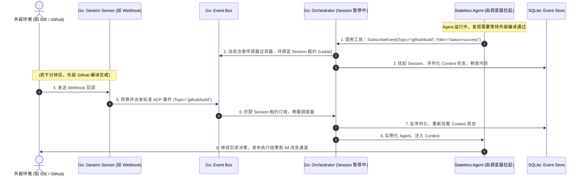

# Morphz 整体软件架构设计文档 (High-Level Architecture)

本设计文档规范了下一代智能体框架 `Morphz` 的高层软件架构、子系统职责、进程模型以及通信协议。

---

## 1. 系统设计哲学 (Design Philosophy)

为了实现高安全、强并发、低延迟的智能体框架，Morphz 遵循以下三个核心系统设计哲学：
1.  **控制与执行分离 (Control-Data separation)**：Go 负责策略编排、状态流转和 I/O (控制面)；Rust 负责代码审计、虚拟化安全沙箱和编译器执行 (数据/执行面)。
2.  **微内核与故障隔离 (Microkernel & Fault Isolation)**：执行沙箱（Rust Yao-VM）作为独立的守护进程运行，通过 Unix Domain Socket 进行进程间通信。即便 AI 生成的指令导致虚拟机崩溃，控制面依然能够无损重启执行层。
3.  **反应式事件驱动 (Reactive Event-driven)**：系统一切动作皆由事件总线（Event Bus）驱动，外部传感器（Sensors）检测到任意物理变更并推送到事件总线，完全解耦智能体自身的思考逻辑。

---

## 2. 进程与拓扑模型 (Process & Topology)

Morphz 部署于宿主机时，物理上划分为三个相互隔离的边界：

```mermaid
graph TD
    subgraph Host OS (宿主机边界)
        direction TB
        A[Go: Morphz Core Daemon] <-->|IPC: UDS + gRPC| B[Rust: Yao-VM Daemon]
        A <-->|Event Bus| C[IM Gateways: TG/Slack/Canvas]
    end

    subgraph L2 Sandbox (Yao-VM 进程内隔离)
        B -->|Embeds| D[Wasmtime Instance]
        D -->|Runs| E[AI yao-lang Skills]
    end

    subgraph L3 Sandbox (宿主物理隔离边界)
        A <-->|FileSync: Tar Streaming| F[L3 Container: Docker/Cloud]
        F -->|Executes| G[Heavy Tools: npm/python/git]
    end
```

---

## 3. 子系统架构与职责

### 3.1 接入层 (IM & Gateway Layer)
- **职责**：适配异构的用户终端（如 Telegram, Slack, Web Canvas UI）。
- **设计**：解耦的插件式架构。每个 IM 插件通过 TCP/WebSockets 连入 Go Core，订阅其感兴趣的主题，并将平台的物理交互（如点击 Button，发送文字）转换为 **ACP (Agent Communication Protocol)** 统一格式，推送给事件总线。

### 3.2 消息中枢 (ACP Message Bus)
- **职责**：解耦所有内部与外部通信，充当系统的“神经系统”。
- **设计**：基于 Go Channel 构建的高性能内存事件总线。支持 Topic 模糊订阅、事件防抖（Debounce）与事件回放。

### 3.3 核心协调层 (Orchestrator & Agent Coordinator)
- **职责**：驱动 Agent 决策流（Attempt DAG）的构建与流转。
- **设计**：
  - **无状态 Agent 调度器**：按需实例化无状态的 Agent 处理器，并为其绑定特定的 Context 视口。
  - **DAG 引擎**：维护动态任务有向无环图，处理重试、异常分叉与任务合并。

### 3.4 记忆与上下文中枢 (Memory & Context Engine)
- **职责**：沉淀事实并生成每次 LLM 所需的 Prompt。
- **设计**：
  - **Event Store**：基于 SQLite 存储只增不减的事实日志。
  - **Graph Engine**：在内存中维护实体与关系的知识网络。
  - **Context Evaluator**：基于时序衰减和拓扑邻近算法，对记忆进行投影求值。

### 3.5 安全执行层 (Rust Yao-VM Daemon)
- **职责**：对 AI 产出的代码提供绝对安全的进程内拦截与微秒级运行。
- **设计**：
  - **Yao-Parser**：利用 Rust 构建快速 AST 解析，过滤高危系统调用和外部 FFI。
  - **WASM VM**：基于 `wasmtime-rust` 嵌入运行时，限制最大内存空间与运行指令数（Gas Limit）。

### 3.6 外部执行层 (L3 Sandbox Manager)
- **职责**：管理需要重型系统依赖的操作。
- **设计**：
  - **Container Manager**：负责本地 Docker 容器生命周期及远程 Serverless VM 的调度。
  - **FileSyncManager**：使用内存 Gzip Tar 流实现宿主机代码工作区与 L3 沙箱间的秒级同步。

### 3.7 感知层与动态订阅 (Sensor & Subscription Layer)
- **职责**：抽象并承载外部物理世界的感知能力，与 Agent 的心智逻辑彻底解耦。
- **设计**：
  - **自描述传感器 (Self-describing Sensor)**：如 `FileWatcher`、`Timer`、`Webhook`、`GmailMonitor`。它们通过 MCP 协议定义其产生的 Event Schema，并向系统总线动态注册。
  - **动态订阅（Dynamic Subscription）**：Agent 在运行过程中，可以通过调用系统工具动态声明“我对主题 X 且满足过滤器 Y 的事件感兴趣”（例如监听某文件的变动，或等待特定邮件的到来）。
  - **租约与生命周期（Lease Mechanism）**：动态订阅绑定到 Agent 会话，拥有 TTL 租约。会话结束或租约过期，控制面自动卸载传感器监听，避免“僵尸订阅（Orphaned Subscriptions）”消耗系统资源。

---

## 4. 内部通信协议 (IPC)

Go Core 与 Rust Yao-VM Daemon 之间通过 **Unix Domain Socket (UDS)** 运行极速的 gRPC 通信。

### 4.1 协议结构定义 (Protobuf 示意)
```protobuf
syntax = "proto3";
package morphz.ipc;

service YaoVMService {
  // 静态 AST 白盒审计
  rpc AuditAST(AuditRequest) returns (AuditResponse);
  
  // 运行 L2 技能代码
  rpc ExecuteSkill(ExecuteRequest) returns (ExecuteResponse);
}

message AuditRequest {
  string source_code = 1;
}

message AuditResponse {
  bool passed = 1;
  string error_message = 2;
  repeated string detected_imports = 3;
}

message ExecuteRequest {
  string wasm_bytecode = 1;
  bytes input_payload = 2;
  int64 max_memory_bytes = 3;
  int64 max_gas_units = 4;
}

message ExecuteResponse {
  int32 exit_code = 1;
  bytes output_payload = 2;
  string stdout = 3;
  string stderr = 4;
  int64 gas_consumed = 5;
}
```

---

## 5. 典型请求生命周期与感知链 (Lifecycle Walkthrough)

以下展现 Agent 运行中，**动态注册传感器订阅**并由**传感器事件触发异步唤醒**的完整链路：


