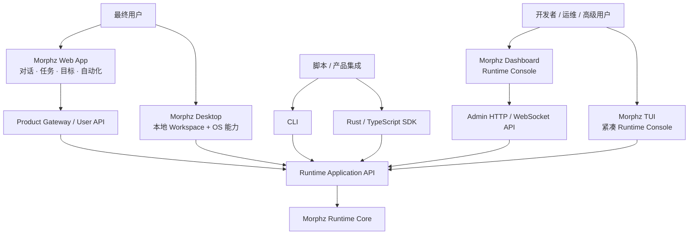

# Morphz 产品界面与交付架构 v1

> 状态：产品分层已达成共识；Dashboard Runtime Console v1 已实现，Web App 留待下一阶段
>
> 日期：2026-07-21
>
> 相关文档：[产品化架构收口 v1](./morphz_productization_architecture_v1.md)、[Dashboard / Runtime Console 设计 v1](./morphz_dashboard_runtime_console_design_v1.md)、[SDK 与可信 Gateway 身份接入](./morphz_sdk_and_trusted_gateway_identity_v1.md)、[通用能力与产品表达矩阵 v1](./roadmap/morphz_product_capability_surface_matrix_v1.md)

## 1. 为什么需要重新划分产品面

Morphz 已经不再只是一个聊天 Agent。它同时是：

- 共享 Context 与持续 Mind 的认知 Runtime；
- 支持多 Session、多 Objective、多 Thread 并发的调度系统；
- 能执行工具、定时任务、Delegation、审批和恢复的执行平台；
- 可以被本地用户、网站用户、开发者和运维者以不同方式使用的产品内核。

如果所有能力都塞进同一个“聊天界面”，底层概念会变得不可观察；如果所有底层对象都直接暴露给普通用户，产品又会难以使用。因此需要明确区分：

```text
Runtime Dashboard   面向 Runtime 本身
Web App             面向最终用户
Desktop App         面向本地最终用户，同时托管 Runtime
TUI                 面向终端中的高级用户，紧凑观察 Runtime
CLI / SDK / Server  面向自动化和集成
```

这些产品面不应各自重新发明 Agent 逻辑。它们共享同一个 Runtime Application API、身份语义和持久状态，只选择不同的视角、术语、权限和信息密度。

## 2. 统一分层



关键边界：

- Runtime Core 不依赖任何 UI；
- Dashboard 不决定 Runtime 领域语义；
- Web App 不直接持有全局管理令牌；
- Desktop 不重新实现一套 Agent，只负责本地宿主与产品体验；
- TUI 不因为展示空间有限而重新定义状态；
- 所有终态来自同一权威 Projection。

## 3. 产品矩阵

| 产品面 | 主要用户 | 默认范围 | 信息密度 | 是否展示底层概念 | 主要写操作 |
| --- | --- | --- | --- | --- | --- |
| Dashboard | Runtime 开发者、运维、高级用户 | Agent / Context，可过滤 Session | 高 | 完整 | 配置、审批、恢复、诊断、生命周期管理 |
| Web App | 最终用户 | 当前用户可见的 Workspace/Session/Task | 中低 | 经过产品语义映射 | 对话、创建任务、目标、自动化、用户审批 |
| Desktop App | 本地最终用户、Coding/创作用户 | 本地 Workspace + 当前身份 | 中 | 默认产品语义，可进入高级控制台 | 文件/项目、对话、任务、权限、Provider、本地 Runtime |
| TUI | 终端高级用户 | 当前 Context/Session | 高但紧凑 | 核心概念摘要 | 对话、审批、切换范围、查看目标/Thread、取消 |
| CLI | 脚本、CI、管理员 | 命令显式指定 | 机器友好 | 使用稳定领域名 | CRUD、查询、消息、导出、维护 |
| SDK | 产品开发者 | Principal/Context/Session 作用域 | 结构化 | 完整类型，但按权限开放 | 集成 Runtime 能力 |

## 4. Morphz Dashboard

### 4.1 定位

产品名称继续使用 **Morphz Dashboard**。`Runtime Console` 是它的功能定位或副标题，不需要另起一个容易混淆的产品名。

Dashboard 展示 Runtime 的真实领域模型：

- Agent / Context / Session / Principal；
- Objective / Thread / Signal / Activation / Schedule；
- Model Attempt / Action Group / Execution Job / Approval；
- Mind / Frame / Observation / Context Encoding / Recall；
- Event History / Projection / Snapshot / Provider / Sandbox / Storage。

Dashboard 可以友好，但不应为了“像聊天产品”而隐藏 Morphz 的核心概念。

### 4.2 权限

Dashboard 默认是可信管理面：

- 本地单用户模式可以访问完整 Runtime；
- 服务部署模式必须使用独立 Admin 身份和管理凭证；
- 普通网站用户不能进入全局 Dashboard；
- Principal scoped 的用户页面属于 Web App，不属于 Dashboard 的权限降级版。

## 5. Morphz Web App

### 5.1 定位

Web App 是面向最终用户的主要互联网产品。它把 Runtime 能力映射为用户可以理解和操作的并发工作体验：

- 与 Agent 正常聊天；
- 用户继续聊天时，后台任务不阻塞；
- 同时查看多个任务、目标和等待项；
- 给任务设定依赖、定时和优先级；
- 查看 Agent 当前在做什么、需要什么以及交付了什么；
- 处理只与当前用户有关的审批和输入请求；
- 在自己的 Session/Workspace 之间切换。

### 5.2 产品语言映射

Web App 不必隐藏所有 Runtime 概念，但应使用用户任务语言：

| Runtime 领域对象 | Web App 默认表达 |
| --- | --- |
| Agent | Agent / 助手 |
| Cognitive Context | Workspace / 认知空间；简单产品中可隐式 |
| Session | 对话 / 频道 |
| Principal | 账户 / 参与者 |
| Objective | 目标 |
| Thread | 任务 / 运行 |
| DialogueTurn Thread | 一次消息处理，不单独命名 |
| Execution Job | 步骤 / 工具执行 |
| Schedule | 自动化 / 定时任务 |
| Approval | 权限请求 / 需要你确认 |
| Delivery | 结果 / 更新 |
| Mind / Frame | 记忆与认知；默认只展示用户可理解的摘要 |
| Event History | 活动记录；不直接暴露全局持久化事件 |

映射只发生在呈现层，不能在 Web App 中重新构造另一套状态机。

### 5.3 推荐信息架构

```text
Home / Inbox       需要关注、最近交付、等待用户输入
Conversations      对话和 Session
Tasks              并发任务、运行状态、依赖、步骤和结果
Goals              长期 Objective
Automations        Schedule
Memory             用户可理解的长期偏好/知识；不是完整 Mind Inspector
Settings           账户、Provider/额度、通知和隐私
```

聊天页可以显示任务胶囊和实时状态，但不显示 Activation lease、orphan Signal、Context Head 等运维细节。

### 5.4 身份与安全

公网 Web App 必须通过 Product Gateway：

```text
GitHub / Google / X / Email
  → Product users.id
  → stable Morphz Principal
  → Principal-scoped SDK/API
```

浏览器不持有 Morphz Admin token，也不能枚举其他 Principal 的 Session。Gateway 负责账户、配额、计费、滥用控制和公开产品策略；Runtime 继续负责 Principal 锚点、Session binding 和因果传播。

## 6. Morphz Desktop App

### 6.1 定位

Desktop App 不是第四套独立交互范式。它应当是 **Web App 用户体验的本地原生宿主**，并在需要时提供 Dashboard 级高级入口。

默认体验：

- 本地项目/Workspace 管理；
- 对话、并发任务、目标和自动化；
- 文件拖放、剪贴板、通知、系统托盘；
- OS 原生 Sandbox 与权限审批；
- Provider、Keychain、本地模型和 Runtime 生命周期；
- 离线/本地优先数据。

高级模式可以打开嵌入式 Dashboard，而不是把 Runtime 调试信息永久混入普通用户页面。

### 6.2 技术边界

Desktop 可以复用 Web App 页面和共享 UI package，通过本地 in-process/loopback adapter 调用 Runtime。是否采用 Tauri 等具体容器后续单独评估，但必须保持：

- Desktop 壳不拥有调度规则；
- Runtime 可以独立升级和测试；
- 用户 UI 与 Dashboard UI 共享基础组件，不共享整套信息架构；
- 本地完全访问、自动审批和人工审批由同一 Permission API 表达。

## 7. Morphz TUI

### 7.1 定位

TUI 与 Dashboard 一样面向底层 Runtime，但受终端布局限制，应当是**紧凑控制面**，不是 Dashboard 的字符画复制品。

TUI 默认保留：

- 当前 Agent / Context / Session / Principal；
- 对话 transcript 和 composer；
- 当前 Thread/Objective/Job 的一行状态；
- pending Approval 和需要关注的失败；
- Mind revision、Frame 数量、pressure；
- 可选择的 Tasks、Objectives 和 Mind Frame 主从视图；
- 当前 Principal 可见的活跃 Session 目录与安全切换；
- 底部单行状态栏；不使用固定顶部 Header。

TUI 默认不承担：

- 完整因果图和大规模 Event History 浏览；
- Frame relation/provenance 图；
- 多列 Runtime 配置控制台；
- 大型 JSON、Prompt 和工具结果的长期并排比较。

这些场景应提供“在 Dashboard 打开”链接、复制 ID，以及 CLI JSON 查询。

### 7.2 与 Dashboard 的一致性

TUI 可以减少元素，但不能修改概念：

- `Thread` 仍是 Thread，不重新叫 Work Item；
- 状态仍来自权威 Scheduler Snapshot；
- Session/Context/Principal 层级保持一致；
- 工具步骤仍归属于 Execution Job/Thread；
- 实时草稿与持久终态保持视觉区分。

## 8. CLI、SDK 与 Server

### 8.1 CLI 与 TUI 分离

- 无子命令或显式 `tui` 进入交互 TUI；
- `context/session/objective/thread/events/runtime` 等子命令提供稳定脚本接口；
- 所有查询支持人类表格与 JSON；
- CLI Help 和命令层级属于公开产品契约。

### 8.2 SDK 是共同能力源

Rust SDK 和 TypeScript SDK 不应只覆盖 Session Service。随着 Dashboard/Web App 演进，应逐步稳定：

- Context 与 Session；
- Principal scoped conversation/task queries；
- Objective、Thread、Schedule 和 Approval；
- Cognition 与 Event History 的只读查询；
- Runtime Admin queries（单独权限域）。

Dashboard、Web App 和 Desktop 可以拥有不同 API facade，但底层 ViewModel 应先在 Runtime/SDK 定义，不能由页面临时拼 SQL 或猜状态。

### 8.3 一个 Server，两类接口权限

当前 `morphz serve` 可以继续作为唯一 Server 入口，不需要再造第二个 `morphz-server` 产品。它内部区分：

- Admin API：Dashboard 使用；
- Principal-scoped User API：Gateway/Web App 使用；
- WebSocket streams：按相同身份和对象范围授权。

是否未来拆进程是部署问题，不应现在制造两个用户可见 Server 概念。

## 9. 前端代码共享策略

长期推荐结构：

```text
apps/
  dashboard/        Runtime Dashboard
  web/              End-user Web App
  desktop/          Native host
packages/
  morphz-client/    Typed SDK adapter
  domain/           Stable view models and terminology
  ui/               Tokens, primitives, Markdown, composer, stream display
  i18n/             Shared base terminology
```

共享：

- design tokens、基础控件、Markdown、Composer、stream renderer；
- Runtime/SDK 类型、状态字典、对象链接和错误模型；
- i18n 的领域词汇。

不共享：

- Dashboard 与 Web App 的页面导航；
- Dashboard 的全局权限和诊断组件；
- Web App 的账户、计费、增长和用户任务视图；
- Desktop 的 OS 生命周期与原生集成。

## 10. 交付形态

### 10.1 `morphz` 单二进制

继续提供一个核心命令行二进制，包含：

- Runtime；
- CLI/TUI；
- `serve` / `dashboard`；
- 内嵌 Dashboard 静态资源。

本地交付最终允许同一个二进制启动两种不同产品面：

```text
morphz dashboard   启动 Runtime Console，并生成本地访问凭证与打开浏览器
morphz web         启动面向最终用户的本地 Web App（后续实现）
morphz serve       启动可被 Gateway 或其他客户端使用的 Server
```

三个命令可以复用同一个 Runtime 与 HTTP 服务器，但必须装载不同的前端入口和权限范围，不能把 Dashboard 通过隐藏菜单伪装成 Web App。

这保证本地下载一个文件即可运行和诊断。

### 10.2 Web App

Web App 有两种交付方式，但使用同一产品语义：

- 本地单机：静态资源可以内嵌进 `morphz`，由未来的 `morphz web` 直接启动；
- 公网产品：独立部署，通过 Gateway/Principal-scoped API 使用 Morphz，不与 Runtime 二进制发布周期强绑定。

是否内嵌是交付选择，不改变 Web App 与 Dashboard 的信息架构和权限边界。

### 10.3 Desktop

Desktop 作为独立安装包发布，内部可以捆绑相同 Runtime 二进制/库和 Web App 静态资源。它不改变 CLI 单二进制承诺。

## 11. 实施顺序

1. 先完成 Dashboard 的领域信息架构与权威查询层；
2. 同时把可复用的 typed client、stream renderer、composer 和 domain vocabulary 从单体页面提取出来；
3. 在稳定的 Principal-scoped SDK 上建立 Web App，不复制 Dashboard；
4. Web App 体验稳定后，用 Desktop 壳承载本地能力；
5. TUI 与 Dashboard 对齐术语和权威状态，但保持紧凑；
6. 最后统一跨产品的设计 token、i18n 和可访问性。

## 12. 当前建议结论

1. Dashboard 保留名称，定位为 Runtime Console；
2. Web App 是独立最终用户产品，不是 Dashboard 的简化主题；
3. Desktop 默认承载 Web App 体验，高级模式嵌入 Dashboard；
4. TUI 是紧凑 Runtime Console，不追求复刻 Dashboard；
5. CLI/TUI/Dashboard/Web/Desktop 共享 Runtime/SDK，不共享一套页面；
6. 当前 Dashboard 采用渐进式重写，为后续 Web App 提取基础资产，但不让 Web App 继承 Dashboard 的信息架构。
