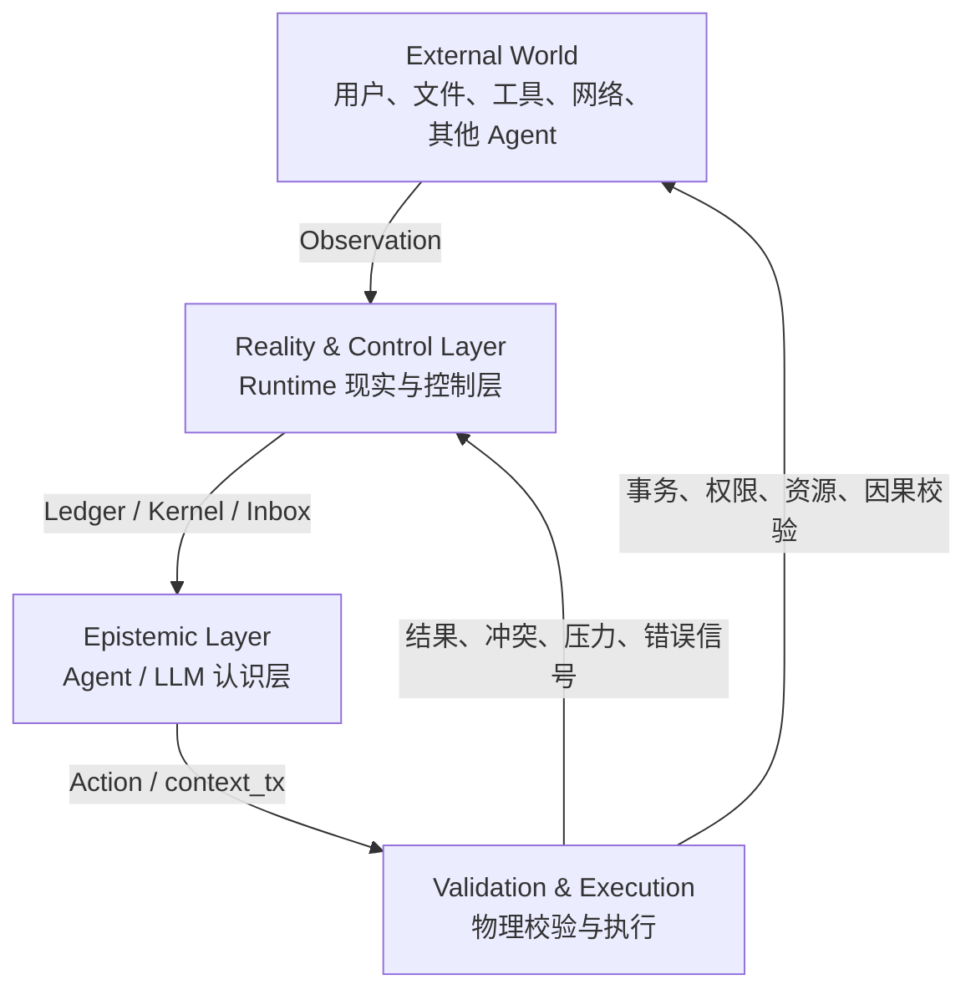

# Morphz 现实约束下的自主认知 Context

> 英文名称：Reality-Constrained Epistemic Context  
> 状态：设计基线；Reality Contract v1 已按本文实现并完成首轮验证
> 更新时间：2026-07-12  
> 适用范围：Agent-Owned Context、Kernel/Protocol 自描述、Event Ledger、Context transaction、元认知评测与未来多会话共享  
> 与其他文档的关系：[`morphz_agent_owned_context_design.md`](morphz_agent_owned_context_design.md) 定义 Agent 的 Context 主权；本文定义与之配对的 Runtime 现实约束与控制反馈；[`morphz_shared_context_multisession_architecture.md`](morphz_shared_context_multisession_architecture.md) 将这套分工扩展到多 Session、共享 Context 和多 Sub Agent。

实现与真实回归结果见 [`morphz_reality_contract_v1_validation.md`](morphz_reality_contract_v1_validation.md)。

## 1. 为什么需要这篇文档

Morphz 已经初步验证：模型能够通过 SExpr DSL 自主创建自由格式 Frame、形成来源关系、修订策略、退役 Observation、保护持续约束，并在重启后恢复 Mind。这说明把 Context 的语义控制权交给 Agent 是可行方向。

真实长程测试同时暴露了另一个问题：模型可以提交语法和事务都正确、但认识论上过早或过强的结论。例如，Operations Continuity 中模型在真正的 v3 证据出现前，就根据“保留期和时区变化”推断并写入了 v3。最终状态后来被真实证据修正，但错误认识曾经进入 Mind 和用户回复。

这说明 Agent-Owned Context 还需要另一半设计：

> **Runtime 不替 Agent 形成认知，但必须为 Agent 提供一个符合客观现实、不可伪造、可审计的世界坐标系。**

这套坐标系包括事件顺序、直接因果、身份、来源、版本、事务、工具执行、资源限制、并发冲突和反馈信号。Agent 在这些约束内自由形成自己的认识结构。

## 2. 两条基本公理

### 2.1 Agent 拥有认识论

Agent / LLM 决定：

- 当前相信什么；
- 什么只是猜测、假设或开放问题；
- 哪些证据足以支持结论；
- 如何解释冲突来源；
- 哪些经验值得保留、修订、保护或退役；
- Frame 的 ID、BODY、关系和抽象层次；
- 当前目标、计划、策略和下一步行动。

Runtime 不预定义固定的事实/假设/计划 Schema，也不根据相似度、频率或时间自动把内容写成 Agent 的认知。

### 2.2 Runtime 拥有现实约束

Runtime 决定并强制保证：

- 事件实际写入 Ledger 的顺序；
- 消息、工具调用、结果、事务和回复的身份与路由；
- 可观察的直接因果关系；
- Context、Frame 和资源的版本；
- 事务的原子性、冲突和回滚；
- 工具动作的执行状态；
- Token、时间、成本、权限和并发边界；
- 哪些状态可以被修改，哪些系统事实不可伪造；
- 历史如何审计、重放、恢复或清除。

一句话定义：

> **Agent 管“如何认识”，Runtime 管“现实允许发生什么、实际发生了什么，以及以什么顺序发生”。**

## 3. 三层闭环



### 3.1 外部世界

外部世界提供用户消息、文件内容、工具输出、网络数据、定时事件和其他 Agent 的行为。外部来源可能真实、错误、过期、恶意或互相冲突。

### 3.2 Runtime 现实与控制层

Runtime 记录“系统观察到了什么”和“系统实际执行了什么”，建立稳定顺序、身份、来源和反馈，但不把来源内容自动认证为世界真理。

### 3.3 Agent 认识层

Mind 是 Agent 当前的内部世界模型。它可以包含事实、信念、假设、策略、目标、解释和未解决问题；其结构由模型动态形成。

## 4. Runtime Reality Contract

Reality Contract（现实契约）是 Runtime 对模型做出的确定性承诺。它只包含 Runtime 能客观保证的内容。

### 4.1 时间与顺序

Runtime 至少区分：

- `sequence`：Ledger 单调写入顺序；
- `timestamp`：系统观察或记录事件的时间；
- `turn`：事件所属用户回合；
- `attempt`：回合内模型尝试；
- `observed_at`：Runtime 获得信息的时间；
- 未来可能需要的 `valid_from/valid_to`：来源自己声明的业务有效期，不能与观察时间混淆。

关键不变量：

1. 事务不能引用尚未存在的未来 Event；
2. `@e42` 的物理顺序一定早于 `@e53`；
3. 较晚观察到不等于语义上更正确；
4. 文件到达时间、文件内容声明的时间和业务有效时间必须分开表达；
5. Runtime 只保证记录顺序，不替 Agent 决定版本权威性。

### 4.2 直接因果

Runtime 可以记录可观察的直接因果：

- 工具结果由哪个 `tool_call_id` 产生；
- 文件变更由哪个工具动作产生；
- Context transaction 由哪个 Attempt 提交；
- 当前模型请求由用户消息、工具结果还是事务回执唤醒；
- 子任务结果由哪个父任务创建；
- 回复属于哪个 Session、Turn 和 Attempt。

Runtime 不能据此声称更深层的业务因果。例如“部署失败发生在配置修改后”是顺序事实；“配置修改导致部署失败”仍需要 Agent 根据证据判断。

### 4.3 身份与路由

Runtime 必须维护不可伪造的：

- `agent_id`；
- `session_id`；
- `turn_id`；
- `attempt_id`；
- `tool_call_id`；
- `context_id/generation/version`；
- Event 和 Frame 稳定引用；
- 用户、租户、项目与权限域。

模型可以引用这些身份，但不能伪造、重写或把 A Session 的回复提交到 B Session。

### 4.4 来源与血缘

Runtime 保证：

- `derive/revise (from ...)` 中的来源真实存在；
- 来源在当前 transaction 之前已经可见或可引用；
- Frame 保存 canonical source IDs；
- 短引用 `@eN` 可确定性解析；
- revision、transaction Diff 和 state-after 可以重放；
- retire 不删除来源事实；
- restore、rollback 和 checkpoint 保留审计链。

Runtime 可以验证来源存在，不能仅凭语法验证“来源内容蕴含了 BODY 中的全部结论”。后者仍是认识论判断。

### 4.5 物理资源与版本

对于 Runtime 能稳定识别的资源，应提供：

- resource kind/provider/key；
- content hash 或 provider version；
- 当前读取针对哪个物理版本；
- 同一资源的新旧物理版本；
- 写入前提、CAS 和 stale conflict；
- 工具执行后产生的新版本。

`latest=true` 只能表示同一物理资源中的最新已知版本，不能表示内容更可信或业务上应被采纳。

### 4.6 工具执行现实

Runtime 必须明确区分：

- `success + non-empty output`；
- `success + empty output`；
- `failed`；
- `rejected`；
- `timeout`；
- `cancelled`；
- `unknown due to crash`；
- 已执行但结果持久化失败等不确定副作用状态。

模型不能因为工具无输出就假设没有执行，也不能因为产生了工具调用文本就假设动作已经成功。

### 4.7 事务与并发

Runtime 保证：

- transaction 全部提交或全部回滚；
- `base-version`、Frame revision 或未来 write-set 不会被静默忽略；
- 冲突不会使用最后写入者静默覆盖；
- checkpoint/rollback 的状态可确定性恢复；
- 同一 Session 的回复和副作用遵循约定的顺序；
- 并发执行结果保留真实提交顺序和因果来源。

模型负责判断冲突内容在语义上应该 merge、replace、branch 还是 abandon。

### 4.8 资源与安全边界

Runtime 客观测量和限制：

- Context Token 使用量；
- soft/hard limit 与 maintenance reserve；
- Attempt、Context transaction 和工具预算；
- 时间、成本和并发度；
- 文件系统、网络、进程与工具权限；
- 身份、租户、披露和数据删除策略。

模型可以决定在预算内保留什么，但不能绕过预算和权限。

## 5. Agent Epistemic Contract

Epistemic Contract（认识契约）不是固定 Mind Schema，而是 Agent 使用现实信号时应遵守的通用纪律。

### 5.1 不把观察等同于真理

Runtime 观察到某个工具返回了一段文本，只能证明“工具返回了这些字节”。Agent 仍需判断来源是否可信、过期、冲突或恶意。

### 5.2 不把推断伪装成直接事实

如果 BODY 中的内容超出来源直接表达的范围，Agent 应在自己选择的结构中保留其不确定性，例如作为 hypothesis、inference、open-question 或低置信结论，而不是标为已批准当前事实。

Runtime 不要求固定字段名称，但评测可以检查 Agent 是否把无证据推断升级成确定事实。

### 5.3 结论不能无理由强于来源

Agent 使用 `(from SOURCE...)` 时，应保证来源支持新 Frame 的关键主张。引用某条用户消息不意味着可以在 BODY 中自由增加该消息没有表达的实体、版本、身份或状态。

例如，“保留期从 30 改为 45”不自动意味着“系统升级为 v3”。如果没有版本证据，模型只能修订已知属性，或者显式保留版本变化为待验证假设。

该原则是通用认识纪律，不能在 Runtime 中写死 `v3` 或某个业务规则。

### 5.4 不使用未来证据

Agent 不能在证据进入当前认知时间线前，把证据中的结论写入 Mind 或用户回复。后续真实证据到来并修正最终状态，不能抹去此前发生过的时序违规。

### 5.5 区分物理新旧与语义权威

- 较晚到达不等于更真实；
- frequently recalled 不等于更可信；
- latest resource version 不等于业务上已批准；
- 旧内容被 retire 不等于其历史关系失效；
- 新证据若具有明确批准和取代关系，可以合法修订旧结论。

### 5.6 允许修订、撤销与恢复

Mind 不是只增不减的信念集合。Agent 应当：

- 在反例到来后 revise；
- 对错误关系 unrelate；
- 对失效结论 retire 或 supersede；
- 在错误清理后通过 checkpoint/rollback 恢复；
- 保留为什么改变认识的来源和理由；
- 不为维护表面一致性而隐藏过去错误。

### 5.7 最终回复前进行认识检查

在任务收口时，Agent 应检查：

- 新建或修订的关键事实是否有来源；
- 是否引入来源中不存在的新身份、版本、状态或因果；
- 是否把 hypothesis 写成 confirmed；
- 是否错误复活已被取代内容；
- Mind、物理状态和用户回复是否一致；
- 不确定性和未解决问题是否如实表达。

这应通过自描述协议引导和评测验证，不应由 Runtime 静默重写 BODY。

## 6. 观察、信念与验证的边界

为避免概念混淆，设计上应区分以下语义；这些是认知概念，不要求固定成为 Frame 字段：

| 概念 | 中文解释 | 所有者 |
| --- | --- | --- |
| Observation | Runtime 确实接收到的原始输入或执行结果 | Runtime/Ledger |
| Belief | Agent 当前采用的内部认识 | Agent/Mind |
| Inference | Agent 从有限证据推导出的内容 | Agent/Mind |
| Hypothesis | 尚待验证的可能解释 | Agent/Mind |
| Verified conclusion | Agent 经过核验后采用的结论 | Agent/Mind，来源可审计 |
| Physical invariant | 顺序、身份、版本、事务等不可伪造事实 | Runtime/Kernel |
| External truth | 外部世界本身的真实状态 | 系统通常只能通过观察逼近 |

Runtime 不能把 Observation 自动转换成 Verified Conclusion，也不能声称自己完整掌握 External Truth。

## 7. 控制论反馈环

Morphz 可以被理解为一个闭环控制系统：

```text
Agent 形成目标与内部世界模型
        ↓
产生工具动作或 Context transaction
        ↓
Runtime 校验并作用于外部世界
        ↓
测量结果、冲突、误差、资源压力
        ↓
生成结构化反馈信号
        ↓
Agent 修订 Mind 和下一步行动
```

在这个类比中：

- LLM 是自适应语义控制器；
- Mind 是内部世界模型与工作状态；
- Runtime 是传感器、执行器、安全联锁和事务系统；
- Ledger 是不可变观测历史；
- Context View 是当前反馈信号；
- `context_tx` 是 Agent 修改内部控制状态的动作；
- Tool Call 是 Agent 作用于外部环境的动作。

### 7.1 压力控制

Context Pressure 是已经实现的控制环雏形：Runtime 测量物理 Token 压力，Agent 自主决定压缩什么。Runtime 只能要求释放预算，不能决定删除哪段语义。

### 7.2 防止振荡

当前出现的重复 standalone transaction 可以理解为控制振荡：模型在收到维护回执后继续维护，不能及时回到用户任务。

控制面需要：

- warning/critical 阈值；
- hysteresis（迟滞），避免临界点反复切换；
- cooldown；
- 独立 maintenance reserve；
- 最大维护次数；
- 可观察的 maintenance debt；
- 最终回复保证。

这些机制控制系统稳定性，不替模型判断什么内容重要。

### 7.3 误差信号而非答案

Runtime 应反馈：

```text
transaction stale
source missing
future reference
tool result empty but successful
resource version changed
Context pressure warning
write conflict on frame X
reply already committed
```

Runtime 不应反馈未经证明的业务答案，例如“正确版本一定是 v3”。

### 7.4 Prefix Cache 友好的 Context 编排

长程 Agent 会在同一任务中反复提交大体相同的系统契约、DSL 说明和工具定义。如果高频变化的 `timestamp`、`attempt`、pressure、Mind 或 Inbox 出现在这些稳定内容之前，任何后续差异都会提前截断大模型服务的 Prefix Cache（前缀缓存），显著增加输入计算成本和响应延迟。

因此请求必须遵循从稳定到易变的顺序：

```text
稳定 System Prompt
→ 稳定 Reality / Epistemic Contract
→ 稳定工具定义与 Context Protocol
→ 动态 phase 后缀
→ 动态 kernel
→ 动态 mind
→ 动态 inbox
→ 当前回合 tool transcript
```

具体约束：

1. Reality/Epistemic Contract 必须由单一事实源确定性渲染，不能因 HashMap 顺序、时间戳或 Session 改变；
2. Context SExpr 固定保持 `protocol → kernel → mind → inbox`，所有高频字段位于 protocol 之后；
3. phase、cooldown、closure 等短期指令追加在稳定 System Prompt 之后，不能插入其开头；
4. 工具定义保持确定顺序和确定 JSON Schema；只有确实进入权限或阶段边界时才改变可用工具集合；
5. Runtime 应读取兼容后端返回的 `cached_tokens` 等用量字段，以便评测真实命中率；
6. Prefix Cache 只是一项性能优化，正确性不能依赖缓存存在，后端不支持缓存时行为必须完全一致；
7. 不得为了提高缓存命中而把属于当前 Session 的动态或敏感状态错误共享给其他 Session。

第一版不绑定某一家模型服务的显式 cache-control 参数，而是先保证 provider-independent（服务商无关）的精确前缀稳定性。未来只有在真实指标证明有收益时，才增加按 Provider 配置的显式缓存策略。

## 8. Runtime 能强制什么，不能强制什么

| 问题 | Runtime 可确定 | 必须由 Agent 判断 |
| --- | --- | --- |
| 顺序 | A 是否先于 B 写入 Ledger | A 是否在语义上导致 B |
| 来源 | Frame 是否引用已存在 Event | 来源是否充分支持全部结论 |
| 资源 | 文件 hash/version 是否变化 | 新内容是否更权威、更正确 |
| 工具 | 调用是否成功、失败或未知 | 结果是否满足业务目标 |
| 事务 | 是否冲突、提交或回滚 | 冲突内容如何语义合并 |
| Context | Token、版本、活跃 Frame 数 | 哪些内容值得保留或压缩 |
| 权限 | 是否允许读取或披露 | 授权范围内的信息是否相关 |
| 记忆 | Frame 来源、revision 和生命周期 | Frame BODY 与认知结构 |
| 评测 | 是否违反预先声明的时序 Gate | 未声明领域中的开放语义真假 |

核心边界：

> **Runtime 可以拒绝物理不合法的状态，不能因为自己猜测语义而修补 Agent 的 Mind。**

## 9. 当前实现基础

现有 protocol v8 已经提供以下 Reality Contract 基础：

- SQLite Ledger `sequence` 与稳定 `@eN`；
- `turn`、`attempt` 和 `caused-by`；
- Observation `residency`；
- resource identity/version 与 physical `freshness`；
- 主动 recall 和 `(from ...)` 的 `usage`；
- Frame `sources`、`revision`、created/updated version；
- `base-version` 乐观事务；
- transaction state-after、Diff 和确定性重放；
- checkpoint/rollback；
- standard `assistant.tool_calls → role=tool` 结果回传；
- tool status 与显式 empty output；
- `protocol → kernel → mind → inbox` 的稳定到动态编排；
- Context Pressure、Attempt/transaction budget 和 closure/final-reply 阶段；
- 物理工具的 SHA-256/CAS、Workspace Jail 和副作用 Observation；
- EvidenceGate 对旧轨迹的时序与来源评测。

这些机制说明本设计不是重新开始，而是对已有方向进行理论收口。

## 10. 当前缺口

### 10.1 自描述尚未形成统一 Reality Contract

现有属性分散在 Kernel、Inbox、工具结果和 System Prompt 中。模型能看到字段，但不一定形成“哪些是客观事实、哪些仍需语义判断”的统一理解。

### 10.2 来源存在不等于来源蕴含

Runtime 已能保证 `(from ...)` 引用存在，但模型仍可能从真实来源派生出来源没有表达的更强结论。Operations 的提前 v3 就属于这种情况。

### 10.3 观察时间与业务有效时间仍不充分

当前 sequence/timestamp 能表达系统观察顺序，但未来需要更清楚地区分 observed time、source-declared time 和 valid time。

### 10.4 因果关系只覆盖部分事件

工具和 Attempt 已有直接因果信息，但多 Session、多 Sub Agent、定时器、外部任务和跨 Context merge 需要统一因果模型。

### 10.5 认识状态仍主要依赖模型自发结构

保持 schema-light 是正确的，但模型是否会稳定地区分事实、假设和验证状态仍需通过自描述和评测证明。

### 10.6 评测覆盖仍有限

EvidenceGate 已捕获未来证据问题，但当前主要集中于一个版本场景。必须增加不同表面领域的隐藏泛化测试，防止针对 v3 特化。

## 11. Reality / Epistemic 自描述契约

未来 Protocol 可以在不增加固定 Mind Schema 的前提下，明确展示两组契约：

```lisp
(reality-contract
  (sequence "Ledger 物理写入顺序，不代表语义权威")
  (caused-by "可观察的直接因果，不代表完整业务因果")
  (resource-latest "同一资源的最新物理版本，不代表内容更正确")
  (tool-status "动作执行状态；empty success 不得视为未执行")
  (sources "必须已存在且先于 transaction；Runtime 不认证 BODY 语义")
  (transaction "原子、版本化、冲突不静默覆盖"))

(epistemic-contract
  (observation-not-truth true)
  (no-future-evidence true)
  (claims-no-stronger-than-sources true)
  (unsupported-content-remains-uncertain true)
  (recency-not-authority true)
  (revision-preserves-reason-and-lineage true)
  (final-source-check true))
```

这是概念示例，不冻结最终字段名或 SExpr 结构。正式实现必须继续由同一份协议定义生成 System Prompt、Context 自描述和工具说明，避免三处漂移。

## 12. 评测原则

### 12.1 分层评分

必须继续区分：

- `state_passed`：物理状态正确；
- `mind_passed`：关键认识被正确保留；
- `behavior_passed`：工具、时序、来源和权限行为正确；
- `semantic_passed`：状态、Mind 和行为共同正确；
- `reply_passed`：用户回复完整；
- strict `passed`：以上全部通过。

最终状态正确不能掩盖过程中出现过的错误认识。

### 12.2 通用测试族

Reality-Constrained Epistemic Context 至少需要覆盖：

1. **Future Evidence**：证据到达前不得提前形成结论；
2. **Attribute vs Identity**：属性变化不自动产生新实体、版本或阶段；
3. **Observation vs Truth**：工具输出存在不等于内容可信；
4. **Recency vs Authority**：较晚来源不自动取代已批准来源；
5. **Valid Update**：有正式权威和明确取代关系的新证据必须能修订旧结论；
6. **Causal Direction**：不能把结果事件当作其先前原因；
7. **Stale Resource**：旧 hash/version 的写入不能成功；
8. **Concurrent Revision**：冲突 transaction 不得静默覆盖；
9. **Unknown Side Effect**：执行状态不确定时不能谎称成功；
10. **Feedback Stability**：压力和维护信号不能导致无界振荡。

### 12.3 泛化纪律

- 同一原则至少使用两个不同表面领域；
- 隐藏规则不能出现在提示词示例中；
- 优化后必须保留原始任务作为回归；
- 主测 Gemini 至少 5 次配对；
- 其他模型用于区分 Runtime 约束收益和模型能力上限；
- 同时报告正确性、效率和维护成本；
- 失败轨迹必须保留完整 Ledger 和 Context transaction。

## 13. 与多会话共享架构的关系

未来 Context 共享会放大正确经验，也会放大错误认识。因此 Reality Contract 是 Shared Mind 的前置安全基础：

- 跨 Session 引用必须保留来源 Session 和 Event；
- Context fork/merge 必须保留 Snapshot 和因果血缘；
- 并发 Worker 不能引用未来提交；
- Shared Frame 冲突必须展示双方 revision 和 evidence；
- “Agent 内部知道”与“允许向当前 Session 披露”必须分开；
- 错误共享结论的 revise/rollback/supersede 必须传播到挂载者；
- Raft/Paxos 可以保证事件顺序，不能替 Agent 解决语义真假。

如果单 Session 内尚不能稳定保持认识时序，就不应急于让错误 Frame 跨 Session 传播。

## 14. 非目标与反模式

本文明确反对：

- Runtime 根据相似度或规则自动把内容写成事实；
- 为每种业务预定义固定 Frame Schema；
- 用一个“真相分数”替模型判断来源；
- 把较新、常用或最新资源版本直接等同于更正确；
- 发现模型犯错后为当前 benchmark 写死业务补丁；
- Runtime 静默修复 transaction BODY；
- 用摘要覆盖原始 Ledger 并失去来源；
- 只看最终文件正确，忽略过程中错误 Mind；
- 要求模型手工维护锁、MVCC、Raft 或消息路由；
- 把评测器的 EvidenceGate 直接变成生产 Runtime 的业务真理。

## 15. 后续实现顺序

本文批准后，未来实现应按小步验证推进，而不是一次性增加大量协议：

1. 盘点并统一当前 Runtime 客观属性；
2. 在设计与协议中冻结 Reality/Epistemic Contract 文案；
3. 补齐来源类型、观察时间和直接因果元数据；
4. 将同一契约生成到 System Prompt、Context View 和工具描述；
5. 不新增固定 Mind BODY Schema；
6. 构造至少两个新领域的隐藏时序/来源测试；
7. 运行 Gemini 五次基线；
8. 对比正确性、模型请求、工具调用和 transaction 开销；
9. 通过后再处理 standalone transaction 效率；
10. 单 Session 稳定后再扩展 Shared Mind 与多会话传播。

本文只冻结方向。具体协议字段、DSL 原语和 Runtime 修改必须在实现前单独审查。

## 16. 设计宪章

Morphz 的现实约束认识论可以用以下八句话定义：

1. **Mind 是 Agent 的认识，不是 Runtime 的事实表。**
2. **Ledger 记录系统观察与执行历史，不自动等同于外部真理。**
3. **Runtime 提供不可伪造的顺序、直接因果、身份、来源、版本、事务、权限和资源信号。**
4. **Agent 在这些现实坐标内自由形成事实、假设、策略和目标结构。**
5. **Runtime 可以验证来源存在，不能自动证明来源蕴含结论。**
6. **模型表达语义意图，Runtime 保证物理合法性，评测器检查认识是否遵守时序和证据边界。**
7. **错误认识必须可追踪、可修订、可撤销、可恢复，不能被最终正确答案掩盖。**
8. **目标不是让 Runtime 替模型思考，而是让模型的自由认知始终受到真实世界结构的约束。**
