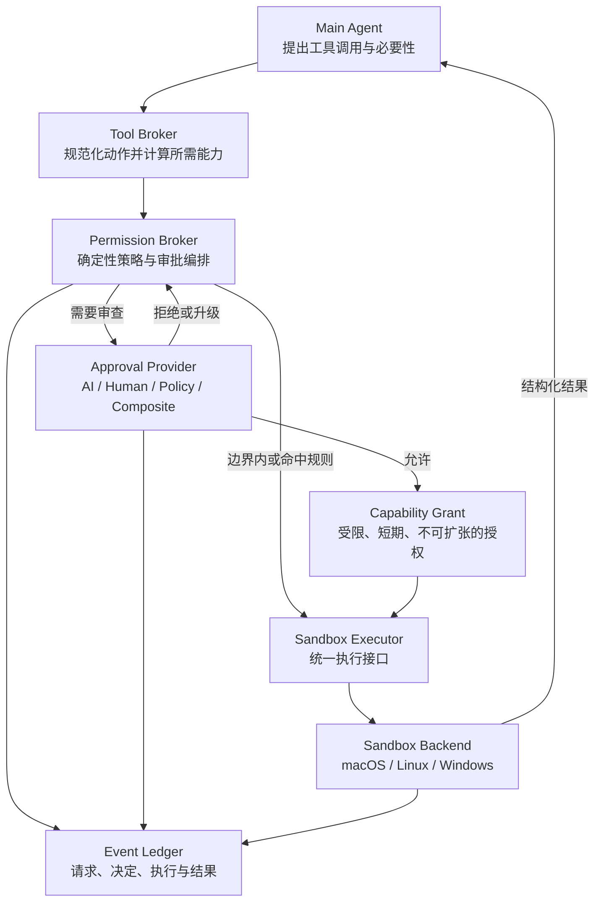
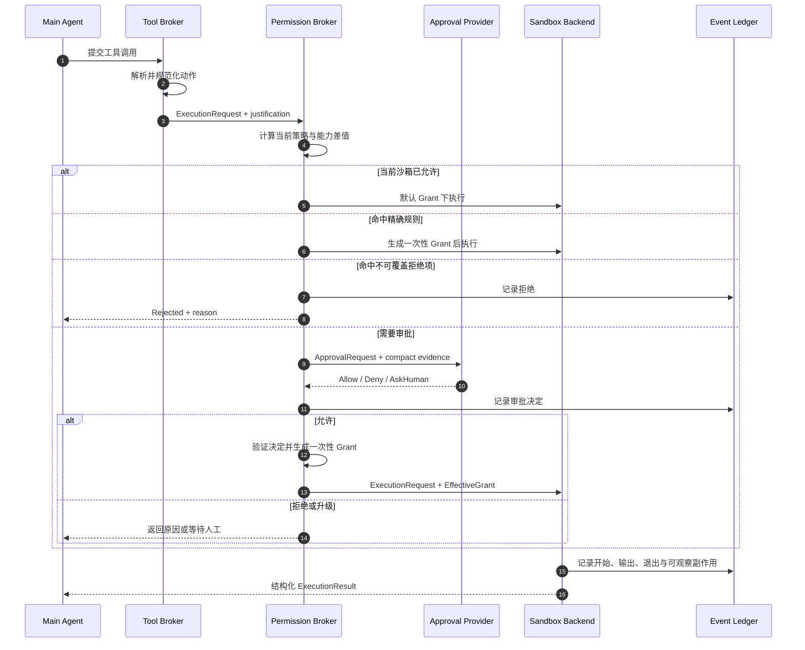

# Morphz 统一沙箱执行与可插拔审批架构

> 英文名称：Unified Sandbox Execution and Pluggable Approval Architecture
> 状态：统一 Permission Profile/Broker、macOS 沙箱、AI/人工审批闭环已实现；Linux/Windows 待各自实机验证
> 更新时间：2026-07-13
> 适用范围：当前实现聚焦本地 Shell；接口未来可覆盖文件、网络、浏览器、MCP 及其他现实副作用工具
> 相关文档：[`morphz_reality_constrained_epistemic_context.md`](morphz_reality_constrained_epistemic_context.md) 定义 Runtime 对现实约束的责任；[`morphz_sandbox_design.md`](morphz_sandbox_design.md) 和 [`sandbox_and_serverless_deep_dive.md`](sandbox_and_serverless_deep_dive.md) 保留早期 WASM、容器与远程沙箱研究。本文重新定义统一执行与审批边界，作为后续实现基线。

## 1. 背景与结论

Morphz 的 Agent 会读取文件、修改代码、执行命令、访问网络，并可能进一步控制浏览器、数据库、远程机器乃至现实设备。这些能力不能只依靠提示词约束，也不能让 Agent 自己决定自己拥有什么权限。

本设计采用四个相互独立的责任主体：

1. **Agent** 提出行动，并解释为什么需要行动；
2. **Permission Broker（权限代理）** 判断行动是否越过现有边界，并组织审批；
3. **Approval Provider（审批提供者）** 判断是否授予这一次越界权限；
4. **Sandbox Backend（沙箱后端）** 在操作系统执行环境中强制落实已经批准的边界。

核心结论是：

> **沙箱负责执行边界，审批器负责授权判断，Runtime 负责协调和审计；Agent 只有申请权，没有授权权。**

Morphz 默认采用 AI 自动审批，在安全性与长时间自主运行之间取得平衡；但自动审批只是默认的 `Approval Provider`，不是默认放行，也不会替代操作系统沙箱、确定性策略和人工审批。

### 1.1 当前实现边界（2026-07-13）

已经进入代码并完成本机验证的部分：

- `PermissionConfig -> PermissionProfile -> PermissionBroker` 统一权限链路；
- `read/write/edit/list_files/search/exec` 共享 canonical 路径、protected paths 和审批语义；
- `request_approval`、`auto_review`、`full_access`、`custom` 四种产品模式；
- 统一的 `SandboxBackend`、`SandboxPolicy`、`ShellRequest` 和后端能力报告；
- macOS `Seatbelt` 后端，约束 Shell 及其后代进程；
- `exec` 默认进入原生沙箱，网络默认关闭，写入限于工作区和显式额外目录；
- `require_escalated` 只申请本次命令所需的网络、只读目录和可写目录差量；
- 可替换的 `ApprovalProvider`，默认主程序接入无工具权限的独立 AI Auto-review 调用；
- Reviewer 允许后只扩张本次命令的策略；拒绝时不启动目标进程；
- 审批请求和决定写入 Event Ledger；
- CLI 人工审批以及 `/api/approvals` 查询、决定接口；
- AI 返回 `ask_human` 时自动转入同一个人工审批 Hub；
- 旧 `[tool_security]` 配置只保留读取迁移，旧路径开关和命令字符串黑名单已退出 Runtime；
- macOS 真实攻击回归：工作区外写入、后代 Shell 越界、拒绝后启动、一次授权重放和敏感目录申请。

尚未完成的部分：

- Linux 和 Windows 后端；它们在统一接口中存在明确的 `unavailable` 状态，启用沙箱时必须 fail-closed；
- 可复用前缀规则、完整的结构化命令规范化、域名级网络授权、资源限制和跨重启 Grant；
- 将同一 Permission Broker 扩展到网络、浏览器、MCP 等其余现实副作用工具。

当前 macOS 策略对**写入和网络**实施强限制；读取策略为了保证编译器和动态链接器可运行，允许读取系统公共路径，但默认拒绝 Home 与临时目录，再显式放行工作区、Cargo/Rustup 和配置的 read roots。因此它还不是“除 read roots 外任何字节都不可读”的最严格文件系统模型。能力报告和后续评测必须如实保留这一边界。

WASM、本地容器、远程容器和远程沙箱不在当前实现范围内。接口不阻止未来重新评估它们，但本阶段不为尚未出现的需求增加实现复杂度。

## 2. 设计目标

### 2.1 统一执行语义

上层 `exec`、文件工具和其他有副作用的工具不依赖某个操作系统。它们提交统一的执行请求，由后端适配到：

- macOS 原生沙箱；
- Linux 原生隔离机制；
- Windows 原生隔离机制；
- 测试使用的内存或模拟后端。

当前主路线只验证操作系统原生沙箱能否覆盖本地 Coding Agent 的 Shell 工作流，不实现 WASM、容器或远程执行。

### 2.2 审批角色可替换

审批可以由以下主体完成：

- 独立的 AI Reviewer；
- 人类用户；
- 企业策略服务；
- 仅包含确定性规则的本地策略引擎；
- 多种审批器组成的串联或降级链路。

### 2.3 默认支持长时间自主运行

日常安全操作不应频繁打断用户。默认模式下：

- 沙箱内操作无需审批；
- 命中精确授权规则的操作无需重复审批；
- 一般越界请求由独立 AI 自动审批；
- AI 无法可靠判断时升级给人；
- 明确违反不可覆盖安全规则的请求直接拒绝。

### 2.4 最小权限和可审计

每次授权应尽量绑定：

- 准确的操作；
- 准确的参数；
- 允许访问的路径、主机或资源；
- 有效次数和有效期；
- 发起的 Agent、Context、Session、Turn、Attempt；
- 审批决定及其依据。

## 3. 非目标

本设计不试图：

- 证明 AI Reviewer 永远不会误判；
- 用 AI 审批替代操作系统强制隔离；
- 通过静态黑名单理解任意程序的全部真实副作用；
- 默认给予 Agent 任意宿主机权限；
- 把审批决策写进 Agent 的 Mind 后就视为有效授权；
- 在第一版同时实现所有操作系统和远程执行后端。

## 4. 总体架构



这里必须保持两个分离：

1. **主 Agent 与审批者分离**：主 Agent 不能批准自己的请求；
2. **审批者与执行权分离**：审批者只返回决定，不能直接执行操作或修改沙箱策略。

审批 AI 即使与主 Agent 使用相同型号的基础模型，也必须是独立调用、独立 Context、独立角色和独立工具权限。

## 5. 统一沙箱执行接口

### 5.1 执行请求

概念上的执行请求如下：

```rust
struct ExecutionRequest {
    request_id: RequestId,
    principal: PrincipalRef,
    action: Action,
    working_directory: PathBuf,
    environment: EnvironmentPolicy,
    stdin: InputSource,
    filesystem: FilesystemPolicy,
    network: NetworkPolicy,
    process: ProcessPolicy,
    resources: ResourceLimits,
    deadline: Option<Deadline>,
    idempotency_key: Option<String>,
}
```

其中 `Action` 不应只是一段含义模糊的字符串。至少应区分：

```rust
enum Action {
    Program {
        executable: PathBuf,
        arguments: Vec<OsString>,
    },
    ShellScript {
        shell: ShellKind,
        source: String,
    },
    ToolOperation {
        tool: ToolId,
        operation: String,
        parameters: JsonValue,
    },
}
```

能使用结构化 `executable + arguments` 时，优先于整段 Shell 字符串。Shell 管道、重定向、命令替换和脚本仍然需要支持，但必须被明确标记为更难静态分析的动作。

### 5.2 执行结果

执行结果必须区分“成功但没有输出”和“没有执行”：

```rust
struct ExecutionResult {
    request_id: RequestId,
    status: ExecutionStatus,
    exit_code: Option<i32>,
    stdout: OutputArtifact,
    stderr: OutputArtifact,
    started_at: Timestamp,
    finished_at: Timestamp,
    observed_effects: Vec<ObservedEffect>,
    backend: BackendRef,
}

enum ExecutionStatus {
    Succeeded,
    Failed,
    Rejected,
    TimedOut,
    Cancelled,
    UnknownAfterCrash,
}
```

大输出可以持久化为 Artifact，Context Encoding 只显示受控预览和稳定引用。

### 5.3 沙箱后端

```rust
trait SandboxBackend {
    async fn capabilities(&self) -> BackendCapabilities;

    async fn execute(
        &self,
        request: &ExecutionRequest,
        grant: &EffectiveGrant,
    ) -> ExecutionResult;

    async fn cancel(&self, request_id: RequestId) -> CancelResult;
}
```

后端必须先报告自己能可靠强制执行哪些能力。不能把后端不支持的限制当作已经生效。例如某个后端无法限制目标网络域名时，Runtime 必须拒绝该请求、选择更强的后端，或者明确升级审批，不能静默降级为无限网络访问。

## 6. 沙箱后端策略

### 6.1 原生操作系统后端优先

本地执行优先利用操作系统提供的原生隔离原语，避免强制所有用户安装重量级容器环境：

- macOS：使用系统可用的进程沙箱、文件访问和进程权限约束；
- Linux：组合文件系统隔离、命名空间、系统调用过滤、资源控制等原生机制；
- Windows：组合受限令牌、进程作业、文件权限和应用隔离机制；
- 具体采用哪些 API，由实现阶段的能力探测和兼容性验证决定，本文不把某一个可能变化的命令行入口写死为架构契约。

原生后端的优势是启动快、部署轻，适合代码读取、构建、测试等常见工作流。

### 6.2 当前不实现容器和远程后端

容器不是当前核心链路的必需条件。只要操作系统原生沙箱能够可靠限制整个 Shell 子进程树的文件、网络、进程和资源访问，本地 Coding Agent 就可以不依赖容器运行。

统一接口的可替换性意味着未来仍可重新评估容器和远程执行，但它们不是当前路线图事项。只有未来出现以下明确需求时，才值得重新立项：

- 需要完整、可复现的 Linux 用户空间；
- 需要安装大量不可信依赖；
- 需要与用户宿主机形成更强的物理边界；
- 需要 GPU、弹性 CPU 或长时间后台算力；
- 当前操作系统后端无法强制执行所需策略；
- 多租户环境需要更强隔离。

后端选择属于 Runtime 的调度决定，不属于 Agent 的最终授权决定。Agent 可以表达需求，例如“需要 Linux 和网络”，但不能指定一个更弱的后端来绕过限制。

### 6.3 WASM 的边界与本阶段结论

WASM/WASI 适合执行纯计算、插件、过滤器或仅使用显式 Capability 的受限程序。WASI 程序默认没有宿主文件系统、网络和进程权限，宿主只向它提供经过选择的导入能力。

但是，**把一段程序编译成 WASM，并不意味着它间接启动的本地 Shell 也自动运行在 WASM 沙箱里。** 需要区分两种情况：

1. WASM 程序只调用标准且受限的 WASI 能力。没有通用宿主进程创建能力时，它不能凭空执行 `/bin/sh`；相关调用会在编译、链接或运行时失败。
2. Morphz 主动向 WASM 暴露了 `run_shell(command)` 一类宿主函数。此时 WASM 只是请求宿主执行命令，真正的 Shell 是由宿主 Runtime 创建的原生进程。除非这个原生进程再次进入操作系统沙箱，否则它继承的是宿主执行权限，WASM 边界无法约束它。

第二种情况通常不应描述为 WASM 漏洞或“从 WASM 内部攻破沙箱”，而是宿主暴露了一个越权能力。它在架构上已经离开 WASM 执行边界。

因此 Morphz 当前采用以下结论：

- **操作系统原生沙箱**：本地 Shell、编译器、测试程序、包管理器和其完整子进程树的主要安全边界；
- **WASM、容器和远程 Backend**：均不在当前实现范围内；只有出现独立且明确的产品需求才重新评估。

最重要的实现要求不是“Shell 由谁发起”，而是原生沙箱能否约束 Shell 及其所有后代进程。Morphz 不应让主 Daemon 直接带着广泛宿主权限执行命令，而应由一个受限 Runner 在计算好的 `EffectiveGrant` 下创建整棵进程树。

### 6.4 三平台统一库调研与选型结论

目前没有发现一个同时满足“macOS、Linux、Windows 都成熟”“安全边界足够强”“Rust 版本兼容”“长期维护可信”的现成统一库，可以直接成为 Morphz 的安全根：

| 项目 | 覆盖范围 | 结论 |
|---|---|---|
| [Anthropic sandbox-runtime](https://github.com/anthropic-experimental/sandbox-runtime) | macOS Seatbelt + Linux bubblewrap；不支持 Windows | 实践价值高，但不是三平台统一库，且项目明确定位为 research preview |
| [sandbox-run](https://docs.rs/sandbox-run/latest/sandbox_run/) | macOS + Linux | 可参考接口和策略表达，但缺少 Windows |
| [Skarn](https://github.com/Rani367/Skarn) | 声称支持 Linux Landlock、macOS Seatbelt、Windows Job Object/AppContainer | 三平台方向最接近，但项目很新、Windows 验证最少，且当前 Rust 工具链要求高于 Morphz 基线；适合作为参考或未来候选，不适合立即成为安全根 |
| [nanosandbox](https://docs.rs/crate/nanosandbox/latest/source/README.md) | 文档声称三平台 | 从其 [Windows 实现源码](https://docs.rs/crate/nanosandbox/latest/source/src/platform/windows/mod.rs) 看，当前主要创建 Job Object；尚不足以证明文档所述的完整 Restricted Token/AppContainer 边界。这里是基于源码的审慎推断，因此不采用 |
| [OpenAI Codex](https://github.com/openai/codex) | 产品内部统一抽象，按平台使用不同原生实现 | 证明“稳定上层接口 + 各平台后端”是可行路线，但目前不是供外部直接复用的独立三平台沙箱库 |

因此选型不是“自己重写所有系统调用”，而是：Morphz 持有稳定的窄接口；每个平台后端可以复用已经验证的系统工具或局部依赖；是否替换某个后端，不影响上层 `exec`、审批和 Ledger。第三方库只有通过同一套攻击契约测试后，才有资格进入后端实现。

跨平台安全不能靠在 macOS 上交叉编译来证明。验证分四层：

1. 与平台无关的 Backend 契约测试，可在所有 CI 节点运行；
2. 目标平台编译与单元测试，发现 API 和条件编译问题；
3. 目标平台原生 Runner 上执行真实越权攻击测试；
4. 人工或专用环境验证难以稳定自动化的系统版本差异。

当前 CI 新增 macOS 原生沙箱任务；Ubuntu 继续验证公共接口。Linux Backend 落地时增加 Ubuntu 原生攻击任务，Windows Backend 落地时增加 Windows Runner。未完成第 3 层的平台只能标记为 `unavailable`，不能因为第 2 层通过就报告为安全可用。

## 7. Permission Broker：权限代理

Permission Broker 是整个系统的授权中枢，但不直接理解任务的业务答案。它负责：

1. 规范化工具动作；
2. 根据当前沙箱策略计算实际所需能力；
3. 判断请求是否越过当前边界；
4. 匹配已有的精确授权规则；
5. 拦截不可覆盖的禁止项；
6. 为剩余请求选择审批器；
7. 验证审批结果并签发受限授权；
8. 将完整过程写入 Event Ledger。

### 7.1 不信任 Agent 自报权限

Agent 可以请求类似 `require_escalated` 的语义，并说明理由，但 Runtime 必须根据准确动作重新计算能力差值。

例如 Agent 声称只需要读取 `/tmp/a.txt`，实际命令却包含向外部网络发送该文件的行为。Permission Broker 不能仅根据 Agent 的自然语言说明授权。

### 7.2 确定性判断优先

审批 AI 不是第一道检查。推荐顺序是：

```text
请求规范化
  -> 当前沙箱已经允许：直接执行
  -> 命中精确授权规则：直接执行
  -> 命中不可覆盖拒绝规则：直接拒绝
  -> 其余边界请求：交给 Approval Provider
```

这既减少 Token 和延迟，也让明确的物理边界保持确定性。

## 8. 可插拔审批接口

### 8.1 审批请求

```rust
struct ApprovalRequest {
    approval_id: ApprovalId,
    execution_request: NormalizedExecutionRequest,
    current_policy: EffectiveSandboxPolicy,
    requested_delta: CapabilityDelta,
    justification: String,
    reusable_rule_candidate: Option<RuleCandidate>,
    provenance: RequestProvenance,
}
```

`RequestProvenance` 至少包含 `agent_id`、`context_id`、`session_id`、`turn_id`、`attempt_id` 和来源工具调用。

### 8.2 审批证据

审批者不应默认接收整个 Agent Mind，也不应依赖主 Agent 的隐藏推理。它接收最小但充分的证据：

- 用户当前明确意图；
- 已对用户显示的 Agent 说明；
- 与请求有关的工具调用和结果；
- 准确的规范化动作；
- 当前沙箱边界及请求的能力差值；
- 组织或用户配置的审批策略；
- 与授权判断有关的文件或目标信息。Runtime 不应通过字符串形状猜测并改写其中的“疑似秘密”；秘密能力应以环境变量名等结构化标识表达，实际值不进入审批请求。

### 8.3 审批决定

```rust
enum ApprovalDecision {
    AllowOnce {
        constraints: GrantConstraints,
        rationale: String,
    },
    AllowRule {
        rule: ApprovalRule,
        constraints: GrantConstraints,
        rationale: String,
    },
    Deny {
        reason: String,
        risk_tags: Vec<RiskTag>,
    },
    AskHuman {
        question: String,
        risk_summary: String,
    },
}
```

审批者可以缩小权限，不能扩大请求。例如请求只涉及 `/tmp/a` 时，审批结果不能自行改成允许访问整个主目录。

### 8.4 审批器实现

```rust
trait ApprovalProvider {
    async fn review(
        &self,
        request: &ApprovalRequest,
        evidence: &ApprovalEvidence,
    ) -> ApprovalDecision;
}
```

建议支持：

- `AiAutoReviewProvider`：默认，用独立 Reviewer Agent 审查；
- `HumanApprovalProvider`：通过 CLI、Web、移动端或消息网关让人审批；
- `PolicyOnlyProvider`：适合 CI 和无人值守的确定性环境；
- `CompositeApprovalProvider`：AI 不能决定时转人工，或高风险请求要求多方批准；
- `DenyAllProvider`：完全禁止越过沙箱边界。

## 9. AI 自动审批

### 9.1 默认含义

Morphz 的推荐默认值是：

> **需要审批时默认由独立 AI Reviewer 审查，而不是默认批准越界请求。**

沙箱内的正常动作不会调用 Reviewer。只有原本需要人工停下来确认的边界请求才进入自动审批。

### 9.2 Reviewer 的边界

AI Reviewer：

- 使用独立的系统身份和安全策略；
- 接收紧凑证据和准确审批请求；
- 可以进行极少量只读核查；
- 只能返回结构化审批决定；
- 不能调用执行工具；
- 不能修改权限策略、授权规则和 Event Ledger；
- 不能向主 Agent 暴露秘密策略内容或敏感信息。

主 Agent 和 Reviewer 可以使用不同模型，也可以使用相同基础模型，但不能共享同一次推理或让主 Agent 直接生成最终授权。

### 9.3 推荐默认风险策略

AI 可以自动批准的典型请求包括：

- 用户明确要求的构建、测试和代码生成流程；
- 在用户指定工作区附近创建受限临时目录；
- 为当前任务下载公开依赖，但目标、目录和范围明确；
- 读取完成任务所必需、且风险较低的非敏感资源。

默认拒绝或升级人工的典型请求包括：

- 搜索、读取或外传凭证、Cookie、Token、私钥和会话材料；
- 将私人数据发送到与任务无关或不可信的目标；
- 广泛、持久地关闭安全机制；
- 具有重大不可逆风险的破坏性操作；
- 请求范围显著大于用户目标；
- Reviewer 无法判断命令真实作用的高风险混淆操作。

这份风险分类是默认策略，不是硬编码到 Agent 提示词中的任务特化规则。用户和组织可以替换或收紧策略。

### 9.4 自动审批不是安全证明

AI Reviewer 仍然会误判。因此系统安全性来自多层组合：

```text
最小默认权限
+ 操作系统强制沙箱
+ 确定性策略
+ 独立自动审批
+ 必要时人工升级
+ 完整审计和取消能力
```

## 10. Capability Grant：能力授权

审批结果不能直接等于一个全局布尔开关。Permission Broker 应将允许决定编译成一次性的有效授权：

```rust
struct EffectiveGrant {
    grant_id: GrantId,
    subject: PrincipalRef,
    request_digest: Digest,
    filesystem: FilesystemGrant,
    network: NetworkGrant,
    process: ProcessGrant,
    valid_until: Timestamp,
    remaining_uses: u32,
    policy_version: PolicyVersion,
}
```

关键不变量：

1. 授权绑定规范化请求摘要，修改命令或参数后必须重新审批；
2. 默认 `remaining_uses = 1`；
3. 授权有较短有效期；
4. 授权不能跨 Agent、Context 或租户复用；
5. Backend 只能获得已经计算好的 `EffectiveGrant`；
6. 授权失败、取消和执行状态必须进入 Ledger；
7. 对未知副作用的重试不能假设上一次没有执行。

可复用规则与一次性授权必须分开。规则只用于未来判断是否需要再次审批，每一次实际执行仍生成独立 Grant 和审计记录。

## 11. 可复用审批规则

用户或 Reviewer 可以建议受限规则，例如：

```text
["cargo", "test"]
["npm", "run", "build"]
["git", "status"]
```

不应默认允许过于宽泛、实际可承载任意代码执行的前缀，例如：

```text
["bash"]
["sh"]
["python"]
["node"]
["curl"]
```

规则除命令前缀外，还应允许绑定：

- 工作目录或项目；
- 文件系统边界；
- 网络目标；
- Agent 或用户；
- 到期时间；
- 是否允许 Shell 元字符；
- 最大资源和并发范围。

Runtime 必须按解析后的命令结构匹配规则，不能用简单字符串前缀匹配一整段 Shell，从而避免通过管道、分号、命令替换或重定向携带未批准操作。

## 12. 完整执行流程



## 13. Context Encoding 与 SExpr 表达

权限控制是 Runtime 的机器状态，不能依靠模型生成 SExpr 来生效。但相关事实可以被编码进 Context，让 Agent 理解现实状态并调整行动。

例如：

```lisp
(execution-result
  (request exec-42)
  (status rejected)
  (reason "requested write path is outside the current sandbox")
  (approval auto-review)
  (decision deny))
```

Agent 也可以表达申请意图：

```lisp
(request-capability
  (action exec-42)
  (scope (write "/workspace/generated"))
  (reason "the user requested generated files in this directory"))
```

但这只是 Agent 对现实控制层的请求。Permission Broker 根据真实工具参数重新计算权限，并且只有 Runtime 签发的 `EffectiveGrant` 才能驱动 Backend 执行。

## 14. Event Ledger 与审计

至少记录以下事件：

- `execution_requested`；
- `execution_normalized`；
- `approval_requested`；
- `approval_allowed`、`approval_denied` 或 `approval_escalated`；
- `grant_issued`、`grant_consumed`、`grant_expired`；
- `execution_started`；
- `execution_output`；
- `execution_finished`、`execution_cancelled` 或 `execution_unknown`；
- `approval_rule_created`、`approval_rule_revoked`。

Ledger 保存客观发生的审批和执行事实；Agent 可以把其中值得长期保留的经验整理进 Mind，但不能改写 Ledger 中的授权与执行记录。

Ledger 必须保留实际发生的控制面事实，Runtime 不应通过 `sk-`、`Bearer` 等字符串形状启发式地改写任意内容，否则可能破坏工具调用 ID、命令和证据的身份一致性。秘密通过 `secret_env` 等命名能力注入，实际值不进入审批请求；对于 Runtime 确实注入给子进程的值，只在该子进程的输出返回边界按精确值隔离。存储层加密和展示层遮罩可以独立提供，但不得反向改变 Ledger 原文。

## 15. 并发、重试与失败语义

### 15.1 并发审批

每个审批请求必须有稳定 `approval_id` 和动作摘要。对同一请求的并发批准只能生成一个可消费的 Grant，防止重复点击或消息重放造成多次执行。

### 15.2 策略版本

Grant 绑定 `policy_version`。如果执行前权限策略发生关键变化，Runtime 应重新验证或使 Grant 失效。

### 15.3 不确定副作用

进程崩溃、网络断开或远程节点失联时，Runtime 可能无法确认操作是否已经产生副作用。此时必须返回 `UnknownAfterCrash`，而不是自动标记失败并无条件重试。

### 15.4 审批器故障

- AI Reviewer 超时不等于请求危险；
- Reviewer 明确拒绝与技术超时必须分开；
- 自动审批不可用时，可以按策略转人工或拒绝；
- 不能因为审批服务故障自动放行；
- 连续拒绝应触发回路熔断，避免主 Agent 通过改写相同命令反复试探边界。

## 16. 产品配置建议

当前提供以下高层模式：

```text
request_approval  工作区沙箱；所有可审批边界请求交给人
auto_review       默认；工作区沙箱；边界请求由独立 AI 审批，必要时转人工
full_access       关闭文件边界、网络限制和 OS 沙箱；不产生边界审批并显示警告
custom            分别配置 sandbox_mode、approval_policy、reviewer 和环境策略
```

人工审批没有 Runtime 超时。CLI 在当前任务中显示准确动作、能力差量和理由，并读取一次 `y/N`；Web 客户端可查询 `GET /api/approvals`，再提交：

```json
{
  "decision": "allow_once",
  "rationale": "用户确认本次操作与当前任务一致"
}
```

到 `POST /api/approvals/:approval_id`。决定只恢复对应的一次执行，不形成持久授权。

不建议用含义模糊的“自动批准所有操作”作为普通产品模式。如果确实提供完全不受限的宿主执行，它必须是显式的高级危险配置，并与默认自动审批在名称和界面上清楚区分。

## 17. 分阶段实现状态与建议

### Phase 1：统一本地执行边界（macOS 最小闭环已完成）

- 已抽象当前最小版本的 `ShellRequest`、`SandboxPolicy`、`BackendReport` 和 `SandboxBackend`；
- 已将现有 Shell 执行接入统一接口；
- 已实现和实测 macOS 原生沙箱后端；
- 明确空输出、取消、超时和未知副作用状态；
- 保留现有工具面对 Agent 的兼容性。

### Phase 2：Permission Broker 与人工审批（已完成最小闭环）

- 已让直接文件工具和 `exec` 共享路径与网络能力差值；
- 已实现进程启动前的一次性策略扩张；
- 已实现 CLI/Web 人工审批及等待恢复；
- 已接入审批请求与决定事件；
- 可复用规则和持久 Grant 留待真实需求驱动。

### Phase 3：独立 AI Auto-review（最小闭环已完成）

- 已为 Reviewer 建立独立调用、独立系统身份和无工具环境；
- 已定义紧凑审批证据和 `allow_once/deny/ask_human` 决策协议；
- 已建立默认风险策略，并把 `ask_human` 接到人工审批 Hub；
- 使用真实编码任务评测误批、误拒、打断次数和完成效率。

### Phase 4：Linux 与 Windows 原生后端

- 分别增加 Linux 与 Windows 原生 Backend；
- 引入后端能力探测和安全等级；
- 在对应原生 CI/VM 上运行相同攻击契约；
- 保证相同执行请求在不同 Backend 上具有可比较的安全语义。

本阶段不包含 WASM、容器与远程执行。

### Phase 5：所有现实副作用统一接入

- 文件工具；
- 网络与 Web 搜索；
- 浏览器和 Computer Use；
- MCP、Connector 和外部 API；
- 数据库写入、消息发送与远程设备控制。

这些能力可以拥有不同的风险标注和 Backend，但复用同一套 Permission Broker、Approval Provider、Grant 和 Ledger 语义。

## 18. 需要通过评测回答的问题

实现不能只验证“命令能否运行”，还需要持续测量：

1. 沙箱是否真实阻止了未授权的文件、网络和进程访问；
2. 不同操作系统 Backend 是否维持相同的安全语义；
3. AI Reviewer 的误批率和误拒率；
4. 自动审批相对人工审批减少了多少用户打断；
5. Reviewer 是否会被工具输出中的提示注入影响；
6. 授权是否能被修改参数、Shell 拼接、路径链接或并发重放绕过；
7. 审批失败或远程执行崩溃后，状态是否仍然可审计；
8. 长时间任务是否能在不获得宽泛永久权限的情况下持续完成。

## 19. 最终不变量

后续实现无论选择什么操作系统 API、模型或产品界面，都必须保持以下不变量：

1. Agent 不能批准自己的权限请求；
2. 审批者不能直接执行被审批的动作；
3. 沙箱边界由 Runtime 和执行后端强制，而不是提示词强制；
4. 自动审批默认审查越界请求，不等于默认放行；
5. 授权不得大于原始请求，且默认单次、短期、不可跨主体复用；
6. Backend 无法落实某项限制时必须显式失败或换用更强后端；
7. 规则匹配必须基于规范化动作，不能依赖脆弱的字符串猜测；
8. 请求、审批、授权、执行和结果都具有稳定身份与审计链；
9. Agent 可以认识和解释这些现实事件，但不能修改它们已经发生的事实；
10. AI Reviewer 是提高易用性的概率性判断层，不是系统唯一的安全边界。
