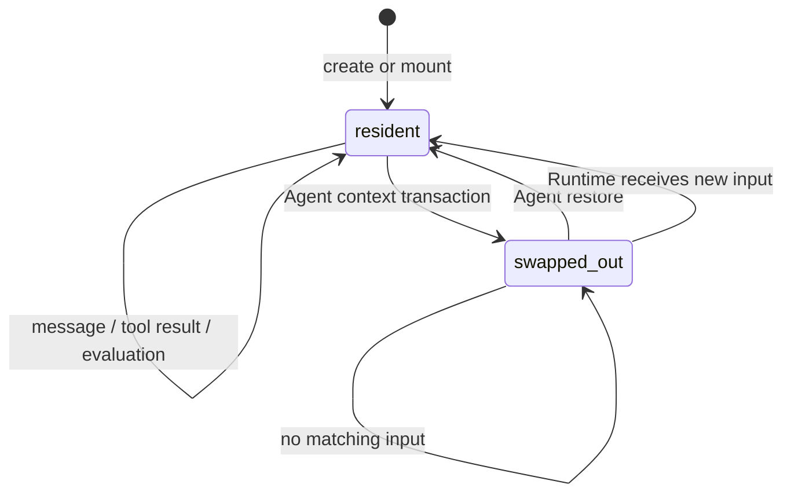

# Morphz Session Residency 与 Context Swap 设计（历史讨论稿）

> 状态：历史讨论稿，尚未实现；v1 语义已由 [`morphz_concurrent_session_working_set_v1.md`](morphz_concurrent_session_working_set_v1.md) 修正并取代
> 日期：2026-07-15
> 适用范围：共享 Cognitive Context、多 Session、Context Encoding、自动上下文维护与 IO 多路复用
> 上位设计：[`morphz_shared_context_multisession_architecture.md`](morphz_shared_context_multisession_architecture.md)
> 产品与并发本体：[`morphz_single_identity_distributed_cognition_architecture.md`](morphz_single_identity_distributed_cognition_architecture.md)

> 修正说明：本文将 Session Residency 主要建模为 Agent 持久维护的 `resident/swapped_out`，并明确排除了 Runtime 时间窗口。后续讨论把问题拆成 IO lifecycle、Agent attention 和 per-evaluation projection 三层：Runtime 使用“时间窗口 + 最大数量 + Token Budget”动态编译 Working Set；Agent 另行使用 `retire-session/restore-session` 表达持久注意力；新定向事件自动恢复。实现时以新 v1 文档为准。

## 1. 问题

Morphz 允许多个 Session 挂载到同一个 Cognitive Context，并共享同一个 Mind。这个结构使 Agent 能够跨会话理解事实、迁移经验并并发处理多条连接，但也带来一个必然问题：

> 如果所有历史 Session 及其原始消息、工具结果永久进入每次 Context Encoding，那么 Session 数量和 Prompt 大小都会随运行时间无界增长。

仅仅依赖 Observation 逐条 `retire` 不够：

- Agent 需要枚举一个旧 Session 的大量 Event 引用；
- Session Directory 本身仍会持续膨胀；
- 多用户和长期运行场景会留下大量长期不活跃连接；
- Runtime 无法仅凭时间判断某个 Session 是否仍具有认知价值；
- Session 再次收到消息时又必须恢复对话连续性。

因此，Session 需要一种属于 Cognitive Context 的**认知驻留状态**。它类似操作系统的 swap，但交换的是模型当前认知工作集，而不是删除 Session 或关闭 IO。

## 2. 核心结论

Morphz 将 Session Residency 定义为：

```text
resident | swapped_out
```

- `resident`：Session 及其未被逐条退役的 Observation 可以进入默认 Context Encoding；
- `swapped_out`：Session 仍存在、仍挂载、仍可接收消息，但其目录项和历史 Observation 不进入默认 Context Encoding；
- Agent 可以显式 swap out / swap in；
- swapped-out Session 收到新的外部消息时，Runtime 必须确定性地自动 swap in；
- Shared Mind 不属于任何单独 Session，不随 Session swap out；
- Event Ledger 是永久 backing store，swap 不删除事实。

这个机制把三个既有设计统一起来：

1. Session 是 IO 多路复用中的 connection；
2. Context Encoding 是模型当前的认知工作集；
3. Agent 通过 SExpr DSL 自主维护自己的 Context。

需要特别区分：Residency 是 Agent 长期维护的认知工作集状态；单次 Evaluation 是否只投影当前 Session，是本次请求的可见性策略。即使 A、B 都是 `resident`，隔离求值 A 也不需要把 B 的全文放入 Prompt。两者不能合并成一个开关。

## 3. 与操作系统 Swap 的对应关系

| 操作系统概念 | Morphz 概念 |
| --- | --- |
| 内存工作集 | Context Encoding |
| 共享内存 | Shared Mind |
| 进程或可换出页组 | Session 及其 Session-scoped Observation |
| 交换区 | Event Ledger + Session Registry |
| swap out | Agent 退役 Session |
| swap in | Agent 主动恢复，或 Runtime 因新 IO 自动恢复 |
| 缺页或外部中断 | swapped-out Session 收到新消息或匹配的外部事件 |

这个类比不是要求 LLM 模拟 CPU 或操作系统，而是描述 Runtime 的物理语义：不在当前 Prompt 中，不等于不存在；新的 IO 到达时，Runtime 必须把对应连接重新放入工作集。

## 4. 四种彼此独立的生命周期

Session 相关状态不能压缩成一个枚举。至少需要区分：

| 维度 | 所有者 | 示例 | 影响 |
| --- | --- | --- | --- |
| Registry existence | Runtime | exists | Session 身份和历史是否存在 |
| IO lifecycle | 用户或控制面 | active / archived | 是否接受新消息和继续交互 |
| Context residency | Agent；Runtime 可因新 IO 唤醒 | resident / swapped_out | 是否进入默认 Context Encoding |
| Observation attention | Agent | active / retired | 单条事实是否进入当前认知工作集 |

因此：

- `archive Session` 不自动 retire 它的内容；
- `swap out Session` 不关闭连接，也不删除 Session；
- `retire Observation` 不等于 swap out 整个 Session；
- Shared Mind 中从某 Session 提炼出的 Frame 不随该 Session swap out。

## 5. 状态机



`swapped_out` 不是 Session 的终态。它只表示该连接当前不占据 Agent 的认知工作集。

## 6. Agent 主动 Swap Out

候选 SExpr 原语为：

```lisp
(retire-session SESSION-ID...)
(restore-session SESSION-ID...)
```

原语名称在实现前仍可审查；也可以考虑把现有 `retire/restore` 扩展为带类型的 target。当前先冻结行为，不冻结最终拼写。

Agent 应能在一个原子 Context Transaction 中先提炼经验，再 swap out Session：

```lisp
(context-tx
  (base-version 87)
  (reason "该会话长期无活动，仍有价值的结论已进入共享 Mind")

  (derive session-c-experience
    (from @e120 @e121 @e134)
    (conclusion ...)
    (scope shared-mind))

  (retire-session session-c))
```

整个事务必须服从 Context 单写锁和 `base-version` 检查。任何一步失败，Frame 提炼与 Session Residency 修改都回滚。

Agent 作出决定前，Runtime 应只提供可客观验证的元数据：

```lisp
(session
  (id session-c)
  (residency resident)
  (last-activity ...)
  (pending-input 0)
  (evaluation idle)
  (active-objectives 0)
  (background-tasks 0))
```

Runtime 不根据年龄、标题或内容替 Agent 判断价值。使用频率、最近活动、Context 压力和跨 Session recall 可以成为 Agent 的决策依据，但不能由 Runtime 静默转化为语义遗忘。

## 7. Swap Out 的确定性效果

一次成功的 Session swap out 应当：

1. 把 Session Residency 记录为 `swapped_out`；
2. 从默认 `session-directory` 移除其完整条目；
3. 在默认 Context Encoding 中屏蔽其 Session-scoped Observation；
4. 保留 Session Registry、Mount、Ledger、消息顺序和来源关系；
5. 保留 Shared Mind 中已存在的 Frame 和 Relation；
6. 保留 Observation 自身的逐条 retired/protected 状态；
7. 产生可审计的 Runtime/Context Event，记录操作者、reason、版本和受影响 Session；
8. 在重启后通过确定性 replay 恢复相同 Residency。

Session 级屏蔽应是附加可见性掩码，不应把该 Session 的每一个 Event ID 展开写入 `MindState.retired`。否则一个 O(1) 的逻辑动作会变成随历史长度增长的巨大事务。

## 8. 自动 Swap In

模型看不到 swapped-out Session，因此外部消息到达时不能等待模型主动恢复。Runtime 必须执行物理唤醒：

```text
new input committed to Ledger
        ↓
lookup Session mount and residency
        ↓
swapped_out ?
        ├─ no  → normal ready scheduling
        └─ yes → atomically mark resident
                  append session-swapped-in audit event
                  advance residency/context revision
                  compile Context Encoding
                  schedule the correct Session evaluation
```

自动 swap in 后：

- 新到达消息必须可见；
- Session Directory 恢复该 Session；
- 过去未被逐条 retire 的 Observation 重新具备进入 Encoding 的资格；
- 已经被 Agent 逐条 retire 的 Observation 仍保持 retired；
- 如果恢复全部历史导致 Context pressure 上升，Agent 在本轮按正常 Context 维护协议重新提炼和退役；
- 后续可以演进为按 Session 分页或 demand paging，但首版不引入隐式 Runtime 摘要。

Agent 也可以主动执行 `restore-session`，例如另一个 Session 的任务需要重新检查旧会话中的原始证据。

## 9. Runtime 安全不变量

Agent 决定语义价值，Runtime 负责防止切断正在发生的物理工作。以下 Session 不能立即 swap out：

- 当前 Context Evaluation 的 active/ready Session；
- 存在未处理或未回复输入；
- 存在 active Objective 或确定性 wait condition；
- 存在运行中的工具任务、Delegation 或 Sub Agent；
- 存在进行中的人工或自动审批；
- 当前持有尚未释放的 Session 执行租约。

首版建议禁止 Session 在自己的 Evaluation 中直接 swap out 自己。未来如果需要，可以增加 `retire-after-reply` 的延迟提交语义，但不能让当前回复路由在回合结束前消失。

## 10. 并发与竞态

### 10.1 消息先到，Agent 后 retire

如果新消息已经进入 Ledger 或 Ready Queue，`retire-session` 必须因 pending input 或 Residency revision 冲突而失败。Agent 重新求值后决定如何处理。

### 10.2 Agent 先 retire，消息后到

事务先完成时，随后到达的消息触发 Runtime 自动 swap in。消息不能因为 Session 当前 swapped out 而丢失或拒绝。

### 10.3 多 Session 并发修改共享 Context

Residency 属于 Context 状态，继续使用 Context 级单写锁、版本检查和确定性 Event 顺序。两个模型不能以最后写入覆盖的方式互相 swap in/out。

### 10.4 重复输入与幂等

同一个 `client_message_id` 的重复投递不能重复推进 Residency revision，也不能产生多个 swap-in wakeup。

## 11. 大规模 Session Directory

swapped-out Session 不应继续以完整条目占据每轮 Prompt。默认 Kernel 只需要展示：

- resident Session；
- 当前 ready Session；
- 绑定 active Objective、任务或等待条件的 Session；
- swapped-out Session 的总数与稳定查询入口。

示例：

```lisp
(session-directory
  (resident-count 4)
  (swapped-out-count 183)
  (session ...)
  (session ...)
  (lookup "按 id、活动时间、来源或状态查询 Session Registry"))
```

当 Session 数量达到数百或数千时，Agent 需要通用的 Session Registry 查询/recall 能力，而不是把所有 retired Session ID 固定放在 Prefix 中。该查询只返回 Runtime 元数据或明确请求的 Ledger 证据，不替 Agent编写语义摘要。

## 12. 与共享 Mind 的关系

Session swap 的核心价值不是制造 Session 隔离，而是让 Agent 控制当前工作集：

```text
Session A raw history ─┐
Session B raw history ─┼─ Agent derive/revise → Shared Mind
Session C raw history ─┘

inactive Session raw history → swap out
Shared Mind              → remains resident
```

因此，一个 Session 被 swap out 后，其他 Session 仍然可以使用它已经贡献到 Shared Mind 的经验。只有需要核验原始证据时，Agent 才主动 restore 或按 Session recall Ledger。

## 13. 不做的事情

本设计明确不引入：

- Runtime 按固定 TTL 自动 swap out；
- 因 Session 不活跃而删除 Ledger；
- Runtime 为每个 Session 生成固定业务摘要；
- 把 Session archived 与 swapped_out 合并；
- 让未知的新消息静默留在 swapped-out 状态；
- 为了节省 Prompt 而破坏消息路由、Objective 或任务连续性；
- 在首版实现 Session 内部的细粒度分页或分段换入。

## 14. 建议的数据模型

最终表结构和 Event Schema 在实现阶段确定。逻辑模型至少需要：

```text
SessionResidencyRecord
├── context_id
├── session_id
├── state: resident | swapped_out
├── revision
├── changed_by
├── reason
├── changed_at
└── source_event_id
```

该记录属于 `Context × Session Mount`，而不是只属于全局 Session。未来一个 Session 如果通过 Binding Generation 挂载到不同 Context，每个挂载关系可以拥有独立 Residency。

Context replay 需要同时重建：

```text
MindState
SessionResidencyState
Observation attention state
```

但 Shared Mind 的 Frame BODY 仍然由 Agent 自由决定，Runtime 不增加固定认知 Schema。

## 15. 验收场景

实现前至少建立以下确定性测试：

1. 一个 Context 挂载 1,000 个 Session；swap out 990 个后，默认 Encoding 大小不再随这 990 个 Session 的历史线性增长；
2. swap out 不删除 Session、Mount、Ledger 或 Shared Mind Frame；
3. 新消息到达 swapped-out Session 后自动且仅自动 swap in 一次；
4. 自动 swap in 后消息被正确路由并得到回复；
5. 逐条 retired 的 Observation 不因 Session swap in 而恢复；
6. active Evaluation、Objective、工具任务和未回复输入阻止 swap out；
7. 消息与 retire 并发时不丢消息、不重复唤醒；
8. Runtime 重启后 Residency 和可见性完全一致；
9. Context 压力测试证明 Agent 能在多个 Session 之间自主维护工作集；
10. 多模型真实测试比较其 Session 驻留判断、错误退役率和恢复正确率。

## 16. 开放问题

以下问题保留到后续讨论，不在本文中提前决定：

1. 最终 DSL 使用 `retire-session/restore-session`，还是扩展 `retire/restore` 的 typed target；
2. 首次 swap in 是否恢复全部未退役历史，还是采用最近尾部加按需 recall；
3. Agent 是否可以提交 `retire-after-reply`；
4. swapped-out Session 的 Registry 查询如何分页、排序和计费；
5. Session disclosure policy 与跨用户共享 Context 下的可见性如何结合；
6. Session 使用频率是否只统计主动 recall，还是还需要独立的 IO 活跃度指标；
7. 在合并 Context Evaluation 中，一个响应是否允许同时 swap out 多个非 ready Session；
8. Residency 是否需要 checkpoint/rollback，还是只依赖 Event replay 与显式 restore。

## 17. 当前实现差距

截至本文记录时，Morphz 当前实现为：

- Session Registry 已有 `active/archived`；
- Context Encoding 会列出同 Context 的 archived Session；
- Observation 只能按 Event ID 逐条 retire/restore；
- Session Mount 已持久化，但尚无 Residency 状态；
- 没有 Session 级 swap out / swap in；
- 没有新消息触发 Residency 恢复的状态机；
- CLI/TUI 尚无 Session Residency 查看入口。

因此，本设计是下一阶段候选能力，不应把当前 `archived` 或逐条 Observation retire 误认为已经实现了 Session Swap。
