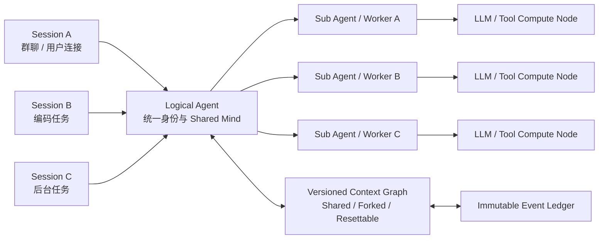

# Morphz 共享 Context、多会话与并行认知架构

> 状态：北极星设计；单进程 `Context → shared Mind + Sessions` 核心层级已实现，COW、多 Worker 协作和分布式一致性仍属后续演进
> 更新时间：2026-07-12  
> 适用范围：Agent 身份、Session、多 Sub Agent、Context 拓扑、并发事务、分布式算力与长期演化  
> 与现有设计的关系：本文扩展并修正 [`morphz_agent_owned_context_design.md`](morphz_agent_owned_context_design.md) 和 [`morphz_memory_scope_design.md`](morphz_memory_scope_design.md) 中把 Session/Scope 主要视为隔离边界、把 Sub Agent 固定为独立 Mind 的早期假设。当前单进程实现见 [`morphz_session_service_v1.md`](morphz_session_service_v1.md)；涉及长期 Context 拓扑与共享语义时，以本文为方向依据。

> 认识论前置约束：共享会同时放大正确经验和错误认识。Runtime 应如何用顺序、直接因果、来源、版本和控制反馈约束 Agent 的自由认知，见 [`morphz_reality_constrained_epistemic_context.md`](morphz_reality_constrained_epistemic_context.md)。

## 1. 文档目的

Morphz 已经初步验证：LLM 可以通过 SExpr DSL 自主创建、修订、保护、退役和恢复自由格式的 Context Frame，并在同一 Session 内形成策略、接受反例修正、建立来源关系和完成重启恢复。

接下来的长期方向不只是“把记忆从 Session 提升到 Agent Scope”，而是建立一个持续存在、可以同时处理多个会话、多个任务和多个并行执行单元的逻辑 Agent。

本文件记录以下共同结论，避免后续设计重新退回传统的一会话一 Agent 模型：

1. Session 是交互连接与执行连续性，不是 Agent 的天然记忆边界；
2. 一个 Agent 可以同时理解、管理和推进多个 Session；
3. 多个 Session 可以共享同一个 Context，也可以使用 COW 分支隔离；
4. 一个 Session 可以由多个并发 Sub Agent 或算力节点共同推进；
5. Agent 的身份、Mind 与 Ledger 不应绑定到某个模型进程；
6. Context 应成为可寻址、版本化、可共享、可分支、可合并、可重置的一等状态对象；
7. Runtime 负责事务、路由、一致性、权限与资源边界，模型负责语义、注意力、共享意图和冲突判断；
8. 复杂底层必须通过小而清晰的认知接口暴露，不能要求模型充当数据库内核。

## 2. 核心命题

Morphz 的长期产品模型是：

> **Agent 是持续存在的逻辑认知主体；Session 是 Agent 与外部世界交互的连接；Sub Agent 和模型节点是并行计算单元；Context 是可以被多个连接和计算单元挂载的版本化认知状态。**

因此，Agent、Session、Sub Agent、模型进程和 Context 不应一一绑定。



该模型同时支持两个方向的多路复用：

- **一个 Agent，多条 Session Connection**：Agent 并发管理多个对话和任务；
- **一个 Session，多个执行单元**：多个 Sub Agent 并行研究、执行、验证和整合同一任务。

最终拓扑是多对多关系，而不是“创建多少聊天线程，就创建多少互相失忆的 Agent”。

## 3. 概念与身份边界

### 3.1 Agent

Agent 是长期存在的逻辑身份，拥有：

- 稳定 `agent_id`；
- 长期 Mind 与可复用经验；
- 可审计 Event Ledger；
- Context 拓扑与版本历史；
- 多 Session 状态目录；
- 权限、身份、长期约束和产品策略；
- 对多个算力节点的调度与协调能力。

Agent 不等于某个 LLM 模型、OS 进程、容器或 Session。模型和进程可以替换，Agent 的连续性仍然存在。

### 3.2 Session

Session 是 Agent 的一条交互和执行连接，类似 IO 多路复用系统中的 connection。它负责区分：

- 当前消息来自哪里、回复应发送到哪里；
- 当前用户回合、消息顺序和因果链；
- 当前任务进度与未完成动作；
- 等待中的工具、定时器、子任务和外部事件；
- 超时、取消、重试、阻塞与完成状态；
- 当前连接可见和可披露的信息范围。

Session 必须保持执行连续性和回复路由隔离，但不应天然隔离 Agent 的全部认知。

### 3.3 Context

Context 是可被 Session、Sub Agent 或其他执行实体挂载的版本化认知状态对象。它不是一次 Prompt 文本，也不等同于全部 Ledger 历史。

一个逻辑 Context 至少需要具备：

```text
context_id
generation_id
head_version
parent_context_id / forked_from_version
template_id
owner_agent_id
visibility / disclosure policy
frames / relations
retired / protected
checkpoints
source lineage
```

模型实际看到的是该对象的一次完整 **Context Encoding**：稳定 protocol、共享 mind、session directory、本次求值的 kernel 和带 Session 来源的 inbox。LLM 对它执行语义 **Context Evaluation**；底层 Mind 不属于任何单独 Session。

### 3.4 Sub Agent / Worker

Sub Agent 是临时或长期的并行认知执行单元。它可以：

- 直接挂载共享 Context；
- 从某个 Context Snapshot 创建 COW 分支；
- 在独立分支中探索并提交 proposal；
- 使用不同模型或工具权限；
- 完成后合并、发布或丢弃结果。

Sub Agent 是否拥有独立 Mind 不应是固定规则，而应由任务的协作策略决定。

### 3.5 Compute Node

模型与工具节点只提供计算能力，不拥有 Agent 身份或长期记忆。理想情况下，一个推理节点接收：

```text
agent_id
session_id
turn_id / attempt_id
context_id / snapshot_version
compiled Context View
work item / capabilities
```

并返回工具调用、Context transaction、proposal、进度或回复候选。节点可以扩缩容、迁移或被其他模型替换。

## 4. Session：隔离执行，共享认知

### 4.1 必须隔离的内容

不同 Session 必须严格区分：

- 消息顺序与回合边界；
- 工具调用及其返回目标；
- 回复路由；
- 局部任务进度；
- 取消、超时和错误；
- 尚未提交的局部工作；
- 当前连接的披露权限。

例如：

```text
Session A：等待数据库查询
Session B：正在修改代码
Session C：等待用户补充文件
```

任何工具结果、进度消息或最终回复都必须回到原始 Session，不能串线。

### 4.2 不应天然隔离的内容

同一个 Agent 应能够跨 Session 理解和复用：

- 通用经验与长期策略；
- 用户长期偏好；
- 项目知识与跨任务约束；
- 其他 Session 的客观最新状态；
- 可合法共享的事实和证据；
- Agent 自己的长期目标和未完成承诺。

Session B 可以引用 Session A 的信息，但必须保留来源、时序、有效性和披露边界。

### 4.3 Session Directory

当 Session 数量增长时，不能把所有会话全文注入每次请求。Kernel 应提供一个紧凑的、多路复用式 Session Directory，只展示 Runtime 能客观确定的元数据：

```lisp
(sessions
  (session A
    (context shared-main@42)
    (updated-seq 182)
    (state waiting-tool)
    (unread 0)
    (summary-ref session:A))
  (session B
    (context shared-main@42 session-B@7)
    (updated-seq 205)
    (state active)
    (unread 2)
    (summary-ref session:B))
  (session C
    (context research-fork@3)
    (updated-seq 191)
    (state blocked)
    (unread 0)
    (summary-ref session:C)))
```

Runtime 不替 Agent 编写固定的“目标/进度/计划”语义摘要。Agent 可以为 Session 自主形成 Frame；Directory 只负责身份、游标、连接状态、挂载关系和稳定引用。Agent 需要更多信息时主动 recall 对应 Session。

## 5. 多会话事件循环：IO 多路复用

Agent Loop 应逐步演化为多连接事件循环：

```text
while Agent is running:
    ready = select(
        Session A user message,
        Session B tool result,
        Session C timer,
        Session D child completion,
        shared Context conflict
    )

    schedule ready work
    compile the correct session/context view
    invoke one or more workers
    execute tools or commit context proposals
    route progress/reply to the originating connection
```

并发分成两个层次：

1. **IO 并发**：多个 Session 可以同时等待用户、工具、网络、定时器或子任务；
2. **认知并行**：多个模型调用可以并行，但对共享 Context 的写入必须服从事务与冲突规则。

同一 Session 内应保持因果顺序；不同 Session 可以并行执行。是否允许同一 Session 的多个工作项并行，由调度策略和 Context 挂载模式决定。

## 6. Context 共享与 COW 隔离是同一机制

Session 不拥有 Context，只保存对 Context Head 的挂载引用。

### 6.1 共享同一 Context

```text
Context shared-main@42
├─ Session A
├─ Session B
└─ Sub Agent 1
```

所有挂载者看到同一 Shared Mind。成功提交的新 transaction 会推进共享 Head，其他挂载者在后续 View 中看到新版本。

适用场景：

- 强协作、共同推进同一目标；
- 多个连接需要实时共享最新事实；
- 不希望复制或延迟同步认知；
- 写入冲突较少或能够由事务协调。

### 6.2 Copy on Write 隔离

```text
shared-main@42
├─ Session A → shared-main@42
└─ Session B → fork B@0
                └─ local delta only
```

Fork 时不复制完整 Context。子分支共享不可变基础 Snapshot，只保存被修改的 Frame、Relation、Retired/Protected Set 和局部事件增量。

适用场景：

- 独立探索和互相验证；
- 高风险推理或实验；
- 防止中间假设污染 Shared Mind；
- 多 Sub Agent 并行研究；
- 需要比较不同决策路径。

### 6.3 统一的 Context 生命周期动作

未来可以提供少量高层动作；名称和语法在实现前仍需重新审查，本文只冻结语义：

| 动作 | 语义 |
| --- | --- |
| `share` / `mount` | 让执行实体挂载既有 Context Head |
| `fork` | 从指定 Snapshot 创建 COW 分支 |
| `publish` | 把局部结论提升到共享 Context |
| `merge` | 合并已验证分支 |
| `rebase` | 在新 Shared Head 上重放本地提案 |
| `discard` | 丢弃失败或无价值分支 |
| `reset` | 从模板创建新 generation |
| `purge` | 按安全策略物理删除历史数据 |

这些动作表达 Agent 的意图。Runtime 负责版本、原子性、权限、引用和审计。

## 7. 清空 LLM 数据与 Context Generation

“清空 Context，只保留最初结构”不应通过原地篡改旧状态实现，而应创建新的 Context Generation：

```text
context agent-main / generation 7
├─ Agent-generated frames
├─ learned policies
├─ relations
├─ session work state
└─ retired/protected decisions

reset-to-template

context agent-main / generation 8
├─ Kernel protocol
├─ tool definitions
├─ product/user seed frames, if configured
└─ empty schema-light Mind
```

必须区分：

- **Reset**：新建干净 generation，旧历史仍可审计或回滚；
- **Purge**：真正删除旧 generation 或敏感数据，通常不可恢复。

为实现确定性 Reset，Runtime 需要区分数据来源：

| 数据 | 所有者 | Reset 默认行为 |
| --- | --- | --- |
| Kernel / Protocol | Runtime | 重新生成并保留 |
| 工具定义 | Runtime | 保留 |
| Context Template | 产品/用户 | 保留 |
| Seed Frames | 用户/产品配置 | 按模板保留 |
| Agent 自建 Frame/Relation | Agent/LLM | 不带入新 generation |
| Session 局部执行状态 | Session | 清空 |
| Observation / Tool Result | Ledger | 默认不挂载到新 Context |
| 旧 Ledger / Snapshot | 存储策略 | 保留、冷存储或 Purge |

初始结构不等于固定认知 Schema。最小模板可以只是 `Kernel + Protocol + Tools + Empty Mind + Empty Inbox`，让模型重新自由形成结构。

## 8. 多 Sub Agent 共享同一 Session

一个复杂 Session 可以由多个 Sub Agent 并行推进：

```text
Session Coding-42
├─ Worker A：分析代码结构
├─ Worker B：定位测试失败
├─ Worker C：检查安全风险
└─ Coordinator：整合并提交最终结果
```

有两种主要协作模式。

### 8.1 Shared-Head 模式

多个 Worker 直接挂载同一个 Context Head，适合低冲突、高实时性的共同维护。所有写入通过事务系统提交。

### 8.2 Fork-and-Merge 模式

每个 Worker 从同一 Snapshot 创建短期 COW 分支，在本地形成临时 Frame 和假设；完成后提交 evidence、proposal 或 Context patch。协调者或指定策略决定 merge、publish 或 discard。

默认更安全的长期方向是：

- Worker 可以自由读取授权 View；
- 高风险或探索型 Worker 默认使用 COW；
- Shared Mind 的最终写入需要事务检查；
- 一个用户 Turn 只有一个正式 Reply Commit；
- 可以按 Frame 或能力给高可信 Worker 更直接的写权限。

旧版“每个子 Agent 必须拥有完全独立 Mind”只是一种保守的 Fork-and-Merge 策略，不再是架构恒等式。

## 9. Agent 状态与算力节点分离

Morphz 不应把认知连续性保存在某个模型进程的内存中。系统应分为：

1. **Event Plane**：不可变 Ledger、事件顺序与因果关系；
2. **State Plane**：Context Snapshot、Shared Mind、COW Overlay、Frame Revision；
3. **Coordination Plane**：Scheduler、事务、租约、冲突检测、最终回复提交；
4. **Compute Plane**：LLM Worker、Sub Agent、工具执行节点；
5. **Delivery Plane**：多连接路由、权限、进度流和正式回复。

算力节点可以是本地模型、远程 API、专用 Coding 模型、视觉模型或工具服务器。它们不拥有 Agent；它们消费 Snapshot 并产生 proposal。

这一分离使以下能力成为可能：

- 同一个 Agent 使用异构模型；
- 按任务弹性扩展 Worker；
- 节点故障后由其他节点继续；
- Session 与计算进程解耦；
- Agent 在长连接、后台任务和无服务器执行之间保持统一身份；
- 将 Context/状态服务与昂贵推理算力独立部署。

## 10. 并发事务与一致性

### 10.1 单机阶段

近期无需立即引入分布式共识。单 Leader、Append-Only Ledger、数据库事务、Snapshot、Frame Revision 和 CAS/MVCC 足以验证语义。

基本提交过程：

1. Worker 读取 `context@version`；
2. Worker 提交 transaction/proposal，并携带 base version 或 read-set；
3. Runtime 计算 write-set；
4. 不相交修改可以并行提交；
5. 同一 Frame 的 revision 冲突被拒绝或要求 rebase；
6. Runtime 返回双方修改和稳定引用；
7. Agent 决定语义上应 merge、replace、branch 还是 abandon。

全局单版本可以先保留，但长期应允许基于 Frame Revision/Write-Set 判断不相交事务，避免无关 Session 互相导致昂贵的模型重试。

### 10.2 分布式阶段

Raft 或 Paxos 适合解决：

- 多节点 Ledger 的统一提交顺序；
- Leader 选举；
- 副本一致性；
- 故障恢复；
- 一条 transaction 是否已经成为集群共识。

它们不解决语义合并。两个 Worker 同时修改同一策略，即使 Raft 决定了日志顺序，仍不能判断应该覆盖、合并、并存还是拒绝。

因此职责分层是：

```text
Raft / Paxos
  → 复制日志、顺序和可用性

MVCC / Revision / Write-Set
  → 事务冲突和并发可串行化

Agent / Coordinator
  → 语义冲突、证据权威和合并决策
```

### 10.3 外部副作用与最终回复

Context 一致并不自动保证外部世界只执行一次。多 Worker 系统必须额外提供：

- 工具调用稳定 idempotency key；
- 执行租约与结果账本；
- 重试去重；
- 文件/部署/消息等副作用的版本检查；
- 每个用户 Turn 唯一 Final Reply Commit；
- 进度消息与正式回复的明确区分。

Raft 不能单独解决“邮件已经发送但节点在记录结果前崩溃”等外部副作用问题。

## 11. 共享不等于披露

同一个 Agent 可以知道 Session A 的信息，但不代表可以向 Session B 输出它。

必须区分：

```text
Agent 可在内部认知中使用
≠
Agent 可向当前连接披露
```

跨 Session 信息至少需要保留：

- 来源 Session、Agent、用户或项目；
- 原始 Event 引用；
- 创建与更新时间；
- 当前 freshness / supersedes 关系；
- 可见范围、受众和披露策略；
- 是否包含隐私、凭证、商业机密或租户数据；
- 是否经过用户授权迁移。

Runtime 强制执行身份、租户、权限和不可绕过的披露边界；Agent 判断信息是否与当前任务相关、是否应当复用。共享能力绝不能成为跨用户或跨租户泄漏的理由。

## 12. 模型能否正确使用这套系统

当前实验表明模型已经能够使用自由 Frame、来源引用、revision、retire、protect、supersedes、checkpoint 和标准工具回传，但也会出现提前推断、过度保护、结构重复和额外维护循环。

因此本设计的可行条件不是“模型理解全部分布式系统细节”，而是：

> **复杂底座，简单认知接口。模型表达语义意图，Runtime 保证机制正确。**

模型不应手工维护：

- Raft term、日志复制和 Leader；
- MVCC 物理版本与锁；
- 消息幂等和回复路由；
- Snapshot 存储与 COW 页面；
- 调度公平性与重试去重。

模型只需要理解：

- 当前挂载了哪些 Context；
- 哪些是共享、局部或分支状态；
- 信息来源和可披露范围；
- 某个 transaction 为什么冲突；
- 它希望 share、fork、publish、merge、discard 还是 reset；
- 两份内容在语义上是否兼容。

Runtime 应把冲突反馈编译为可行动的自描述信息，例如：

```lisp
(transaction-result
  (status conflict)
  (frame shared-policy)
  (expected-revision 4)
  (actual-revision 5)
  (changed-by session-A)
  (their-change ...)
  (your-proposal ...)
  (options rebase merge branch abandon))
```

不能把模型同时当作认知主体、数据库内核、并发控制器和一致性协议。

## 13. 与 Agent-Owned Context 主权原则的关系

共享 Context 不改变 Morphz 的所有权宪章：

| 决策 | Agent / LLM | Runtime |
| --- | --- | --- |
| Frame BODY 与认知结构 | 决定 | 不预定义业务 Schema |
| 是否共享、分支或发布结论 | 表达意图 | 校验权限并执行 |
| 信息是否适用、是否冲突 | 判断 | 展示来源、版本和 Diff |
| 语义合并 | 决定 | 保证原子提交和可回滚 |
| Session/Turn/Reply 路由 | 不得伪造 | 确定性维护 |
| Snapshot/COW/MVCC | 不手工维护 | 确定性实现 |
| 身份、租户与披露权限 | 不得绕过 | 强制执行 |
| Ledger 事实与因果顺序 | 引用和解释 | 保存、复制、重放 |

Context 共享不是 Runtime 自动把所有信息注入所有 Prompt。Agent 仍然拥有注意力和语义控制权；Runtime 提供 Session Directory、挂载关系、稳定引用和按需 recall。

## 14. 当前已验证与尚未验证

### 14.1 已初步验证

- 模型可以自主形成自由 Frame 结构；
- 同一 Session 内可以形成、修订和恢复策略；
- Context transaction 可以确定性提交、重放和审计；
- 工具结果标准回传显著减少重复调用；
- 模型能在真实证据到达后使用来源引用；
- 最终 Mind 可以保留实体、关系、策略、案例和持续约束；
- COW 所需的 Snapshot、版本、Checkpoint 与不可变 Ledger 已有部分基础。

### 14.2 尚未验证

- 同一 Agent 跨 Session 的 Shared Mind；
- 多 Session Directory 与正确回复路由；
- 多 Sub Agent 共享同一 Context Head；
- COW Context 的真实存储与 merge/rebase；
- Frame 级 MVCC 与不相交写并发提交；
- 跨 Session 正迁移、负迁移和隐私隔离；
- 长期 Agent 是否稳定优于空白 Agent；
- 多节点状态复制、Leader 切换和故障恢复；
- 大规模 Session 下的 Context 选择、调度和容量收敛；
- 错误共享事实的撤回传播。

本文不能被用来声称这些能力已经实现。

## 15. 演进策略：现在不一次性实现

这套方向复杂，但不要求当前阶段立即实现全部机制。近期开发只需避免堵死未来：

1. Ledger 保持不可变、可重放；
2. 事件逐步具备稳定 `agent_id/session_id/turn_id/attempt_id` 和因果关系；
3. Mind 不依赖某个模型进程的内存；
4. Frame 保持稳定 ID、revision、sources 和 transaction Diff；
5. 工具调用和 Final Reply 具备唯一提交身份；
6. Context View 与物理 Context State 分离；
7. Snapshot 和 transaction 语义保持确定性；
8. 不把“一 Session 一 Mind”或“一 Sub Agent 一 Mind”固化为不可改变的数据模型。

建议的能力演进顺序是：

```text
Agent-Owned Single-Session Mind
        ↓
Agent Identity + Multi-Session Directory
        ↓
Shared Agent Context + Session-local Overlay
        ↓
COW Fork / Publish / Merge / Reset
        ↓
Multi-Sub-Agent Shared Session
        ↓
Frame-level MVCC + Distributed Compute
        ↓
Replicated Ledger / Consensus / Failover
```

每一步都必须配套可证伪评测，不能只验证 API 能调用。

## 16. 未来评测方向

### 16.1 多会话正确性

- Session A/B/C 并发推进时，消息、工具结果和回复不串线；
- 每个 Session 的进度、阻塞和完成状态正确；
- Agent 能感知其他 Session 的最新客观状态；
- Session 数增长时 Context View 保持有界。

### 16.2 跨会话共享

- A 形成的通用经验能在 B 正确复用；
- B 能引用 A 的稳定证据来源；
- C 提供反例后共享策略被正确 revision；
- 无关 Session 不发生负迁移；
- 私有信息不被错误披露。

### 16.3 COW 与并行 Sub Agent

- 多 Worker 从同一 Snapshot 独立探索；
- 失败分支不会污染 Shared Mind；
- 不相交修改可以无重试提交；
- 冲突修改被检测且不会静默覆盖；
- merge 后来源、revision 和 Diff 完整；
- 一个 Turn 只产生一个正式回复；
- 并行执行相对串行具有实际时间或质量收益。

### 16.4 长期自主进化

- Evolved Agent 与 Fresh Agent 同条件配对；
- 经验带来更高正确率或更低请求/工具成本；
- Context 不随任务数线性无限膨胀；
- Schema churn、重复 Frame、过度 Protect 和错误经验可测量；
- 错误策略可以被反例修订、回滚或 supersede；
- 长期 Agent 不因记忆污染而退化。

## 17. 北极星定义

Morphz 的长期架构可以用以下几句话定义：

1. **Agent 是持续存在的逻辑认知主体，不等于 Session、模型或进程。**
2. **Session 是可并发管理的交互连接，隔离执行连续性，但不天然隔离 Agent 认知。**
3. **Context 是一等版本化对象；共享与隔离分别是挂载同一 Head 与 COW Fork。**
4. **多个 Session 可以共享一个 Context，多个 Sub Agent 也可以共同推进一个 Session。**
5. **Agent 的状态、Ledger 和 Context 与实际推理/工具算力节点分离。**
6. **Runtime 保证事务、并发、路由、权限、恢复与一致性；模型负责语义、注意力、共享意图和冲突判断。**
7. **Context 可以从模板创建新 generation，清除 LLM 生成状态，同时保留可审计历史或按策略 Purge。**
8. **最终目标不是许多彼此失忆的聊天 Agent，而是一个通过多条连接与多个算力节点持续理解世界、并行行动和自主演化的统一 Agent。**
